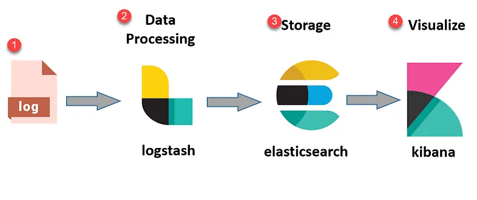

# Observability簡介

# 前言

本文為簡介Observability的概念，並且介紹如何使用OpenTelemetry來實作Observability。

主要為以下內容

1. Observability簡介
2. OpenTelemetry簡介
3. ELK簡介
4. OpenTelemetry on .net
5. 實作範例

本文撰寫時的OTel版本為: `1.25`

## 可觀察性(Observability)

可觀察性是指一個系統可透過`監視`和`分析`每個元件狀態的狀態藉以觀察內部變更及診斷這些變更發生的能力
。白話一點的說法就是能夠藉由`系統外的資訊觀察系統內部的運作狀態`。通常為侵入性的作法(埋code)，而且可能會影響應用程式的作業。

Observability三本柱

- Log
  - 泛指系統或應用程式運行所產生用來紀錄系統或程式資訊的文字檔

- Metrics
  - 為系統或程式在運行時的量化數據，通常為一數值化的結果，例如CPU使用率、記憶體使用量等
  
- Trace
  - 紀錄一個任意請求(Request)在不同應用中處裡的路徑，例如一個請求從前端進入後端，後端再呼叫其他服務，最後回傳給前端，這個過程中的每個步驟都會被記錄下來，並且可以透過`trace_id`來串聯這些步驟，作為後續的追蹤使用。

# OpenTelemetry

由字面上`Open`以及`Telemetry`可得知`OpenTelemetry` （OTel） 是一種跨平臺、開放式`標準`，解決Telemetry資料的資料模型定義、檢測、採集、處理、輸出等標準化問題, 並提供一組標準化SDK、API與一些常用工具.

要產生Telemetry主要有兩種方式，一個為Auto Instrumentation，另一個為Manual Instrumentation。

Auto Instrumentation為透過`自動`的方式，將Telemetry資料從系統中擷取出來，並且將其送到OTel的後端，這種方式不需要修改原始碼，但是會有一些限制，例如無法自訂資料的內容等。

Manual Instrumentation為透過`手動`的方式，將Telemetry資料從系統中擷取出來，並且將其送到OTel的後端，這種方式需要修改原始碼，但是可以自訂資料的內容等。

# ELK 簡介

ELK為一套由Elastic所提供的開源軟體組合，包含Elasticsearch, Logstash, Kibana三個軟體

- Elasticsearch為一個分散式搜尋引擎，也是個TSDB(Time Series Database)，來儲存以及搜尋資料。
- Logstash為一個資料收集引擎，建立data process pipline，
- Kibana為一個資料視覺化工具。

## ELK流程圖

## OpenTelemetry on .Net

### Automatic v.s Manual Instrumentation

### Automatic 

### Manual

# 實作範例

## ELK install by docker
## Manually Instrumentation
## Demo

## resource

