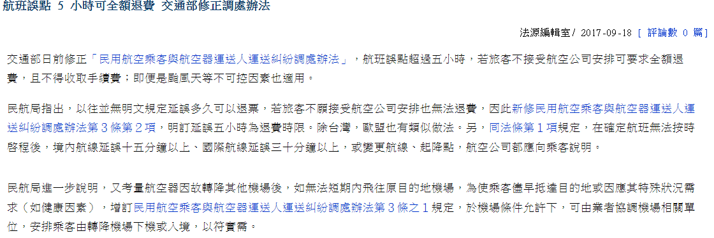
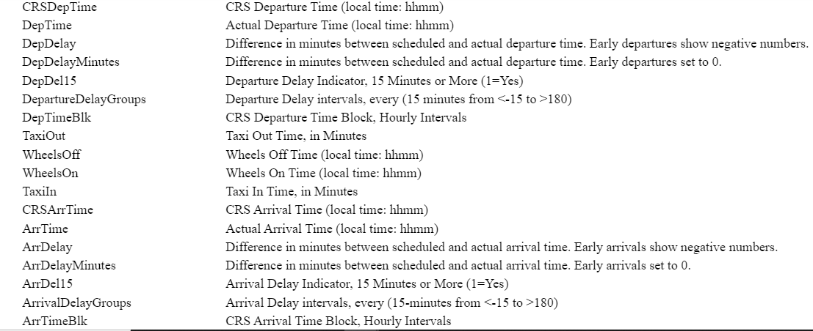
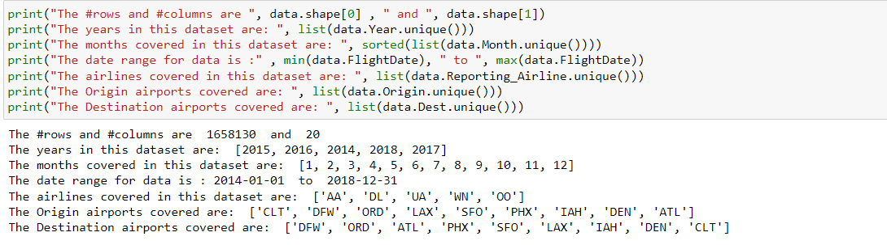
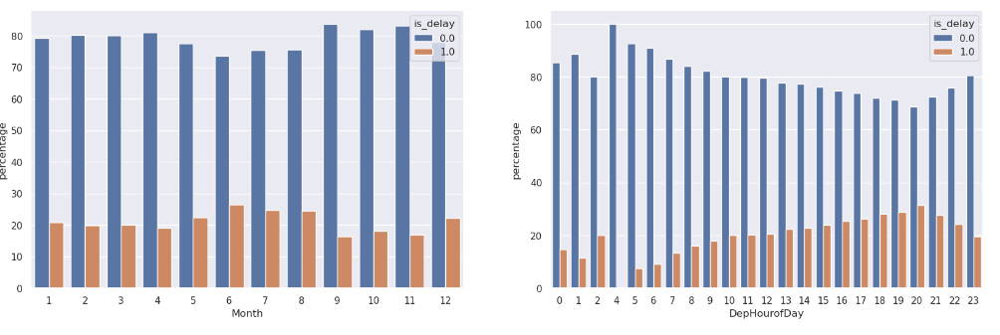
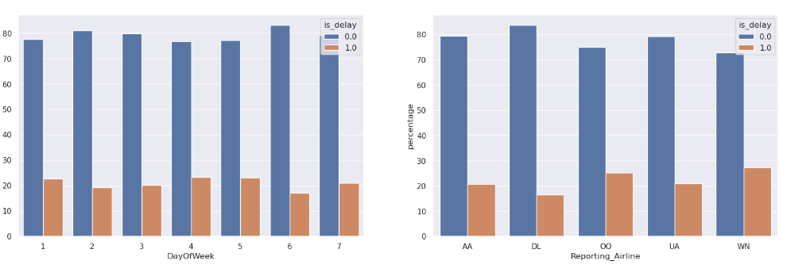
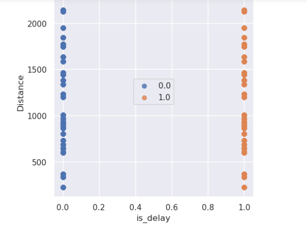
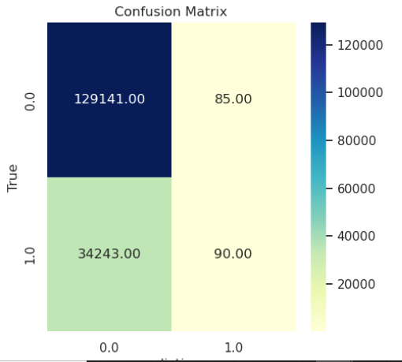

# Flights Delay Prediction
## Bing, Rita, Eric, Zac
---
# Outline
  - Business Scenario
  - Business Problem
  - Machine Problem
  - Data Set Information
---
# Business Scenario
  - 航空公司想要提供一項服務
  - 旅客在購買機票時便告知航班是否會因天氣而導致誤點，以便提前做好準備，提高顧客體驗(减少损失)。
  - 給予2013-2018的航班data，希望藉由ML的方式預測航班是否會因天氣而誤點。
---
# Scenario Analysis
  - 適合用ML來解決這個問題的原因
    - 難以用人力去閱讀數據以及預測
    - 大量資料需要處裡以及自動化
  
  - 商業上的影響
    - 誤點太久旅客可要求全額退費，對航空公司造成損失
    - 
    - 
---
# Business Problem
  - 飛機因為天氣而誤點太久造成對航空公司的損失
  - 透過預測是否會誤點，在旅客買票時提前告知可能會誤點，讓旅客有心理準備
  - 若在告知有可能誤點的情況下旅客仍選擇購買，則航空公司可選擇不予退費(or 部分退費)
  - 簡化問題所以忽略部分退費的情況，考慮若delay超過15分鐘則退費
---
# Business Goal
  - 減少因天氣誤點而對航空公司造成的損失(i.e 顧客退費)
  - Success metrics: 因天氣而退費給顧客金額比例降低   
---
# ML Problem
  - 給予航班的data，預測是否班機會delay超過15分鐘
  - 適合使用二元分類演算法(是否會delay超過15分鐘)
  - 使用recall作為評估指標 (因為航空公司希望能夠盡量減少誤點造成的損失)
  - False Positive 較沒影響(因為沒誤點，皆大歡喜)
---
# DataSet Information
  - 日期
  - 起飛/降落機場
  - 預計到達時間/實際到達時間
  - Delay Time 相關attribute
---

---

---
# Thoughts
  - 天氣通常與季節循環有關(日期,時間)
---
# DataSet Analysis

---

---
# Model Evaluation

---