# 目錄

[TOC]

# Unit Test 簡易入門

## 概述

1. 本篇將比較 NUnit 與 xUnit 兩套測試框架，最後選用其中一套。
2. Assert 部分將導入 Fluent Assertions.
3. 本篇有簡易測試教學。

## 什麼是測試？

模擬程式碼的執行行為，來進行正確性檢驗的測試工作。

### 單元測試 (Unit testing)

單元測試指的是最小單元的測試，一個單元就是單個程式、函式、過程等。對於物件導向程式設計，最小單元就是方法，包括基礎類別、抽象類別、或者衍生類別中的方法。

這種測試由開發人員自行撰寫。

### 整合測試 (Integration testing)

整合測試是指將 2 個以上的類別整合一起測試，以確保它們之間的連動是否正常。例如：單元測試分別測試了購物車、轉帳的功能。而整合測試就一口氣將 2 步驟一次跑完，所以整合測試一定是跨類別的。

這種測試通常由專門的測試團隊撰寫，但大部份情況由某模組的負責人寫。

### 端對端測試 (End-to-end testing) (E2E testing)

使用者（一端）對真實系統（另一端）進行測試。從用戶的角度、環境出發，實際操作系統服務，看結果是否符合預期，這部份就屬於人工測試的範圍。


更詳細的測試介紹請看 [一次搞懂單元測試、整合測試、端對端測試之間的差異](https://blog.miniasp.com/post/2019/02/18/Unit-testing-Integration-testing-e2e-testing)

## 為什麼要寫測試？

1. 確保程式碼品質

   每次改動某個功能、模組，時常會忽略、擔心會不會導致別的呼叫端錯誤，只要有單元測試就可以避免這個問題，每次改版完都只要跑一次測試並且都通過，就可以確保改動後的邏輯是沒問題的、不會牽連到其他模組。

2. 省去人工測試麻煩

   雖然寫單元測試需要額外花時間，但只要寫完一次就可以不斷重複使用，也省去自己 Debug 跑模擬的過程。

3. 彈性高

   可以一上班就測試、中午測試、下班測試，上版時搭配 CI/CD 自動測試，想什麼時候測試都可以。

4. 速度快

   單元測試的執行速度應該要非常快，所以跑測試也就不需要太多時間。

## 如何建立測試專案

1. 建立測試專案：

   專案內都已經有建好的測試專案，直接在底下加入檔案撰寫測試即可。

   > Red.API.Tests
   >
   > Red.Service.Tests
   >
   > Tester/B2B.CoreTests
   >
   > Tester/B2B.Tests
   >
   > Tester/B2E.Tests
   >
   > Tester/B2E.UnitTest
   >
   > Tester/EUMALL.DataAccess.Test

2. 檔名規範：在檔名後面加上 Tests

   > e.g.
   >
   > HomeController.cs                XXXService.cs
   >
   > HomeControllerTests.cs       XXXServiceTests.cs

   舊有的檔名都是加 Test，無 s。現在一律使用 Tests

3. 路徑規範：與原本的專案路徑一致

   > e.g.
   >
   > HomeController/HomeController.cs             Service/Service.cs
   >
   > HomeController/HomeControllerTest.cs      Service/ServiceTest.cs

## NUnit 入門

[NUnit 官方網站](https://nunit.org/)

### 寫測試程式

在測試專案安裝 NuGet 套件 NUnit，於測試專案底下加入一個測試檔案 Tests.cs

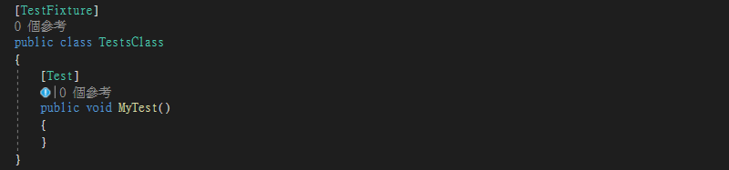

其中 [TestFixture] 指出這個 Class 是測試用的 Class

而 [Test] 則代表此 Method 是測試 Method，如果不寫 [Test] 則測試時就不會跑。

### 執行測試

開啟 Test Explorer ：上方工具列 -> 測試 -> Test Explorer  （或是快捷鍵 Ctrl + E, T）

因為沒有任何程式碼，所以執行測試後通過。

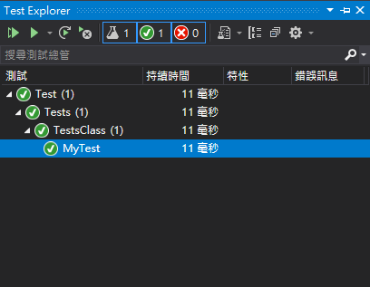

### 驗證

使用 Assert 以驗證結果的正確性：

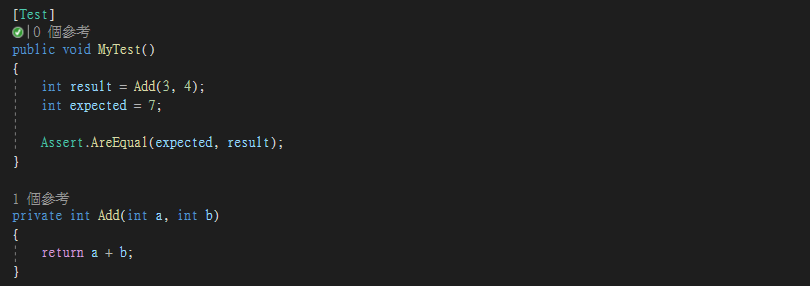

Assert 就是寫單元測試中的關鍵了，用以判斷實際得到的結果與預期的結果是否相符。若 Assert 是 True，則測試會通過。


### 改善程式碼

**Method命名方式：**

測試的名稱應該包含三個部分

* 所測試的方法名稱

* 用以測試的案例

* 叫用案例時的預期行為

測試方法名稱_測試案例\_預期行為

將 MyTest 更名為 Add_InputTwoInreger_ReturnSum


**以 3A 原則改善程式碼：**

Arrange: 初始化

Act: 執行方法、行為、操作並取得結果

Assert: 驗證

這三個步驟會讓測試更明確，同時也應該加入註解中。

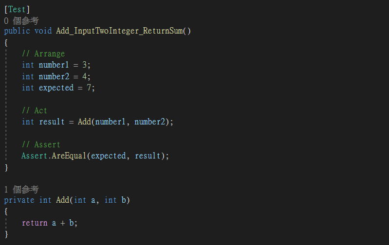

### 測試多筆資料

使測資放在傳入參數中，用 [TestCase] 即可

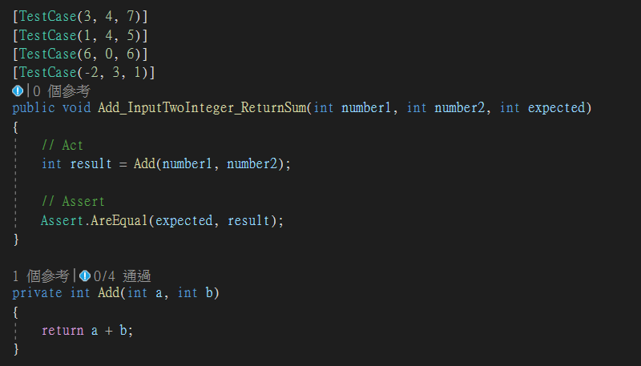

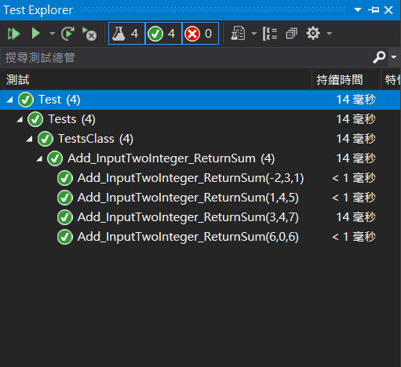


也可以使用 TestCaseSource 的方式，從外部代入測試資料，這樣的話就可以將測試資料額外放一個檔案 

> e.g.
>
> TestCases\TestCases.cs

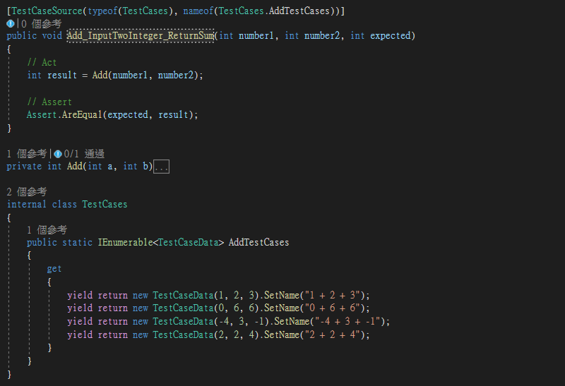


其中回傳的測試資料型態為 TestCaseData 的集合，這種方式可以輕易代入參數、並且設定測試的名稱。

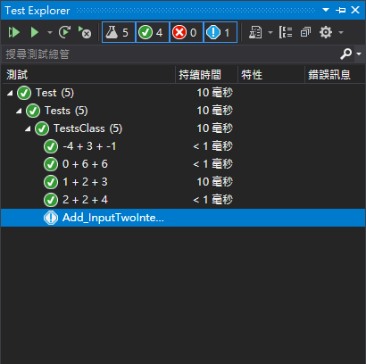

### SetUp 與 TearDown

SetUp: 每個測試案例開始前，會執行此方法。通常用來還原測試案例初始化狀態，確保測試案例不互相干擾。

TearDown: 每個測試案例完成後，會執行此方法。通常用來清除測試案例的狀態，確保測試案例不互相干擾。

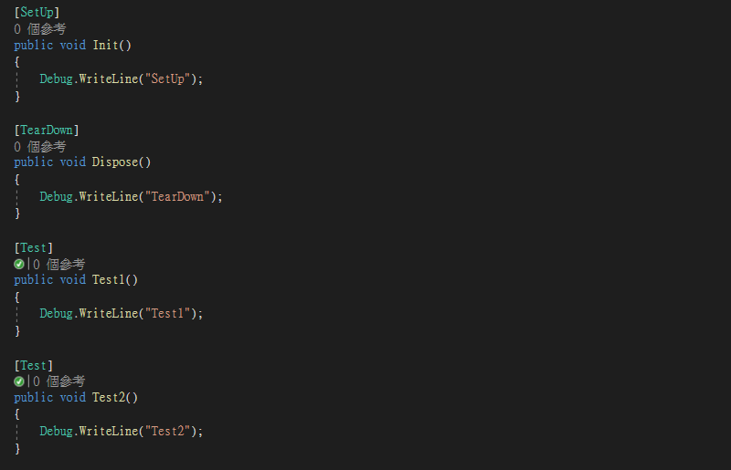

執行順序如下：

SetUp

Test1

TearDown

SetUp

Test2

TearDown

## xUnit 入門

[xUnit 官方網站](https://xunit.net/)

### 標記測試方法

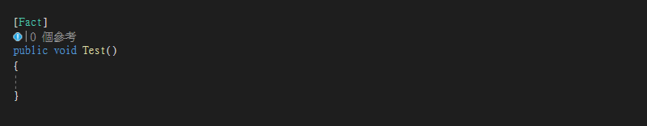

與 NUnit 不同，需標記為 [Fact]

xUnit 沒有標記為測試 Class 的方法，它會自動搜尋測試專案內的測試方法。實際上 NUnit 也可以省略標記測試 Class，至於這樣會不會為了搜尋而拖慢速度？這不清楚。

### 測試多筆資料

使用 [Theory] 與 [InlineData] 達成

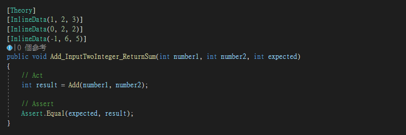

若要將測試資料額外分開，則使用 [MemberData] （另外也有 [ClassData] 的方法）

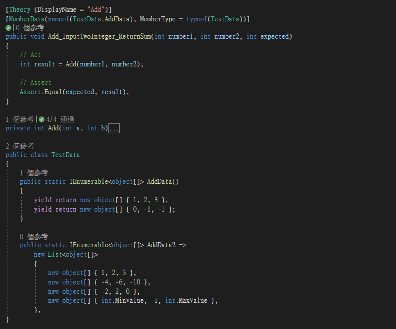

TestData 內提供 2 種給予測資的方式 AddData 與 AddData2


目前查不到個別設定測試名稱的方式，只可統一使用 DisplayName 放在 [Theory]

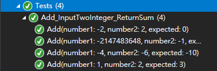

### Fact 與 Theory

為什麼 xUnit 不使用像是 [Test] 這樣的標記？以下節錄至 [官方說明](https://xunit.net/docs/getting-started/netfx/visual-studio#write-first-theory)：

> **Facts** are tests which are always true. They test invariant conditions.
>
> **Theories** are tests which are only true for a particular set of data.

Fact 只用於測試單一情況，不會有外在影響，因此也不可有傳入參數

Theory 用於測試特定資料，可有傳入參數

### Constructor 與 Dispose

xUnit 沒有 NUnit 那樣的 SetUp 與 TearDown。

xUnit 認為這兩個方法是糟糕的方法，取而代之的 xUnit 是使用建構、解構的概念去實作。

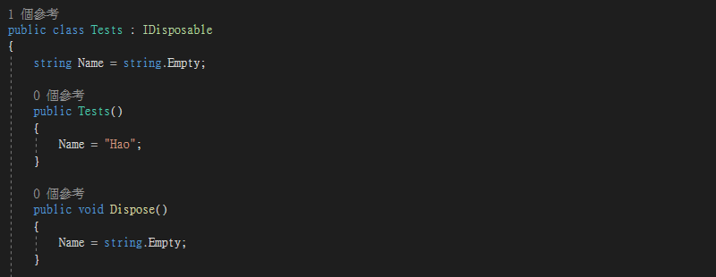

### Analyzers

xUnit 有 Analyzers 套件，可以自動分析測試程式碼的好壞。

去 NuGet 安裝 xunit.analyzers

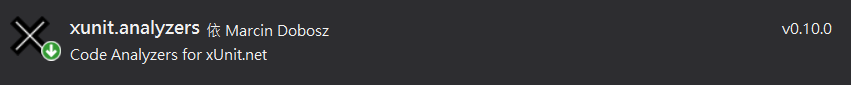

**範例 1**

用 Assert.True 與 string.StartWith 判斷某 string 開頭是否為 "AB"，但 xUnit 有可讀性更佳的 Assert.StartWith

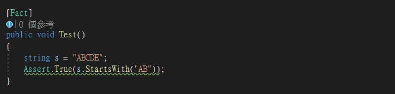

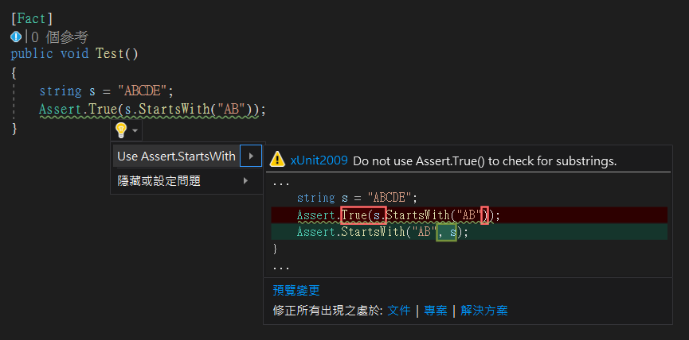

**範例 2**

[Fact] 不可傳入參數，需用 [Theory] 或者刪除傳入參數

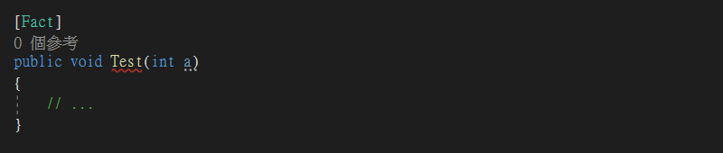

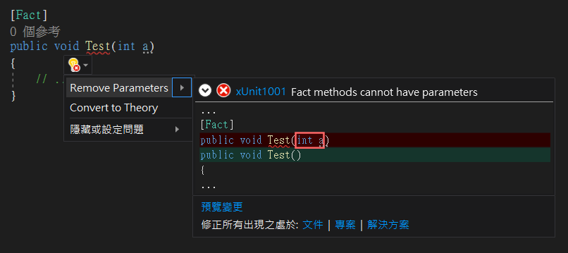

## NUnit 與 xUnit 簡易比較

其實所有的測試框架都差不多，差異僅有一些特別功能，但感覺這些功能的使用時機也不多。

### 功能比較

太多了，請直接看這篇文章 [MSTest,NUnit 3,xUnit.net 2.0 比較]([https://blog.yowko.com/mstest-nunit-xunit/#mstest-nunit-3-xunit-net-2-0-%E6%AF%94%E8%BC%83](https://blog.yowko.com/mstest-nunit-xunit/#mstest-nunit-3-xunit-net-2-0-比較))

### 語法差異

1. xUnit 在 Assert 上捨去了 be 動詞 is, are

   > xUnit:  Assert.Equal()              Assert.Null()
   >
   > NUnit: Assert.AreEqual()        Assert.IsNull()

2. Exception 的處理

   > xUnit:  Assert.Throws<Exception>(() => Add(0, 1));
   >
   > NUnit: Throws.TypeOf<Exception>

   xUnit 的 Assert.Throws<> 內部是接收一個 delegate，Assert.Throws<Exception>(() => 物件.方法);

   代表某物件的某方法應該要會 Throw 指定的 Exception

### SetUp / TearDown 與 Constructor / Dispose

xUnit 認為 SetUp 與 TearDown 是不好的方法。雖然 SetUp 與 TearDown 可以協助初始化、清除狀態，但是每個測試執行前後都會分別呼叫一次 SetUp 與 TearDown，如果在 SetUp 中不只是 new 出一個物件，甚至還賦值。在特殊案例的測試中又需要視情況賦值，如此一來特殊案例就重複賦值，且每一個測試都會需要一次掌管 3 個 Method：SetUp、自己、TearDown，這違反了 [SOLID]([https://zh.wikipedia.org/wiki/SOLID_(%E9%9D%A2%E5%90%91%E5%AF%B9%E8%B1%A1%E8%AE%BE%E8%AE%A1)](https://zh.wikipedia.org/wiki/SOLID_(面向对象设计)) 中的 [單一職責原則](http://glj8989332.blogspot.com/2018/02/design-pattern-single-responsibility.html)。

範例如下：

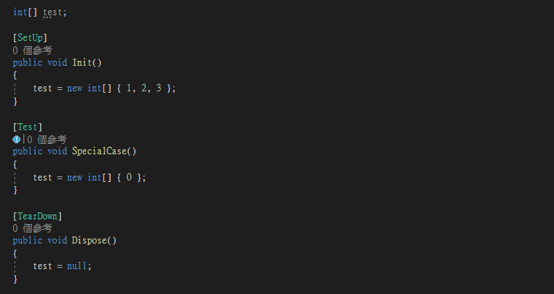

與其這樣寫，不如在每個測試都 new 出一個物件、賦予這個情境下的數值。雖然多了些重複的 code，但至少確保每個測試都是獨立且封閉的。

而 xUnit 則使用建構、解構的方式實作該功能，不會每個測試都重一次初始化、清除狀態。

而是 初始化 -> 跑完所有測試 -> 清除狀態

不過 NUnit 也沒有強制要寫 SetUp 與 TearDown。使用 NUnit 可以考慮避開 SetUp 與 TearDown

### 相依性

xUnit 在每個測試中分別使用新的 Instance，強迫每個測試都獨立、封閉，且相依性為 0，請看以下範例

NUnit

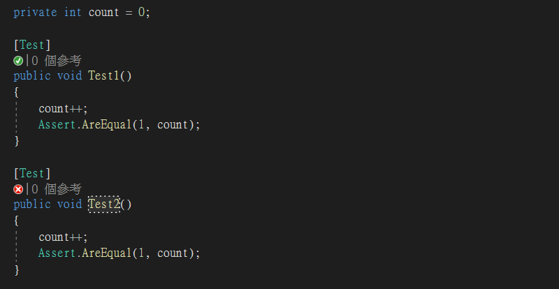

xUnit

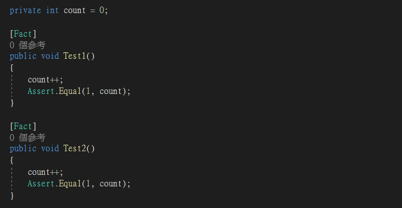

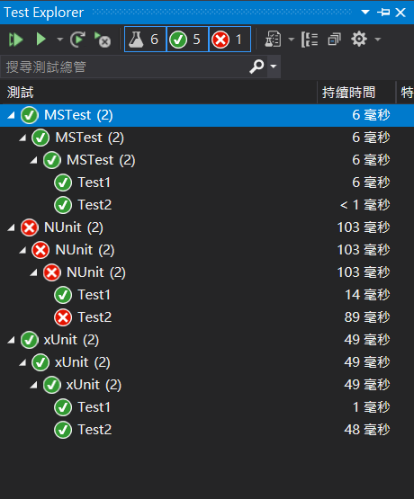


### 擴展性

xUnit 可自定義 Attributes ，這是其他測試框架都沒有的功能。

可參考 [Creating a custom xUnit theory test DataAttribute to load data from JSON files](https://andrewlock.net/creating-a-custom-xunit-theory-test-dataattribute-to-load-data-from-json-files/)

### 文件

NUnit 較齊全，xUnit 連 Attributes 的說明文件都沒有。

## Fluent Assertions

[Fluent Assertions 官方網站](https://fluentassertions.com/)

### 什麼是 Fluent Assertions

一種口語化的 Assert，讓程式碼更有可讀性，且跨測試框架，若有多種測試框架並行的情況，仍可用同一種 Assert 寫法。

基本上把測試結果講出來，Code 差不多就是那樣子寫。

### 安裝

去 NuGet 安裝 Fluent Assertions

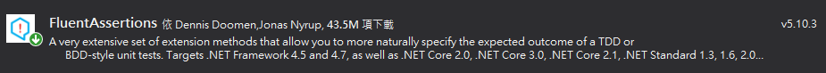

### 範例

以 xUnit 為例，某 string 需要一次判斷 4 個條件

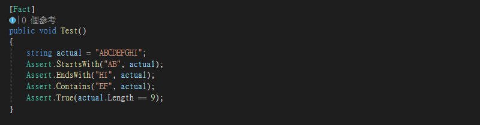

改成 Fluent Assertions

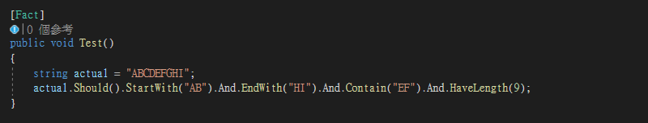

就是這麼簡單。

**判斷物件是否相等**

自定義物件是 Reference type，要比對裡面的值是否一樣需要自訂比較方法或是 Override Equal 方法，但 Fluent Assertions 只要一個方法即可搞定。

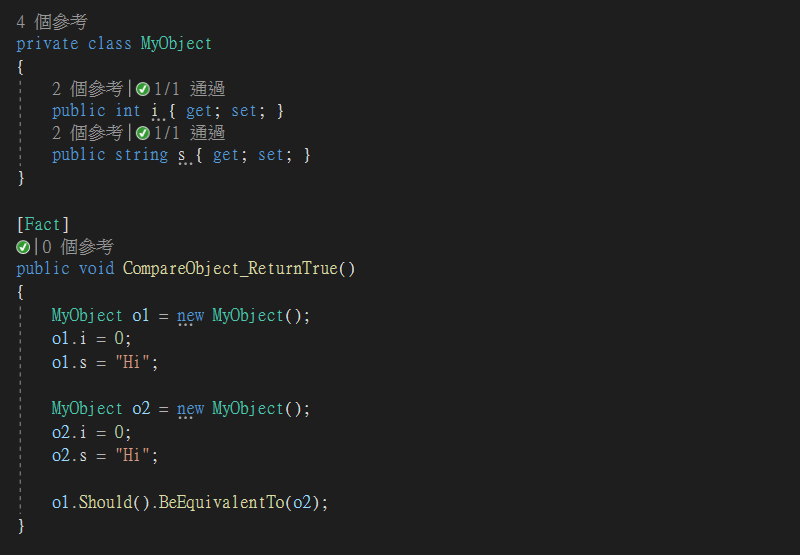

## Selenium

[Selenium 官方網站](https://www.selenium.dev/)

### 什麼是 Selenium

Selenium 是 E2E 測試工具，可執行開啟瀏覽器、操作功能等行為，可模擬使用者操作系統的真實情況。

### 安裝

去 NuGet 安裝 Selenium.WebDriver

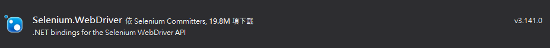

若要測試某瀏覽器，需要額外安裝該瀏覽器的 WebDriver，以 Chrome 為例

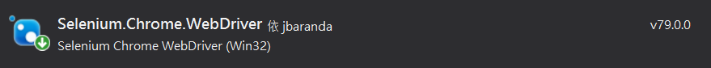

### 範例

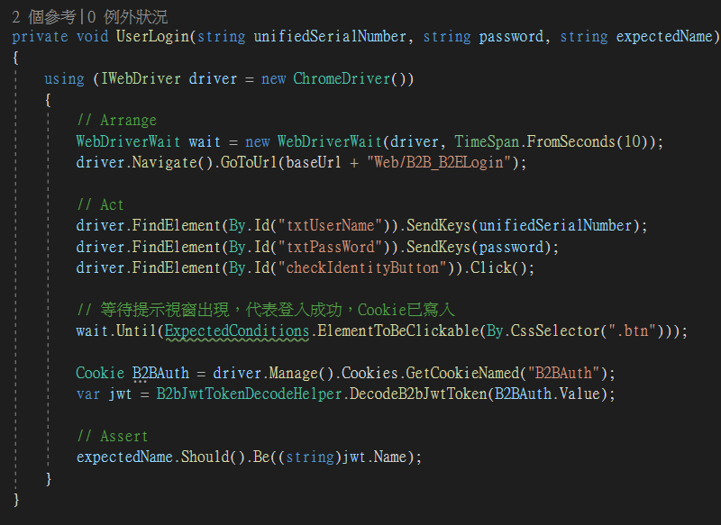

這是模擬使用者登入 B2B 網站的程式碼。

打開瀏覽器，並且測試結束時關閉

```c#
using (IWebDriver driver = new ChromeDriver())
```

設定一個監聽事件

```c#
WebDriverWait wait = new WebDriverWait(driver, TimeSpan.FromSeconds(10));
```

前往 B2B 登入網址

```c#
driver.Navigate().GoToUrl(baseUrl + "Web/B2B_B2ELogin");
```

根據 Id 找到這些欄位，並且使用 SendKeys() 填入統編、密碼相關資訊，最後透過 Id 找到登入按鈕並按下。

``` c#
driver.FindElement(By.Id("txtUserName")).SendKeys(unifiedSerialNumber);
driver.FindElement(By.Id("txtPassWord")).SendKeys(password);
driver.FindElement(By.Id("checkIdentityButton")).Click();
```

B2B 登入成功會彈出提示視窗，這邊的測試程式碼是透過取得 Cookie 值來判斷是否成功，而提示視窗彈出則代表登入已成功、Cookie 已寫入。這個判斷就是等待提示視窗出現才會繼續往下做。

提示視窗含有一個按鈕，判斷提示視窗是否已出現的依據是這個按鈕是否已出現。

```C#
wait.Until(ExpectedConditions.ElementToBeClickable(By.CssSelector(".btn")));
```

取得名字為 B2BAuth 的 Cookie

```C#
Cookie B2BAuth = driver.Manage().Cookies.GetCookieNamed("B2BAuth");
```

透過 Fluent Assertions 驗證

```C#
expectedName.Should().Be((string)jwt.Name);
```


跑這個測試 Selenium 會打開 Chrome 瀏覽器來實際做這些操作並且測試。

### 如何不實際開啟瀏覽器測試？

我們跑測試時剛開始也許需要實際看瀏覽器的操作來確保自己的程式碼正確。當確認完畢後，我們不希望每次測試都要打開瀏覽器，耗時又佔記憶體。

以 Chrome 為例：

```c#
ChromeOptions chromeOptions = new ChromeOptions();
chromeOptions.AddArguments("headless");
using (IWebDriver driver = new ChromeDriver(chromeOptions))
{
}
```

Chrome 有個 headless 模式，只要將這個參數傳入建構子，跑測試時就不會真的開啟瀏覽器測試。

### Selenium IDE

Selenium IDE 可以直接錄製你對網頁的操作、甚至轉成程式碼，在不懂程式的情況下仍可完成人工測試腳本。

以 Chrome 為例：

去擴充功能搜尋 Selenium IDE

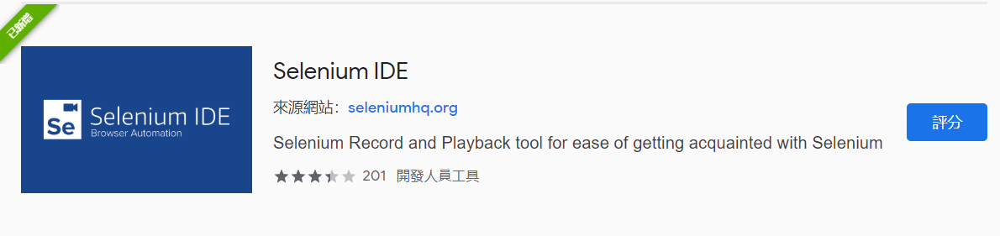

打開 Selenium IDE

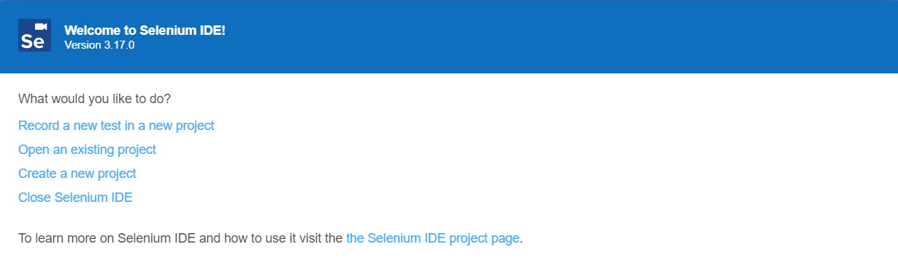

點選 Record a new test in a new project

輸入測試專案名稱，這可以協助你分類測試腳本

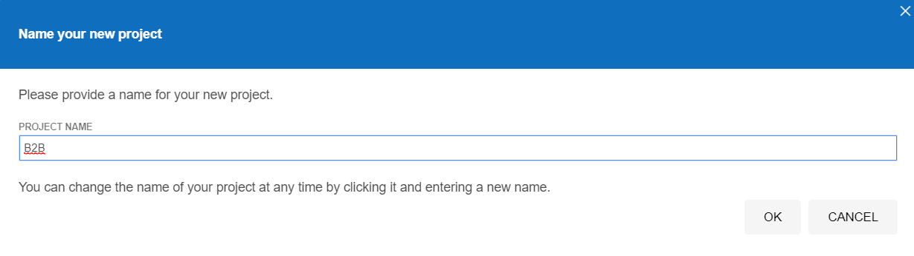

輸入想要錄製腳本的網址，按下 START RECORDING

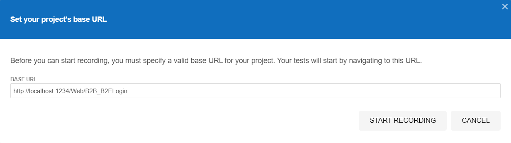

Selenium IDE 會打開你輸入的網址，打開後就已經在錄製了，可以執行自己想測試的操作。

登入完畢後，我選擇依照網頁的標題來判斷是否登入成功，在登入成功後的頁面 右鍵 -> Selenium IDE -> Assert -> Title

點開 Selenium IDE，按下停止錄製就完成了。

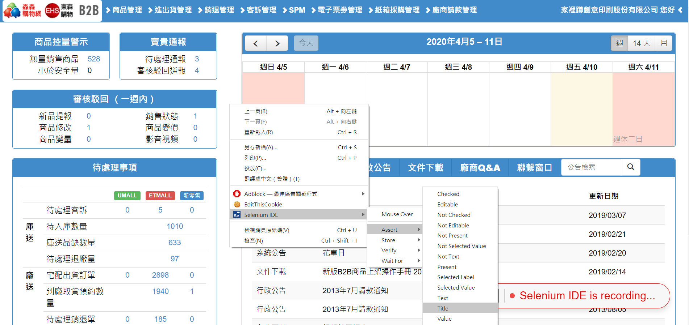

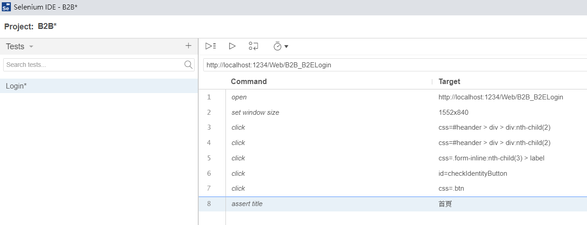

左邊就是你所有的測試，右邊是該測試執行的動作，最後一個動作是 Assert Title 是否為 "首頁"

執行測試後綠色代表成功。

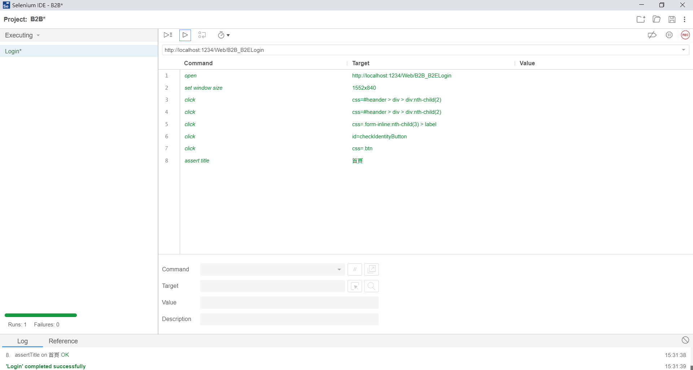


**如何匯出成程式碼**

滑鼠移到測試名稱上，最右邊應該會顯示 3 個點

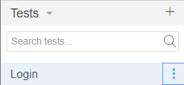


按下 Export

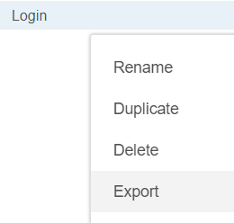


就可以將剛剛錄製的腳本轉成程式碼

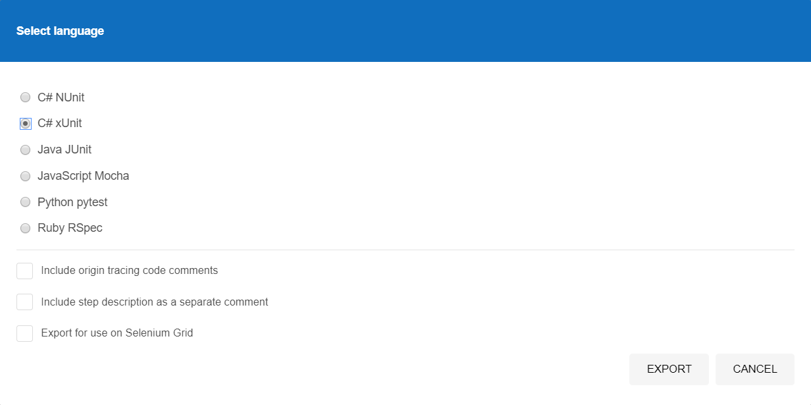


## 程式碼覆蓋率 (Code Coverage)

### 概述

代表程式碼被測試的比例。

以下要被測試的 Class 只有一個方法 Test，輸入什麼數字就回傳什麼數字。

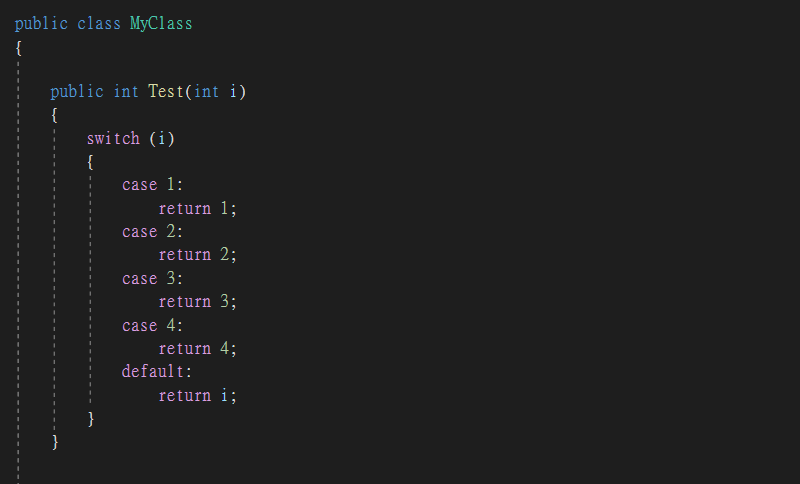

測試方法這樣會傳入 1, 2, 3 ，共 3 個整數

Assert 與 Fluent Assertions 只要擇一來寫就好。

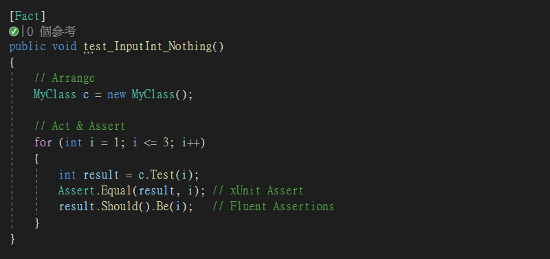

這樣子程式碼覆蓋率 (Code Coverage) 就是 75%，因為 5 個 case 中只測試了 3 個 case

### 分析工具

#### Visual Studio Enterprise (企業版)

Visual Studio Enterprise 內建就有程式碼覆蓋率的工具，且有 UI，讓操作與閱讀都十分方便。但只有企業版有這個功能。

教學請看官方文件 [使用程式碼涵蓋範圍來決定所測試的程式碼數量](https://docs.microsoft.com/zh-tw/visualstudio/test/using-code-coverage-to-determine-how-much-code-is-being-tested?view=vs-2019)

#### dotCover

JetBrains 出品的工具，也是有 UI 的。但是是付費工具，有 30 天免費試用，或者該公司產品的 ReSharper 也有附贈。

那免費仔該怎麼辦呢？幸好他們有開放 Command line tools 免費使用，太棒啦

去 [官方網站](https://www.jetbrains.com/dotcover/download/#section=commandline) 下載 dotCover Command Line Tools

##### .NET Core

打開 CMD 視窗 -> cd 到 dotCover 的目錄 -> 輸入以下指令 （MSTest、NUnit、xUnit 都是同一個指令）

> dotCover.exe dotnet --output=AppCoverageReport.html --reportType=HTML -- test "C:\MyProject\MainTests.csproj"

**參數介紹：**

output: 輸出覆蓋率報告的位置、名字。若不指定輸出路徑，則輸出在 dotCover 目錄底下

> output=C:\Users\Hao\Report\AppCoverageReport.html 指定路徑

reportType: 輸出覆蓋率報告的類型，這邊用 HTML

test: 要分析覆蓋率的測試專案，需指到 csproj 檔

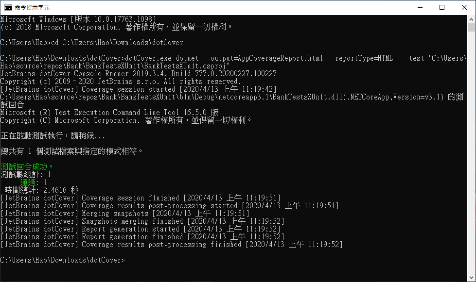

如此一來就會在 dotCover 的目錄底下輸出一個 AppCoverageReport.html 檔，把它打開就可以看到覆蓋率的分析了。其中綠色代表有被測試到、紅色代表沒有被測試到。

分析包含了：該檔案的覆蓋率、檔案內的方法的覆蓋率等等……

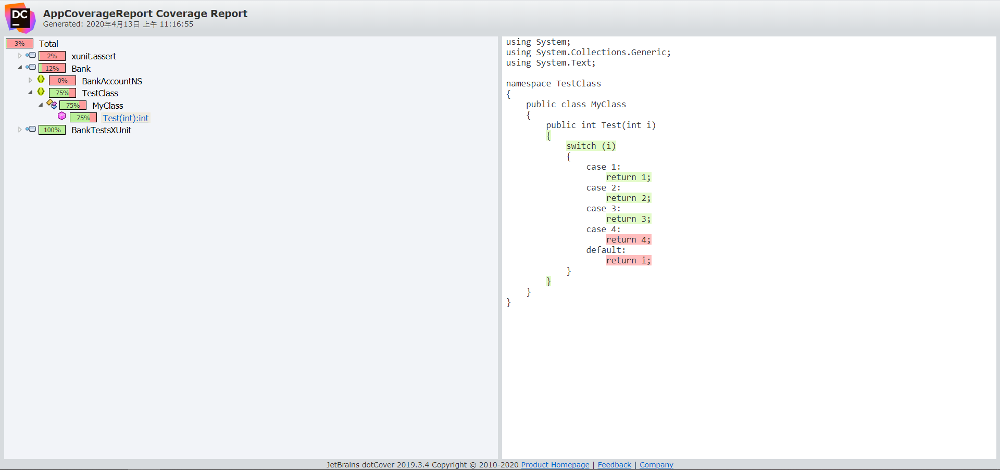


##### .NET Framework

因公司內測試專案為 .NET Framework 4.6.1，因此使用這個版本來做說明

打開 CMD 視窗 -> cd 到 dotCover 的目錄 -> 輸入以下指令 （根據不同測試框架，參數值會不同）

> dotcover cover /TargetExecutable="TestRunner\TestRunner.exe" /TargetArguments="C:\MyProject\bin\Debug\MyTest.dll" /Output="AppCoverageReport.html" /ReportType="HTML"

**參數說明：**

TargetExecutable: 要執行的測試框架的 Runner

TargetArguments: 要被分析覆蓋率的測試專案，編譯後產出的 dll

Output: 輸出覆蓋率報告的位置、名字。若不指定輸出路徑，則輸出在 dotCover 目錄底下

ReportType: 輸出覆蓋率報告的類型，這邊用 HTML

###### MSTest

測試失敗，原因還沒釐清，Runner 應該是 Visual Studio 資料夾內的 vstest.console 沒錯，因為用這個 Runner 去跑測試，是成功的。

> dotcover cover /TargetExecutable="C:\Program Files (x86)\Microsoft Visual Studio\2019\Community\Common7\IDE\Extensions\TestPlatform\vstest.console.exe" /TargetArguments="C:\MyProject\bin\Debug\MyTest.dll" /Output="AppCoverageReport.html" /ReportType="HTML"

如果要用 vstest.console 去執行測試，指令如下

> vstest.console.exe myTestProject.dll

###### NUnit

先去 NuGet 安裝 NUnit.ConsoleRunner，然後 TargetExecutable 參數指定該套件底下的 nunit3-console.exe

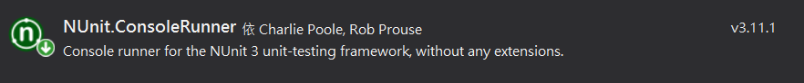

> dotcover cover /TargetExecutable="~\nunit.consolerunner\3.11.1\tools\nunit3-console.exe" /TargetArguments="C:\MyProject\bin\Debug\MyTest.dll" /Output="AppCoverageReport.html" /ReportType="HTML"

###### xUnit

先去 NuGet 安裝 xunit.runner.console，然後 TargetExecutable 參數指定該套件底下的 xunit.console.exe

目錄底下有很多資料夾細分對應的 .NET 版本。以下指令使用 .NET Framework 4.6.1 的目錄。

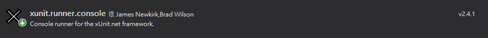

> dotcover cover /TargetExecutable="~\xunit.runner.console\2.4.1\tools\net461\xunit.console.exe" /TargetArguments="C:\MyProject\bin\Debug\MyTest.dll" /Output="AppCoverageReport.html" /ReportType="HTML"

#### 其他

其他還有 [OpenCover](https://github.com/OpenCover/opencover)、[Coverlet](https://github.com/tonerdo/coverlet) 等，但似乎都只針對 .NET Core 使用。且這兩個工具產出的覆蓋率報告是 XML 格式，需透過 [ReportGenerator](https://github.com/danielpalme/ReportGenerator) 來將報告轉為 HTML 格式。

# 番外篇

## TDD

### 什麼是 TDD?

TDD（Test-Driven Development）是一種開發模式，就是**先寫測試再開發**。先寫測試除了能保證一定有測試之外，還可一併思考程式該如何設計。

先寫測試時得先思考程式如何運作、定義什麼方法要執行什麼行為，這就如同幫自己寫規格、規劃程式一樣，會迫使自己照著測試訂好的規則走。避免開發時突然發現自己的架構不良、介面不好用，又需要大幅度更動。且通常預先想好的架構耦合性不高。

### 沒有程式怎麼寫測試？

沒道理啊，程式都還沒寫，要怎麼寫測試？其實 TDD 就是**先寫會失敗的測試** -> 再將測試通過 -> 重構。

1. 選定開發需求，寫出測試程式碼。定義好 API 介面
2. 執行測試 -> 失敗
3. 以最快的速度通過測試
4. 執行測試 -> 成功
5. 重構

### 範例

現在有一個需求，要寫出能執行加減乘除的計算機 (Calculator)

先寫測試

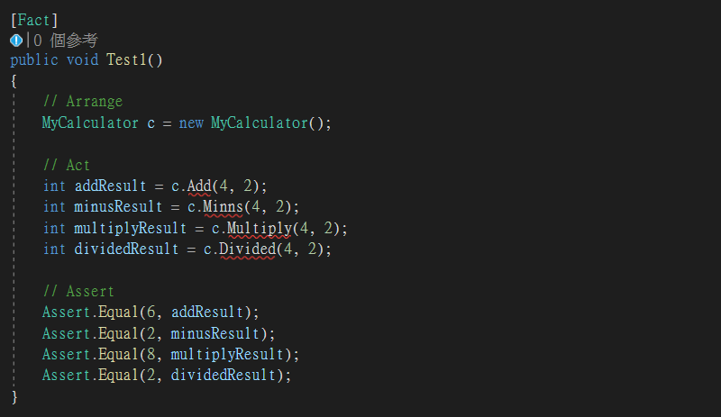

我已經將程式架構設計完成、預期的方法都寫好了，就照這個方向去設計

將方法都實作介面，至於內部細節都先不管，能編譯成功就好。

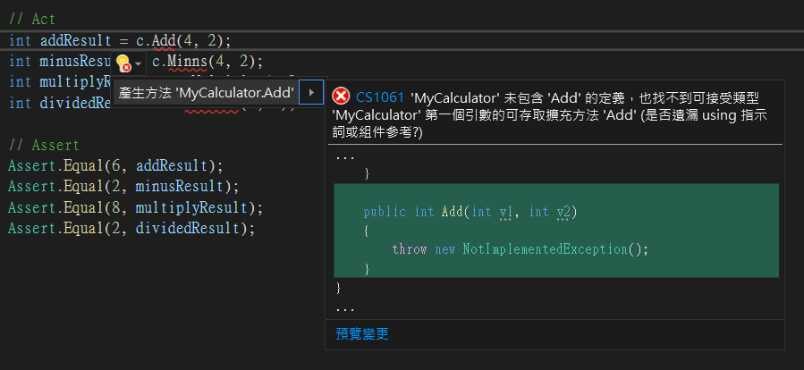

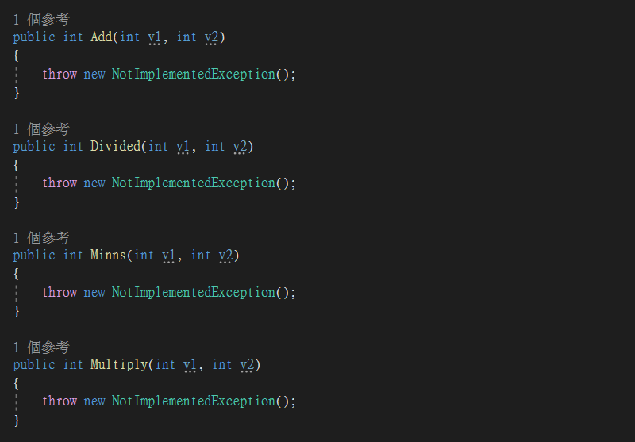

跑一下測試，失敗了

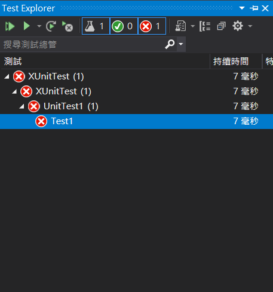

接者開始想辦法讓測試通過

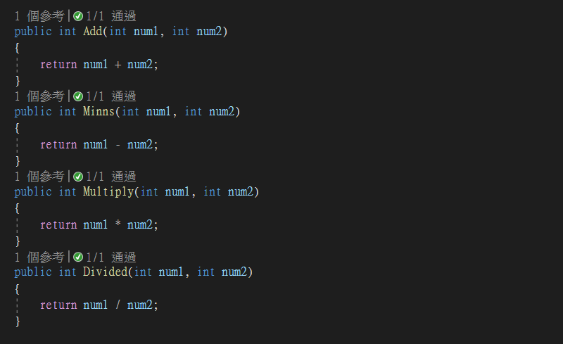

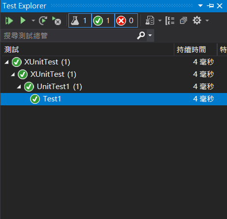

重構

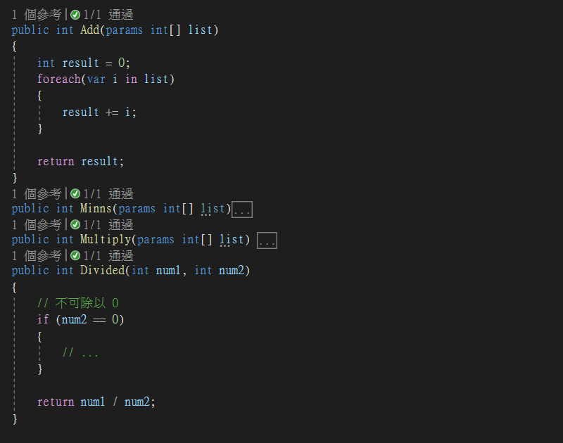


TDD 就是不斷重複 紅燈 -> 綠燈 -> 重構 的過程。

# 參考資料

[一次搞懂單元測試、整合測試、端對端測試之間的差異](https://blog.miniasp.com/post/2019/02/18/Unit-testing-Integration-testing-e2e-testing)

[NUnit - 測試案例 TestCaseSourceAttribute](https://blog.johnwu.cc/article/nunit-test-case-source-attribute.html)

[.NET Core 和 .NET Standard 的單元測試最佳做法](https://docs.microsoft.com/zh-tw/dotnet/core/testing/unit-testing-best-practices)

[Creating parameterised tests in xUnit with [InlineData], [ClassData], and [MemberData]](https://andrewlock.net/creating-parameterised-tests-in-xunit-with-inlinedata-classdata-and-memberdata/)

[xUnit Theory: Working With InlineData, MemberData, ClassData](https://hamidmosalla.com/2017/02/25/xunit-theory-working-with-inlinedata-memberdata-classdata/)

[MSTest,NUnit 3,xUnit.net 2.0 比較]([https://blog.yowko.com/mstest-nunit-xunit/#mstest-nunit-3-xunit-net-2-0-%E6%AF%94%E8%BC%83](https://blog.yowko.com/mstest-nunit-xunit/#mstest-nunit-3-xunit-net-2-0-比較))

[Comparing xUnit.net to other frameworks](https://xunit.net/docs/comparisons)

[Why you should not use SetUp and TearDown in NUnit](https://jamesnewkirk.typepad.com/posts/2007/09/why-you-should-.html)

[使用程式碼涵蓋範圍來決定所測試的程式碼數量](https://docs.microsoft.com/zh-tw/visualstudio/test/using-code-coverage-to-determine-how-much-code-is-being-tested?view=vs-2019)

[Coverage Analysis from the Command Line](https://www.jetbrains.com/help/dotcover/Running_Coverage_Analysis_from_the_Command_LIne.html#)

[VSTest.Console.exe 命令列選項](https://docs.microsoft.com/zh-tw/visualstudio/test/vstest-console-options?view=vs-2019)

[TDD 開發五步驟，帶你實戰 Test-Driven Development 範例](https://tw.alphacamp.co/blog/tdd-test-driven-development-example)

[Why Should You Use xUnit? A Unit Testing Framework For .Net](https://www.clariontech.com/blog/why-should-you-use-xunit-a-unit-testing-framework-for-.net)

[Creating a custom xUnit theory test DataAttribute to load data from JSON files](https://andrewlock.net/creating-a-custom-xunit-theory-test-dataattribute-to-load-data-from-json-files/)