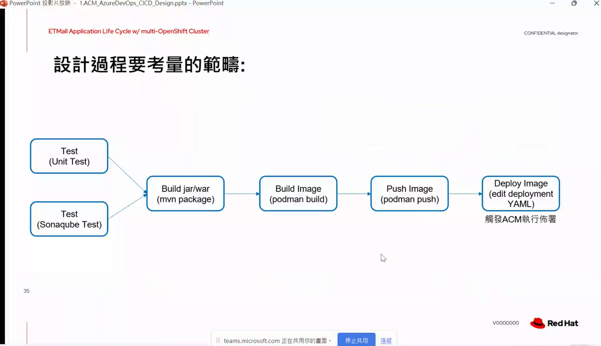

# ETMall-cicd-workshop-bing-v1.0-231030

Development Flow


- application release process
- azure devops
- redhat ansible automation/argo
- [redhat advanced cluster management](https://www.redhat.com/en/technologies/management/advanced-cluster-management)


- images => base image + application image
- use redhat universal image for security
- 


# ET2.0

SIT/UAT 2 site
- 用 docker image
 


`本次討論視角介於開發以及 infra之間(DevOps)`


由於維服務變動快速，需要上版的次數會變緊湊，需要有devops的腳色來協助開發人員，讓他們可以專注在開發上，而不是花費大量的時間在環境建置上，這樣可以讓開發人員可以更快速的上版，也可以讓維運人員可以更快速的部署，這樣可以讓整個團隊的效率更高。


- production以地端為主
- 一個環境一個cluster ? 
- 單一clsuter 或是 多cluster
- ACM 管理 cluster
- 可透過k8s內建的機制擴充pod數量
- 要考量大流量的點須知道系統的瓶頸會發生在哪邊
- Cluster 可否跨 WAN? 會造成影響會有latency的問題
  - 可設定新的App部屬在特定的worker上
  - 針對worker node資源不同配置不同的app


- ACM 背後使用GitOps的概念 [GitOps](https://www.redhat.com/zh/topics/devops/what-is-gitops)

```
GitOps 与 DevOps 之间有何区别？
GitOps 和 DevOps 的确在原则和目标上有着相同之处。DevOps 更侧重于文化转变，旨在为开发团队和运维团队提供一种协同工作方式。

而 GitOps 则为您提供工具和框架来采用 DevOps 实践，如协作、CI/CD 和版本控制，并将其应用于基础架构自动化和应用部署。开发人员可以在自己已经熟悉的代码存储库中作业，而运维部门则可以将其他必要组件落实到位。
```

pipeline 設計基本訴求
- 快
- 品質
- 高速自動化
- 快速反饋
- 標準化流程(可重複執行)
  


IaC 的程式碼在單一環境通常只會有一個版本(YAML檔)
- 透過git來管理版本 
- 


 

目前azure artifacts 目前不支援docker image，所以需要透過其他方式來管理docker image，透過 [Quay](https://quay.io/)管理

 


## 學習撰寫dockerfile
## YAML 檔案的管理
