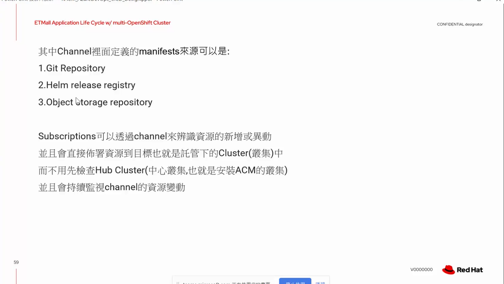

- ACM 有自有的subscription model

- imperative `直接式` 直接用cli建立
- declarative `宣告式` 透過yaml檔案建立 可做版控

- push式 賦予權限給k8s
- pull式 k8s自己去取得權限

- 須嚴格遵守single source of truth
- 透過gitops來達成 

- ACM Application Subscription Model

- 在創建時需要指定要sync的 repo 位置
- repo 帳號暴露給 k8s, 讓k8s可以去pull
- plcaement rule 紀錄要部屬到哪個cluster
- channel 紀錄要部屬到哪個namespace
- subscription 紀錄要部屬到哪個application

ACM subscrition model 範例

- kustomization.yaml

[參考](https://www.netron.asia/tw/newsDetail/34?kustomize)

- kustomize 會將所有的yaml檔案合併成一個

- 整合ansible Automation platform integration

# Universal Base Image & Quay

- 挑選適合的base image
- Red UBI 介紹
- Quay for org
- RBAC

挑選base image 的考量

- 架構
- 安全性
- 效能

 

