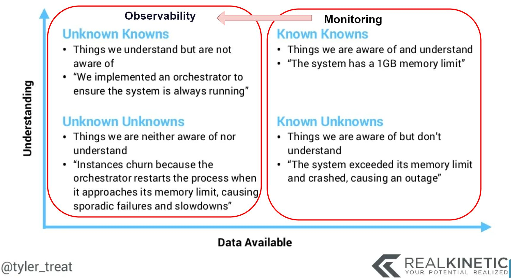
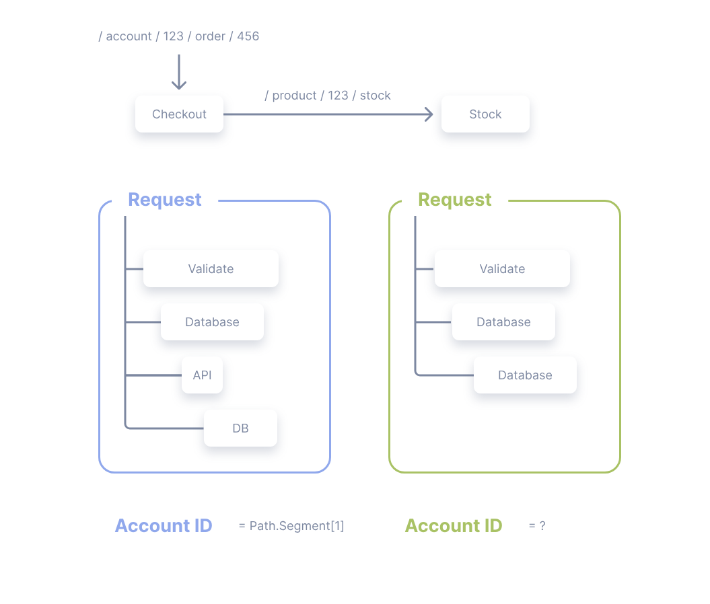

# 淺談 OpenTelemetry  

# 前言

本篇文章為介紹以及整理`Opentelemetry`此標準，包含前半部分的 `Concept` 以及 後半部分具體的 `Spec`。由於 `Spec` 內容較為生硬，可先閱讀前半Concept的部分。

本文撰寫時的OTel版本為: `1.25`

# 名詞定義

## 可觀察性(Observability)

分散式系統內容中的可觀察性是指可透過`監視`和`分析`每個元件狀態的狀態藉以觀察效能變更，以及診斷這些變更發生的能力
。白話一點的說法就是藉由`系統外的資訊觀察系統內部的運作狀態`。通常為侵入性的作法(埋code)，而且可能會影響應用程式的作業。

Observability三本柱

- Log
  - 泛指系統或應用程式運行所產生用來紀錄系統或程式資訊的文字檔

- Metrics
  - 為系統或程式在運行時的量化數據，通常為一數值化的結果，例如CPU使用率、記憶體使用量等
  
- Trace
  - 紀錄一個任意請求(Request)在不同應用中處裡的路徑，例如一個請求從前端進入後端，後端再呼叫其他服務，最後回傳給前端，這個過程中的每個步驟都會被記錄下來，並且可以透過`trace_id`來串聯這些步驟，這些都可稱為Traces。


 [來源](https://ithelp.ithome.com.tw/m/articles/10287306)


## 遙測資料(Telemetry)

指的是從跨越不同系統來源的迎用程式中收集資料，其中包含 log, metrics, trace 等資料。


# 淺談 OpenTelemetry (Concept)

由字面上`Open`以及`Telemetry`可得知`OpenTelemetry` （OTel） 是一種跨平臺、開放式`標準`，解決Telemetry資料的資料模型定義、檢測、採集、處理、輸出等標準化問題, 並提供一組標準化SDK、API與一些instrument工具.，其中包含以下內容:

- 程式碼執行時可用來記錄遙測資料的 API 標準定義。

- 開發人員用來設定將透過網路傳送哪些部分記錄資料的 API 、傳送至該資料的位置，以及如何篩選、緩衝、擴充和轉換。

- 提供遙測資料的命名和內容指引。 對於產生遙測資料和接收資料的工具的應用程式而言，請務必瞭解不同類型的資料，以及哪些資料類型很有用，以便工具提供有效的分析。

- 匯出的介面。可讓遙測資料以特定格式傳輸至不同的遙測後端。

- OTLP 有線通訊協定是廠商中性網路通訊協定選項，可用於傳輸遙測資料。 有些工具和廠商除了預先存在的專屬通訊協定之外，還支援此通訊協定。

使用 OTel 相容各種不同的 APM 系統，例如 Prometheus 和 Grafana 、 Azure Monitoring - Azure 中的 Microsoft APM 產品，或來自與 OpenTelemetry 合作的許多 APM 廠商 。

## Signal

Signal為OTEL裡的分類，其中可分為`Trace`, `Metrics`, `Logs` 以及`baggage`。

`Trace`、`Metrics`、`Logs`為前面所介紹的三本柱，baggage則是代表Span傳遞時所攜帶的資訊，例如trace_id, span_id等。

### Traces

Trace紀錄的一個任意的請求(Request)在不同應用中的路徑，例如一個請求從前端進入後端，後端再呼叫其他服務，最後回傳給前端，這個過程中的每個步驟都會被記錄下來，並且可以透過trace_id來串聯這些步驟，這些都可稱為Traces。

#### Context Propagation

Context Propagation是指在不同應用程式之間傳遞資訊的過程，例如在一個請求中，前端會將trace_id, span_id等資訊傳遞給後端，後端再將這些資訊傳遞給其他服務，這個過程就稱為Context Propagation。

#### Span

既然trace指的是一個請求在各應用中如何被處理的路徑，用來表示此trace的經歷內容就稱為span，span是trace的一部分，一個trace可以包含多個span，span也可以包含其他span，形成一個span tree。 以下為一個span的內容，可以看到span包含了trace_id, span_id, parent_id, start_time, end_time, attributes, events等資訊。

以下為Span的範例
```
{
  "name": "hello",
  "context": {
    "trace_id": "0x5b8aa5a2d2c872e8321cf37308d69df2",
    "span_id": "0x051581bf3cb55c13"
  },
  "parent_id": null,
  "start_time": "2022-04-29T18:52:58.114201Z",
  "end_time": "2022-04-29T18:52:58.114687Z",
  "attributes": {
    "http.route": "some_route1"
  },
  "events": [
    {
      "name": "Hello!",
      "timestamp": "2022-04-29T18:52:58.114561Z",
      "attributes": {
        "event_attributes": 1
      }
    }
  ]
}

```
#### Span Context

Span Context是指一個span的上下文，包含了trace_id, span_id, parent_id等資訊，這些資訊會在Context Propagation時被傳遞給其他應用程式。

#### Attributes 

Attributes 為一個key-value 的pairs，用來描述一個span的屬性，例如http.route, http.status_code等。

#### Span Events

Span Event 可以被視為Span上結構化的log，用來描述一個span的事件，例如一個span的開始、結束等。通常會含有timestamp標示事件發生的時間點。

### Metrics

Metrics 為系統或程式在運行時所擷取的一種量測數據，通常為一數值化的結果，例如CPU使用率、記憶體使用量等。在OpenTelemetry中有以下相關的component:

- Meter
- Metrics Expoter
- Meter Instrument
- Aggregation
- Views

### Logs

Log為一個有timestamp的文字數據，包含結構化以及非結構化的資料，在Observability中log有著最大的legacy stack，因log最容易產生且橫跨各系統以及工具等。在OpenTelemetry中，任何不是分散式追蹤或指標的資料都是log，例如事件就是log的一種。Opentelemetry中的log有以下相關的component:

- Logger Provider
- Logger Exporter

### Baggages

Baggage 為在span傳遞時所包含的前後上下文資訊。 是由Key-value的格式所組成。OpenTelemetry會用到前面所提到的Context Propagation去傳遞baggage。會需要baggage主要是因為當需要propogate span從一個service到另一個service，或是將context在各個signals中傳遞，都會需要用到baggage。Baggages適合用在儲存當下的context讓後面的應用可以繼續使用的情境。


Baggage 並不會直接出現在Span當中，因為Baggage並不會等於Span。當你將Baggage加入到Span中時，你必須要將Baggage轉換成Span的Attributes。

舉例來說，在.NET中，你可以這樣做:

```csharp
var accountId = Baggage.GetBaggage("AccountId");
Activity.Current?.SetTag("AccountId", accountId);
```

### Instrumentation

為了使一個系統可被觀測，應用程式中勢必要能產生會產生log, metric 以及log。在沒有人為的注入程式碼下而能蒐集到signal的方式稱為Automatic Instrumentation，反之則稱為Manual Instrumentation. 也可使用原生語言自有的library產生signal，這種方式稱為Native。 

### Spec

為了跨平台的需求以及可以跨語言的實作，OpenTelemetry提供了以下的定義

`API`: 定義了資料的類型以及各式各樣關於tracing, metrics以及logging的操作定義

`SDK`: 各語言的實作定義。組態設定 資料處裡以及輸出的規格皆定義於此

`Data`: 定義了與第三方軟體相容的OpenTelemetry Protocol (OTLP) 以及語意轉換的規範

### Collector

Collector做為proxy的腳色，負責接收、傳送以及輸出OTLP的遙測資料，也支援其他格式的遙測資料，例如Jaeger, Zipkin, Prometheus等。

### Language-specific API & SDK implementations

針對各個方法 OpenTelemetry 提供了統一的API介面定義以及同時提供了各種語言的SDK實作，其中功能包含

- Instrumentation Libraries
- Exporters
- Automatic Instrumentation
- Resource Detector
- Cross Service Propogator
- Sampler


# OpenTelemetry Specification


# TODO

1. 範例程式碼介紹
   - Log
   - trace
   - metrics
   - exporter
   - examplar
2. 

## resource


[淺談OpenTelemetry]([淺談OpenTelemetry](https://ithelp.ithome.com.tw/m/articles/10287771))

[Microsoft learning](https://learn.microsoft.com/zh-tw/dotnet/core/diagnostics/observability-with-otel)

https://code-maze.com/opentelemetry-in-dotnet/

https://training.onedoggo.com/tech-sharing/uncle-joe-teach-es-elastc-observability

https://opentelemetry.io/docs/specs/otel/metrics/data-model/#exemplars

https://marcus116.blogspot.com/2022/01/opentelemetry-in-asp-net.html.html