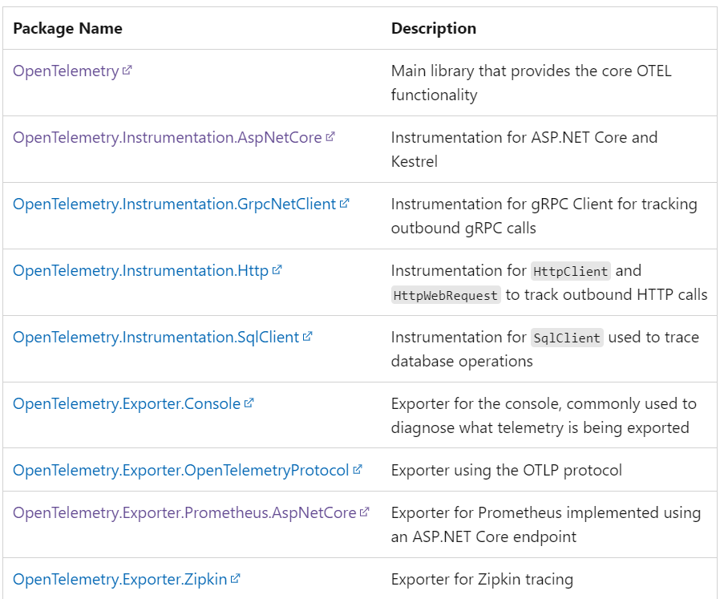
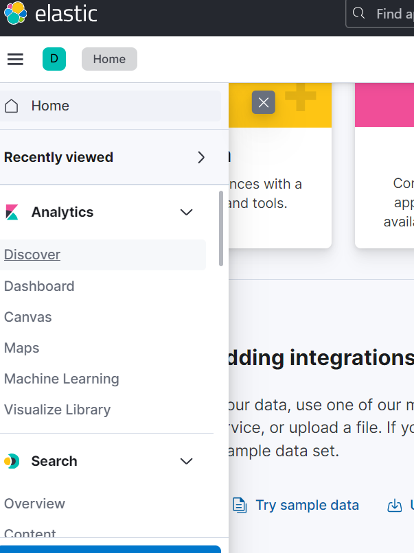
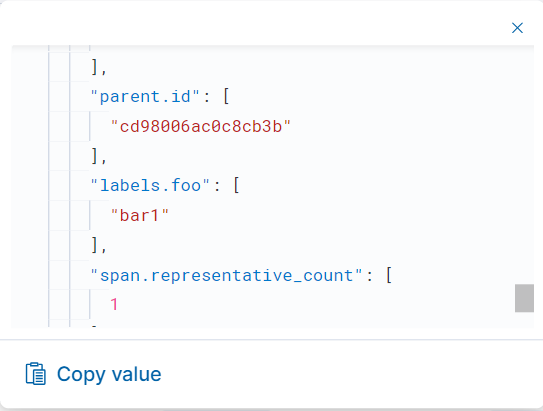
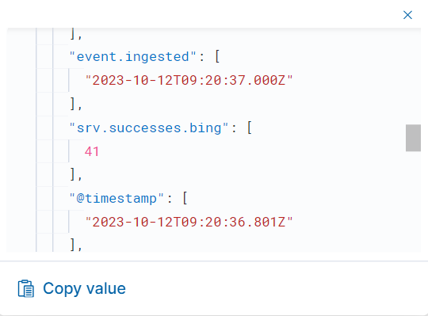

# OpenTelemetry .Net Instrumentation

at# 前言

本篇文章為研究如何在.net中使用OpenTelemetry進行Instrumentation，會探討Auto + manually 以及全 manually的內容

本文撰寫時的OTel版本為: `1.25`

# OpenTelemetry on .net

在.net framework中，已提供logging，metrics以及activity APIs 實作OTel的標準，代表OTel不用再額外提供APIs，只要使用原生的APIs即可。.Net OTel以下列的方式實作了OTel的標準

- Microsoft.Extensions.Logging.ILogger<TCategoryName> (Logging)
- System.Diagnostics.Metrics.Meter (Metrics)
- System.Diagnostics.ActivitySource and System.Diagnostics.Activity (Tracing)

`OpenTelemetry in .NET is implemented as a series of NuGet packages that form a couple of categories:`

- Core API
- Instrumentation - these packages collect instrumentation from the runtime and common libraries.
- Exporters - these interface with APM systems such as Prometheus, Jaeger, and OTLP.



## Register Customer Signals to Auto Instrumentation

第一種方式為在使用Automatic的情況下塞入自定義的Instrumentation，這種方式可以在`僅修改少量原始碼`的情況下，將自定義的Instrumentation塞入到Auto Instrumentation中。


接續先前`rollingDice`的範例，首先在專案中加入`System.Diagnostics.DiagnosticSource`的Nuget Package

```csharp
<PackageReference Include="System.Diagnostics.DiagnosticSource" Version="7.0.2" />
```

接著新增一個名為`source`的`ActivitySource`，使用的名稱為`Sample.DistributedTracing`

```csharp
 ActivitySource source = new ActivitySource("Sample.DistributedTracing", "1.1.0");
```

接著幫此Activity加入`key`為`foo`的tag，`value為bar1`


```csharp
using (var activity = source.StartActivity("Main"))
{
    activity?.SetTag("foo", "bar1"); //加入此trace要使用的log
}
``` 
接著就是開始建置後使用ELK觀察結果，首先到左方的`menu`選擇`discover`



接著左方的filter選擇`APM`


接著在右方可看到剛剛傳送上來的`traces`，點選其中一個並查看其內容。


可以看到剛剛設的tag已經被傳送上來了。


以上就成功埋入相關的tag到automatic instrumentation中了。

接著為嘗試加入`metrics`

首先一樣在專案中加入`System.Diagnostics.DiagnosticSource`的Nuget Package

接著在code裡加入以下的程式碼

```csharp
    var meter = new Meter("Sample.Service", "1.0");
    var successCounter = meter.CreateCounter<long>("srv.successes.bing", description: "Number of successful responses");
    successCounter.Add(1, new KeyValuePair<string, object?>("tagName", "tagValue"));
```
命名一個名為`Sample.Service`的`Meter`，並且建立一個名為`srv.successes.count`的`counter`，並且加入一個`tag`為`tagName`，`value為tagValue`的`counter`。
 
接著就是開始建置後使用ELK觀察結果，首先一樣到左方的`menu`選擇`discover`，並且左方的filter選擇`APM`
接著在右方的filter輸入`data_stream.type:"metrics" `，可看到下方出現相關的record，點選其中一條即可看到剛剛傳送上來的`srv.successes.bing`，並且可以看到剛剛設的tag已經被傳送上來了。



## Todo


1. manually instrumentation
2. manually register to Auto
3. metrics
4. trace
5. event/span/link
6. filter
7. sampling
8. processor

## resource


[淺談OpenTelemetry]([淺談OpenTelemetry](https://ithelp.ithome.com.tw/m/articles/10287771))

[Microsoft learning](https://learn.microsoft.com/zh-tw/dotnet/core/diagnostics/observability-with-otel)

https://code-maze.com/opentelemetry-in-dotnet/

https://training.onedoggo.com/tech-sharing/uncle-joe-teach-es-elastc-observability

https://opentelemetry.io/docs/specs/otel/metrics/data-model/#exemplars

https://marcus116.blogspot.com/2022/01/opentelemetry-in-asp-net.html.html