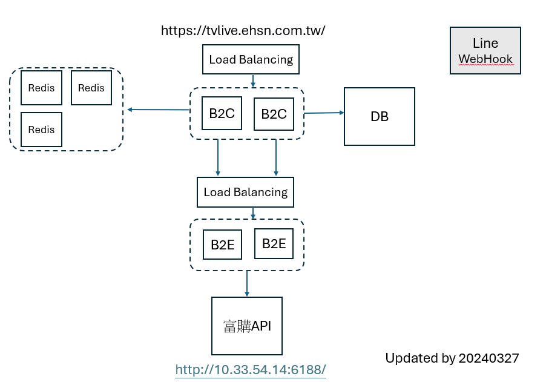
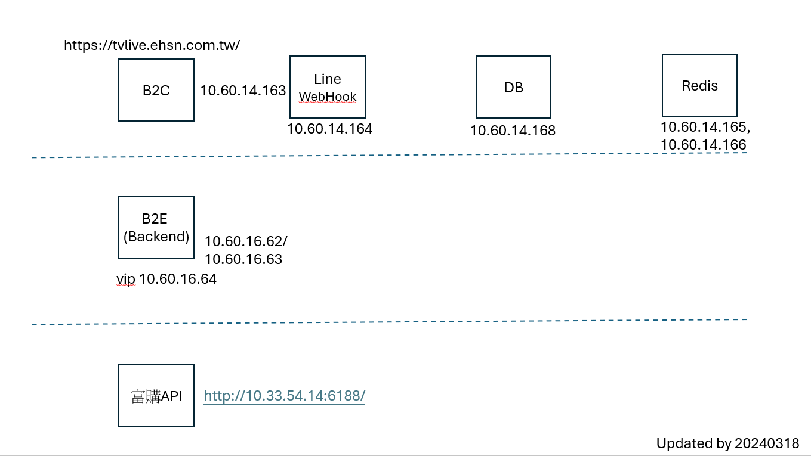
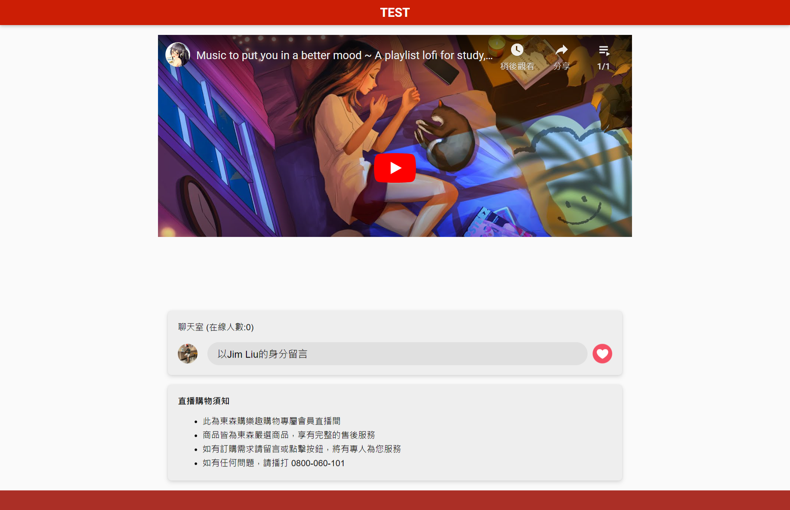
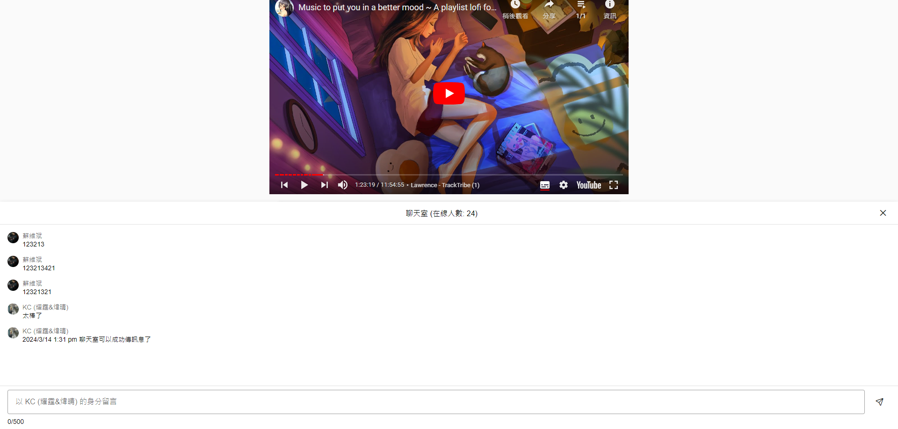

<!--
author: bing
created: 2024-03-06
description: 
-->

# 前情提要

因有直播需求短期要能有直播頁面可以直播，因B2C之前有做過類似專案，因此要直接拿B2C的code修改後，根據舊專案結構建立環境並且上線測試使用

## Project Overview

- B2C
  - .Net Framework 的專案，沒有後端分離
- B2E
  - 前後端分離
- Line Webhook
  - 用來接收Line的訊息 (240326版本不上)
- Jobs
  - 用來執行排程任務 (240326版本不上)
- DB schema
  - 從測試區DB dump出來的資料庫結構  
 
## 網路架構圖

- 3台 redis 做 cluster
- 2台b2c + load balancing
- 一台DB
- 2台B2E + load balancing
- 會外接fugoAPI
- 一台line webhooh(0326不上)
  
## infra 環境 overview

  - infra環境簡介
    - 三層式架構
      - app 對外 (10.14)
      - server (10.16)
      - DB Server (10.13)
    - 不同層由網段區分

## 架構圖

## CI/CD 流程

正式區 Jenkins 監控 https://gitlab.etzone.net/B2BB2E/live-stream-shopping-for-tv-dept master 分支，有異動便會build後佈版，
config需要透過維運人員進行更新設定

# 遇到的問題
- 機器間權限開通/申請
  - 只要跨不同網段都需要申請開通 
  - 跳板機連到正是區的申請
  - 開通VPN連到跳板機
- line 權限申請
  - 需要申請連線line服務的權限
- 打出去對外要proxy
  - 打對外的API需要使用proxy
- domain name 無法連 80/443 WAF開通
- 線上人數亂跳以及會有0的情況
  - 因為直播的人數是透過redis的key去計算，而發現165那台redis並沒被同步，因此會讀到0

  
# https相關設定

因為直播需要開通https，需要有憑證，目前都是統一infra前端有台WAF，再由WAF將443流量導到80 port，後端只需要監聽80即可

這邊有遇到個問題是websocket建立連線時也需要開通WAF的http2_websocket功能，不然會無法傳送訊息

# 專案 Timeline
0313 19:05 網頁成功顯示

0314 13:31 可留言成功(原本因WAF功能沒開而無法留言)

0326 順利直播

# 無法傳送聊天室訊息的解決方法
 
1.請 Larry 確認防火牆或是 WAF 有沒有阻擋 WebSocket

2.Larry 確認防火牆沒有阻擋 WebSocket

3.但是 WAF 在 192.168.132.179 這台 Virtual Server 上面沒有啟用 http2_websocket

4.Larry 在 WAF 網頁管理介面中，將 192.168.132.179 啟用 
http2_websocket，然後就可以正常傳送聊天室訊息了

ps: 192.168.132.179 會經由 WAF 轉到 10.60.14.163

# 小編模式要點兩次才到對應頁面的修正
 
原因概述 : 
Url路徑的大小寫問題，導致Cookie檢測出現錯亂。
 
詳情：
- events/livestream(都小寫)，我們一開始使用的是全小寫，所以在建立Authoruzation cookie的時候Path是events(小寫)。
- 當跳轉小編模式的聊天室窗時，Url是Events/BackStage(都是大寫)，因此在檢測Authorization Cookie的時候會在Path = Events的路徑下會找不到Cookie，因此會跳回到直播畫面。

# 頁面全白問題詳解

主要原因

1. 沒有用https連線
2. line api 登入需要使用proxy去打
3. 如果沒加line@好友也會變白

# 線上人數亂跳以及會有0的問題

## 問題分類
- 人數亂跳問題
- 數值為0問題
  
### 數值為0
- 線上人數主要是透過redis的key去紀錄，但是由於有一台redis沒有被同步到，因此每次讀時都會為0，後來通知infra確認後解決同步問題後就不在出現0

### 數值亂跳
- 數值亂跳的原因有幾個因素
- 原本的數值更新機制如下
  - 當有人進入直播間時，會將人數+1並通知所有人更新數值
  - 當有人進入直播間時，會將人數-1並通知所有人更新數值
  - 根據GA顯示人進入直播間時，停留時間短暫
- 根據以上原因，會導致數值常因人的進出而快速跳動
- 也因為停留時間短所以線上人數無法衝高
