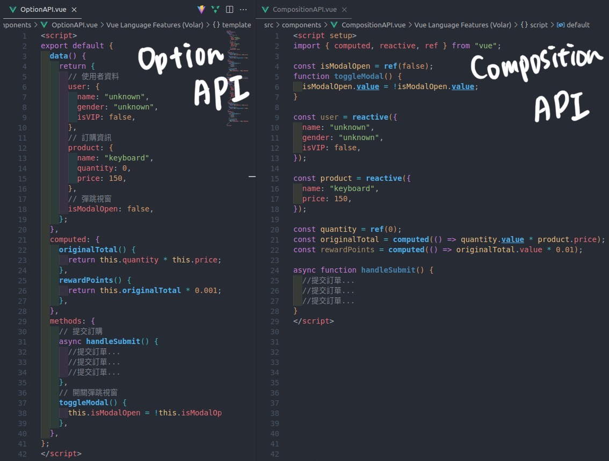
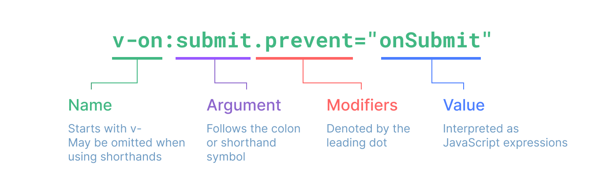
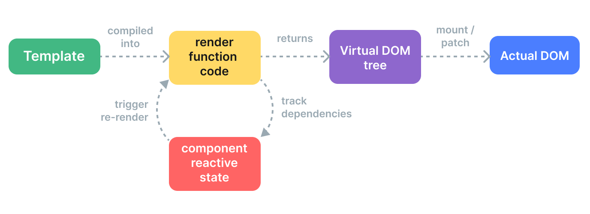

<!-- vscode-markdown-toc -->
* 1. [Vue3 入門](#Vue3)
* 2. [理解 `<script setup>` 的優點](#scriptsetup)
* 3. [什麼是 Vue directive？](#Vuedirective)

<!-- vscode-markdown-toc-config
	numbering=true
	autoSave=true
	/vscode-markdown-toc-config -->
<!-- /vscode-markdown-toc --># 目錄


##  1. <a name='Vue3'></a>Vue3 入門

以下為參考 iThome [真的好想離開 Vue 3 新手村 ](https://ithelp.ithome.com.tw/m/articles/10291010)的心得筆記

1. vue-cli 為vite的前身
2. vite的執行以及編譯速度更快
3. meta 為網頁提供給瀏覽器的相關資訊像是viewport (螢幕大小)[Viewport](https://ithelp.ithome.com.tw/articles/10195279)
4. main.js 為程式的進入點
5. Vue 3 提供 Option API 和 Composition API 兩種寫法，Option API 是延伸自 Vue 2 的寫法，Composition API 則是跟著 Vue 3 一起推出的新寫法。

Option API 和 Composition API 主要差別有兩個：

- 管理功能程式碼的方式
- Composables (Vue 官網翻譯成組合式函數)

所謂的 Option (選項)，就是 Vue 將程式碼根據特性不同，分類成資料(data)、方法(method)、計算屬性(computed)、生命週期......不同選項，讓開發者透過分別「宣告選項 (Option)」的方式，來定義元件內的邏輯。

舉例比較常用的 Option 如：

`data`：用來宣告響應式資料的初始值

`method`：用來宣告在元件中要使用的方法

`computed`：回傳對資料的加工或計算結果




`.vue`裡面一般只會有一個 `template`，內容會被傳到 @vue/compiler-dom 預編譯成 JavaScript 的渲染函式

每個 .vue 最多只能有一個 `<script>` (不包含 `<script setup>` )

##  2. <a name='scriptsetup'></a>理解 `<script setup>` 的優點


##  3. <a name='Vuedirective'></a>什麼是 Vue directive？

簡單來說，就是在 Vue 模板中，我們常常用到的 v- 開頭的「指令」，像是：v-if、v-for、v-bind 等等，都被稱作 directive，中文常看被翻成「指令」



- `v-text`: 更新元素的 textContent
- `v-html`: 更新元素的 innerHTML，注意 Vue 不會編譯這份 HTML，所以無法在裡面使用 vue 指令，也不會套用 scoped CSS
- `v-show`: 根據綁定條件(truthy / falsy)切換元素的 inline CSS
- `v-if、v-else-if、v-else`: 根據綁定條件(truthy / falsy)決定是否渲染或銷毀該元素
- `v-for`: 根據綁定的陣列、物件或數值渲染多個元素
- `v-on`: 為元素綁定事件監聽，可以縮寫為 @
- `v-bind`: 為元素動態綁定一個或多個屬性，可以縮寫為 :
- `v-model`: 為`<input>、<select>、<textarea>` 或元件做值與輸入的雙向綁定
- `v-slot`: 參數為 slot 名稱，能在 `<template>` 內放入對應的 slot 內容
- `v-pre`: 不要「編譯」這個元素和他的後代，直接渲染即可（可以用來呈現 {{ }}）
- `v-once`: 只渲染元素一次，未來不需要再更新
- `v-cloak`: 在沒有事前編譯打包的情況下，用來隱藏尚未編譯完成的模板(by CSS {display: none})，直接編譯完成再切換成顯示
- `v-memo`: 可以給一個固定長度的陣列，只在陣列內的項目 value 改變時，更新元素或元件，如果陣列內的項目都不變，會繼續使用之前記住的 sub-tree（舉例：- v-memo="[valueA, valueB]，在 valueA 或 valueB 改變時更新，而 v-memo=[] 和 v-once 效果一樣 ）

```
Vue 3 推出的 reactive() 跟 ref() 就是用來攔截資料的讀取跟寫入，所以在開發上所有需要響應性的資料，都需要傳入 reactive() 或 ref() 來處理。

reactive() 是用 Proxy 來實作，ref() 則是用 get和set 關鍵字來實作。

所以在進入 reactive() 或 ref() 之前，先來點原生 Javascript。
```



# 參考資料

[v-directive](https://vuejs.org/api/built-in-directives.html#v-text)

[真的好想離開 Vue 3 新手村 ](https://ithelp.ithome.com.tw/m/articles/10291010)