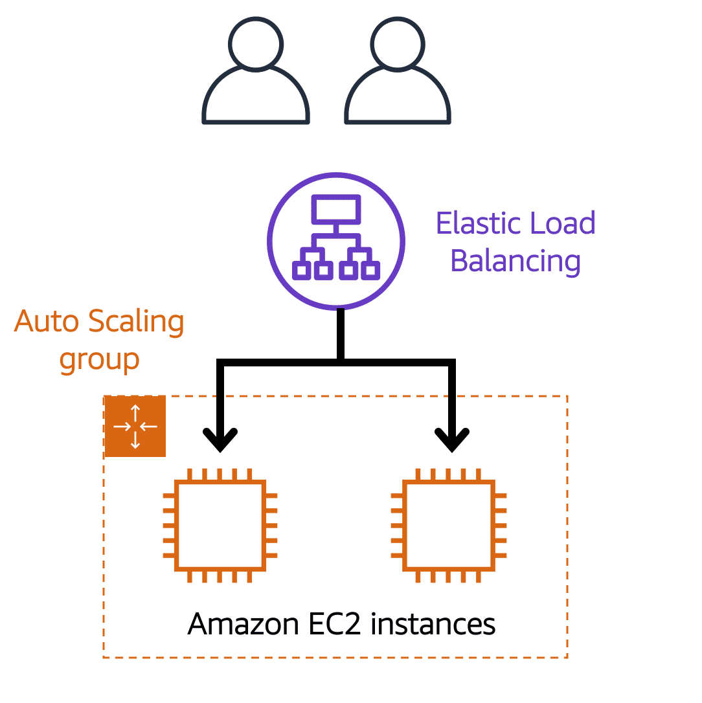
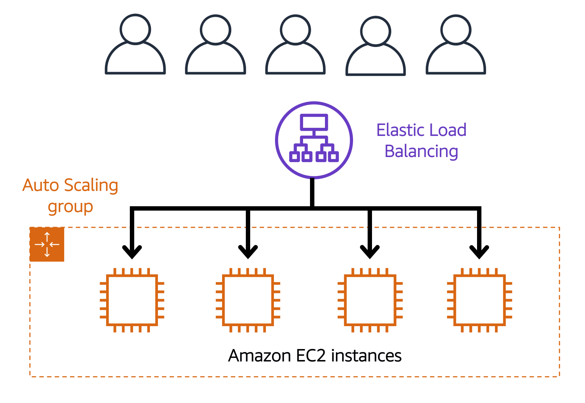
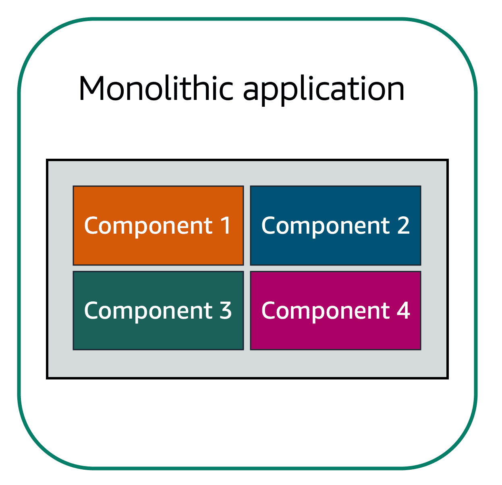
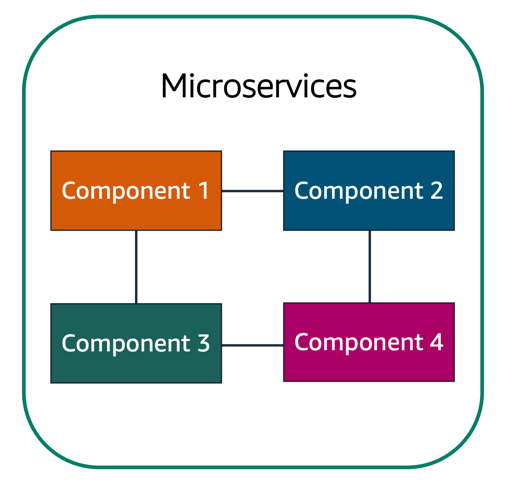
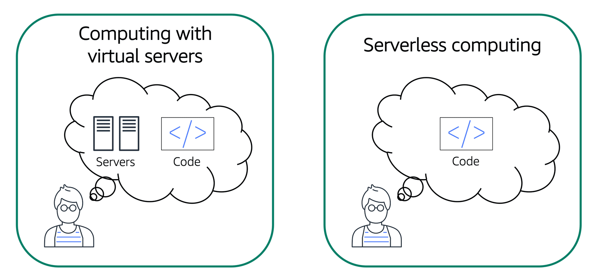
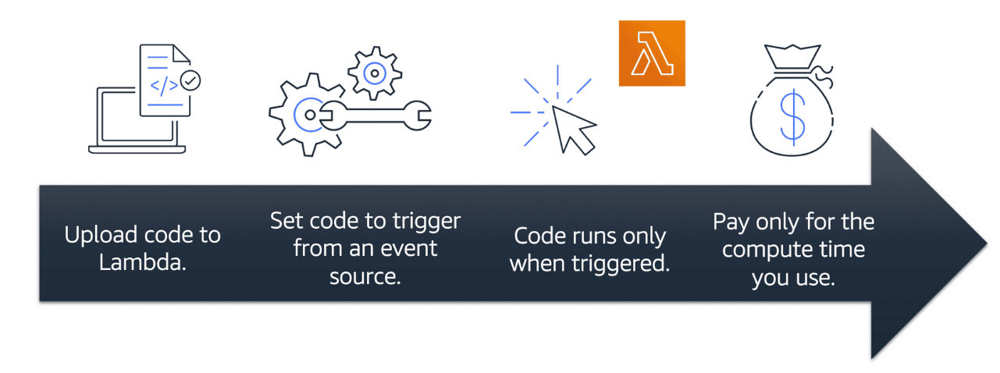

本文件記錄AWS Cloud Practitioner Essentials (Second Edition)的學習筆記。

相關連結:
[Skill Builder](https://explore.skillbuilder.aws/learn/course/134/play/93606/aws-cloud-practitioner-essentials)

# Introduction to AWS Cloud Essentials

## client-server model

In computing, a client can be a web browser or desktop application that a person interacts with to make requests to computer servers. A server can be services, such as Amazon Elastic Compute Cloud (Amazon EC2) – a type of virtual server.

## Deployment models for cloud computing

The three cloud computing deployment models are cloud-based, on-premises, and hybrid. 

- cloud-based Deployment
  - 
- on-premised 
  - deploy resources by using virtualization and resource management tools.
  - also known as a private cloud deployment
- hybrid 
  - Connect cloud-based resources to on-premises infrastructure.
  - Integrate cloud-based resources with legacy IT applications.

## Benefits of cloud computing

- Trade capital expense for variable expense
  - Instead of having to invest heavily in data centers and servers before you know how you’re going to use them, you can pay only when you consume computing resources, and pay only for how much you consume.
- stop money on running and maintaining data centers
  - focus on projects that differentiate your business, not the infrastructure.
- stop guess about capacity
  - scale up to meet spikes for your application, and scale down when you no longer need the additional resources.

# Amazon EC2

- provides secure, resizable compute capacity in the cloud as Amazon EC2 instances. 
- with an Amazon EC2 instance you can use a virtual server to run applications in the AWS Cloud.
- You can stop using it when you have finished running a workload
- You pay only for the compute time you use when an instance is running, not when it is stopped or terminated.

## Amazon EC2 instance type
- general purpose
- cpu optimized
- memory optimized
- accelerated computing
- storage optimized

## EC2 pricing model
- on-demand
  - pay for compute capacity by the second with no long-term commitments.
- reserved
  - provides a significant discount (up to 75 percent) compared to on-demand pricing.
  - you make a low, one-time, up-front payment for each instance you want to reserve, and in turn receive a significant discount on the hourly charge for that instance.
  - reserved instance options: 1 year or 3 years
- saving plans
  - offer the lowest prices on Amazon EC2 usage, in exchange for a commitment to a consistent amount of usage (measured in $/hour) for a 1- or 3-year term.

- spot instance
  - enable you to bid on unused Amazon EC2 capacity, known as spot instances.
  - 隨時可能被收回
  
- auto scaling
  - automatically scale your Amazon EC2 capacity up or down according to conditions you define.

## Elastic Load Balancing
- automatically distributes incoming application traffic across multiple Amazon EC2 instances.
- acts as a single point of contact for all incoming web traffic to your Auto Scaling group

Low demand

High-demand period

# Message Queue

- Applications are made of multiple components. The components communicate with each other to transmit data, fulfill requests, and keep the application running. 
- 
## monolithic application

## microservices approach

## SNS

Amazon Simple Notification Service (Amazon SNS) is a publish/subscribe service. Using Amazon SNS topics, a publisher publishes messages to subscribers. This is similar to the coffee shop; the cashier provides coffee orders to the barista who makes the drinks.

## SQS

Amazon Simple Queue Service (Amazon SQS) is a message queuing service. 

Using Amazon SQS, you can send, store, and receive messages between software components, without losing messages or requiring other services to be available

## Serverless computing

- Serverless computing allows you to build and run applications and services without thinking about servers.
- AWS Lambda(opens in a new tab) is a service that lets you run code without needing to provision or manage servers. 

# AWS Global Infrastructure

# EFS Elastic File System
## 定義 
- Amazon Elastic File System (Amazon EFS) provides a simple, scalable, fully managed elastic NFS file system for use with AWS Cloud services and on-premises resources.
## 優勢
- EFS is designed to be highly available and durable.
- EFS is a regional service that stores data within and across multiple Availability Zones (AZs) for high availability and durability.
## EFS vs EBS
- EFS is a shared file storage service that you can mount to multiple EC2 instances.
- EBS is a block storage service that you can mount to a single EC2 instance.

# Amazon Kinesis
## 定義
- Amazon Kinesis makes it easy to collect, process, and analyze real-time, streaming data so you can get timely insights and react quickly to new information.
- Amazon Kinesis enables you to ingest, buffer, and process streaming data in real time.

# Amazon Cloudtrail
## 定義
- AWS CloudTrail is a service that enables governance, compliance, operational auditing, and risk auditing of your AWS account. With CloudTrail, you can log, continuously monitor, and retain account activity related to actions across your AWS infrastructure.

# Amazon Step Functions
## 定義
- AWS Step Functions is a serverless function orchestrator that makes it easy to sequence AWS Lambda functions and multiple AWS services into business-critical applications.q
- Step Functions automatically triggers and tracks each step, and retries when there are errors, so your application executes in order and as expected.

# AWS Outposts
## 定義 
- AWS Outposts is a fully managed service that extends AWS infrastructure, AWS services, APIs, and tools to virtually any datacenter, co-location space, or on-premises facility for a truly consistent hybrid experience.

## Outposts vs EC2
- Outposts is a fully managed service that extends AWS infrastructure, AWS services, APIs, and tools to virtually any datacenter, co-location space, or on-premises facility for a truly consistent hybrid experience.
- EC2 is a web service that provides secure, resizable compute capacity in the cloud. It is designed to make web-scale cloud computing easier for developers.

# AWS Neptune
## 定義
- Amazon Neptune is a fast, reliable, fully managed graph database service that makes it easy to build and run applications that work with highly connected datasets.

# Amazon AppStream 2.0
## 定義
- Amazon AppStream 2.0 is a fully managed application streaming service that allows you to stream desktop applications from AWS to a web browser.