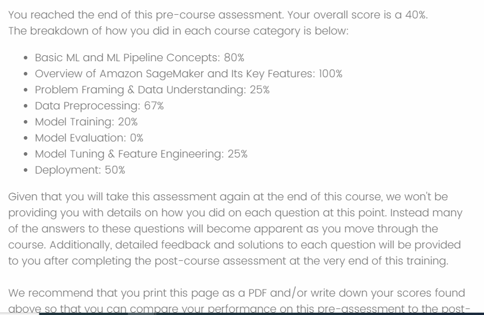

<!--
---
marp: true
theme: uncover
---

-->
# notion
https://wenlien1001.notion.site/2024-02-20-Machine-Learning-Pipeline-on-AWS-53387c70f6d94724af83a7dbfe0d0705

##

Pre-test

## machine learning categories

- supervised learning
  - binary classification
  - multi-class classification
  - regression
  - k-nearest neighbors 監督式學習
    - 找最近的k個點
- unsupervised learning
  - k-means clustering
    - 找重心
- reinforcement learning 
  - AWS Deep Racer
  - Agent/Environment/Action/Reward
    - Environment 給Agent一個狀態，Agent根據狀態做出一個行動，Environment給Agent一個reward/penalty

Model training
- data preprocessing
  - data cleaning
  - data transformation
  - data normalization
  - using 80% of data for training and 10% for validation and 10% for testing

- AWS Sagemaker
  - built-in algorithms
  - custom algorithms
  - hyperparameter tuning
  - model evaluation
  - model deployment