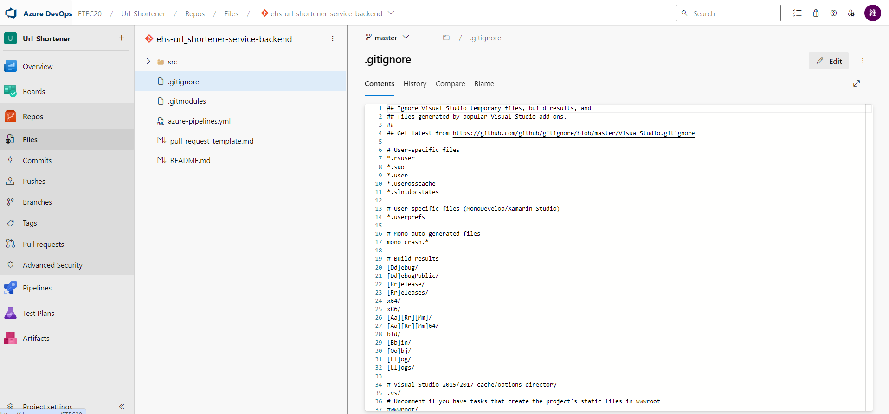
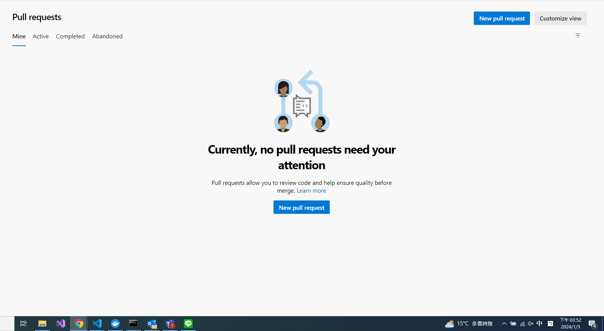
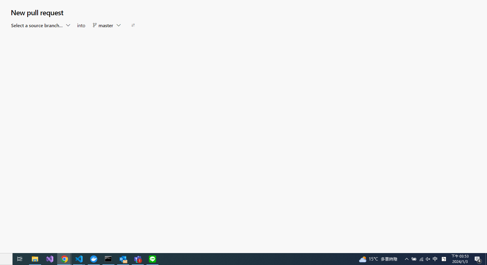
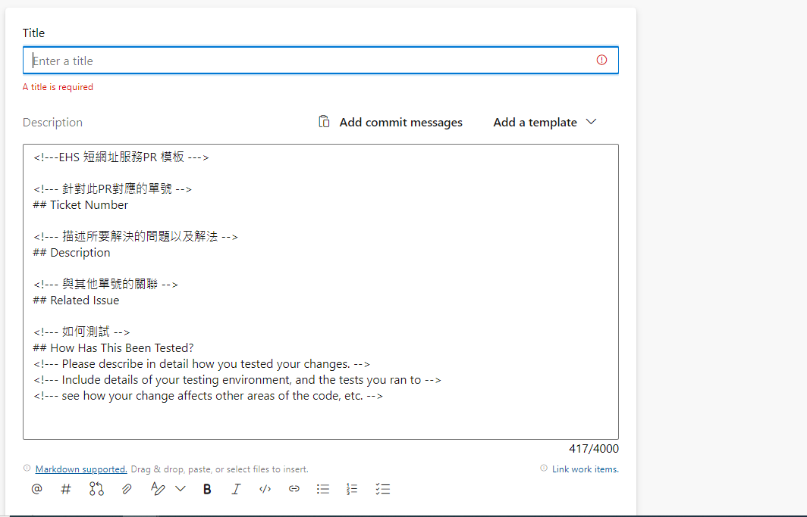
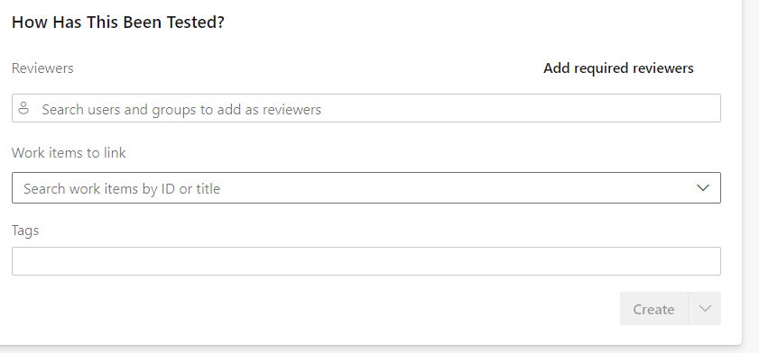
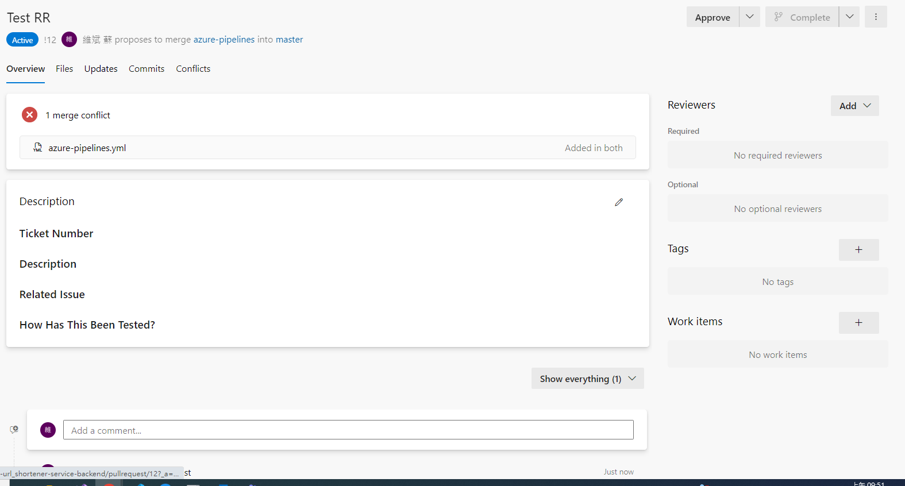
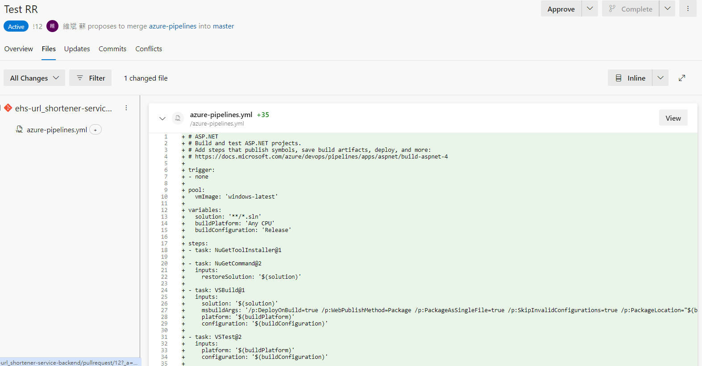
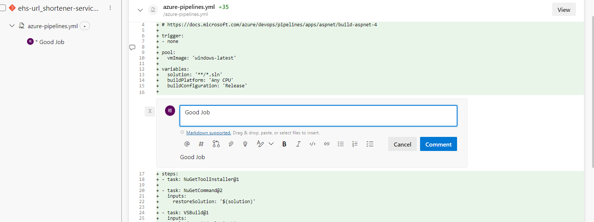

# Pull Request (Merge Request) Intro

## 什麼是PR?
Pull Requests(Merge Requests, MR)是一種開發流程中的一環，在進版前透過code review的方式，讓團隊成員可以一起討論、審查、確認、優化、修改程式碼，最後再將修改後的程式碼合併到主要的程式碼庫中，減少上code後產生的bug或是避免上錯code或merge到別的分支上。

## 流程

1. 建立新分支開發 -> 開發完後push新分支到remote -> 發出PR -> peer code review -> approved -> merge進dev -> CI/CD

## 發出PR

1. 點選左方的Repos 下方會有個Pull Requests

2. 點選New Pull Request

3. 選擇要merge的branch

4. 輸入Title和Description

5. 指定Reviewer後點選Create 

## code review

1. view changes / left comment
2. accept changes& merge

## Note  

1. code review會需要時間，修改也會需要時間，所以需要提早發出PR

## Why need code review?

- 減少bug
- share 經驗
- 統一團隊開發風格以及domain knowledge 
