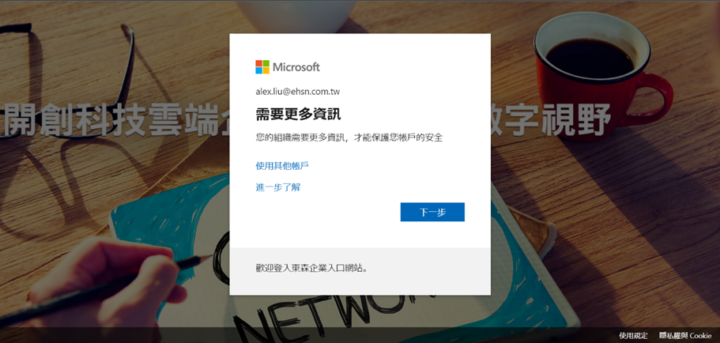
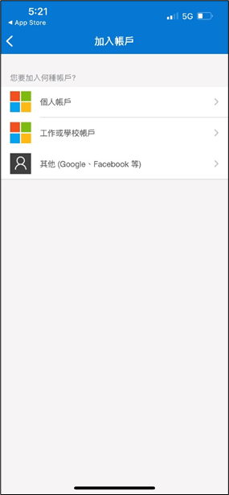
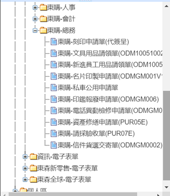
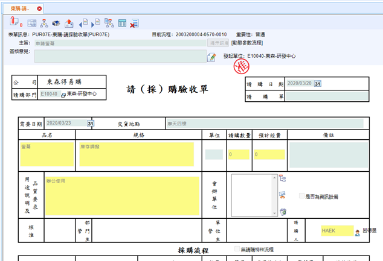

# b2b/b2e新人到職環境安裝

## 文件說明

此文件主要提供B2B新人報到時可快速上手部門內部的作業流程以及環境建置作業包含新人常見的F&Q，希望能透過此文件快速開始進行研發作業。

## 常用文件

- [B2E-EC概念-新人教育訓練](https://sensengo.sharepoint.com/:p:/s/b2be_po/EUyxmq07ITpOpaGteQ8gJWkBN05pl880tbXSssBOAuCy1g?e=cJPZZK)
- [Api文件](https://dev-bpbe01.etzone.net/o/swagger/index.html)
- [API文件說明](http://b2b-lab.etzone.net/B2BAPIGuide/Home/index)
- [DB Schema 文件](http://dev-webbe01.etzone.net/dbschema/)
- [東購2.0架構圖](https://sensengo.sharepoint.com/:i:/s/b2be_po/Eb6D49LzxrhBmX9fX5934KABe25R8lTQqx3Ok4NyGAbbsA?e=e2XQGK)
- [ETM2.0-IFA-後端框架技術棧說明](https://sensengo.sharepoint.com/:p:/s/b2be_po/EV--kjwrO5ZOhRdCyegiuOsBDW7QAp7oE6I6rmauS9jlnQ?e=4CGLLt)
- [Git協同作業說明](https://sensengo.sharepoint.com/:p:/s/b2be_po/EV--kjwrO5ZOhRdCyegiuOsBDW7QAp7oE6I6rmauS9jlnQ?e=4CGLLt)
- [本機開發環境建置說明](https://sensengo.sharepoint.com/:w:/s/b2be_po/EU7flJOcb6BIqi44AV7hK6oBP3w_6QaleVmzfc2yeXXb3w?e=GZmr0A)
- [後台程式撰寫規範](https://sensengo.sharepoint.com/:w:/s/b2be_po/EQ7XePNUW9ZOiK5LhiR9fLMBk_LLJc2iNQgnzz-jZG5IbA?e=VzzsdS)
- [程式上版操作流程](https://sensengo.sharepoint.com/:w:/s/b2be_po/EZMA6_C9BbtHvzk6794uLk4BNcdAmhZekOlhRXJTvYbd7A?e=xwyPTb)

## 常用連結

[EZFlow](https://ezflow.ehsn.com.tw/efnet/)  申請電子表單

[104簽核](https://ehr.ehsn.com.tw/ehrportal/LoginFOrginal.asp) 請假申請

[GitLab](https://gitlab.etzone.net/) (需用ETZone)

[Redmine](https://redmine.etzone.net/) (需用ETZone)

## 環境建置

### AD帳號登入(一定優先做不然要重設定!!!)

1.	需要先用一台可以連公司內網的電腦將預設密碼(1234_abc那串)修改掉後才可進行下列登入步驟
2.	公司使用Azure Active Directory(Azure AD)統一管理使用者，電腦需以公司帳號(xxx.xx@ehsn.com.tw)登入。

`點選頭像->變更帳戶設定` 

 
側欄選擇「存取公司或學校資源」,中間會出現 +連線，點選[+] 
如果下方列表已有連線表列，建議先中斷那些項目的連線後，再點選[+]開始設定

`[重要步驟]請點選下方「將此裝置加入Azure Active Directory」`

在此處輸入email (xxx.xx@ehsn.com.tw)和密碼進行登入 (請務必先進行步驟3)
若不慎跳過步驟3，請回到步驟2移除連線再加入一次

會出現如下的提示框，點選加入，即可見到連線列表中，出現
「已連線到東森集團企業的Azure AD」

再次點選頭像，可見清單最下方出現「切換帳戶」選項，點選切換帳戶

[本步驟無截圖] 出現登入畫面，本次請選「其他使用者」，輸入帳號(xxx.xx@ehsn.com.tw)和密碼登入。(之後登入會出現AD 帳號的選項，不必每次從「其他使用者」開始)
 

確認所有環境和資料均已移植與備份完成後，可刪除原有本機帳號
(重要資料與環境設定請務必確認已移植與備份完成)

## 設定Microsoft 帳號雙步驟驗證 

說明: 公司Azure Active Directory(Azure AD)有設定雙步驟驗證，在登入Microsoft 前需先依照以下步驟設定。

1.	前往Microsoft office 365官網，點選下方登入，登入公司帳號(xxx.xx@ehsn.com.tw)和密碼。

2.	登入後會顯示需要更多資訊，點選下一步。

3.  可使用Microsoft Authenticator(步驟4.)或點選「我想要使用其他驗證器應用程式」選擇使用google Authenticator(步驟5.)及其他驗證應用程式。

4.	使用Microsoft Authenticator驗證:
4.1.	手機下載Microsoft Authenticator
4.2.	點選加入帳戶後，選擇工作或學校帳戶。

4.3.	選擇「掃描QR Code」，並掃描畫面提供的QR Code。

4.4.	進入後會顯示東森集團企業，點選後可取得單次密碼驗證。

4.5.	回到瀏覽器點選下一步，並於App點選「核准」(每次登入都需要至此核准)。

 
5.	使用Google Authenticator

5.1.	手機下載Google Authenticator
5.2.	進入後點選登入(需使用本人google 帳號)

5.3.	選擇「掃描QR Code」，並掃描畫面提供的QR Code。

 5.4.	掃描成功後可以看到驗證碼，瀏覽器點選下一步輸入驗證碼(每次登入公司Microsoft帳號都需要輸入驗證碼)。

   

 5.5.	設定應用程式密碼名稱(最短需8個字元)，並記錄下應用程式密碼(拍照或筆記等其他方式)。之後可使用應用程式密碼代替驗證碼()。
 
 

 

 

 登入成功
 

## MS 365設定

[連結](https://www.microsoft365.com/?auth=2)

使用公司信箱以及密碼登入MS 365 可下載MS Office系列軟體以及 Teams

`**開啟Teams後請主管Josh幫忙加入各群組`

## ETzone Wifi設定

`說明: 初次取得電腦時Wifi應該是連接到「EHS-3-1-Room」，此wifi可用於連接外部網路。如需存取公司內部網路資源(如GitLab)，請先設定ETzone Wifi。`

1.	首先於ETzone wifi 的mac address線上[申請表](https://forms.office.com/Pages/ResponsePage.aspx?id=LRf1RQh20UulKsOn3gQj00ajY3LOAC5Gny2ic-ihpP9UQ0NONDJJMFRZUTI1UktMOUI2WTBTWDBOTyQlQCN0PWcu&wdLOR=c33A572C1-7C79-41BF-9D5F-2A92EC9E7FDA)填寫資料(Wifi mac address的查找辦法請見步驟2.)。

2.	Wifi mac address查找辦法
2.1.	開啟命令提示字元輸入「ipconfig /all」。

 
2.2.	找到「無線區域網路介面卡 Wi-Fi」的「實體位址」即為Wifi mac address。

3.	送出後請聯絡鋕昇(分機：1215) 或 家慶(分機：1216) 協助開通，開通後會收到Email以及密碼。
4.	連接ETzone Wifi。

## 開通Gitlab以及Redmine

`在連上ETZone後開啟一下網址`

[Redmine](https://redmine.etzone.net/)
[Gitlab](https://gitlab.etzone.net/)

`因為Redmine以及Gitlab帳號開通需要Josh幫忙開通需要時間 因此可先申請節省後面時間`

## 開通ELK權限

`在連上ETZone後找到本機的ip，將此ip寄信給 連亞琳 說要開通ELK權限`

B2B ELK: http://10.60.17.105:5601/
Username:elastic
Password:1234_abc

## GitLab SSH設定

1.	Git 是使用SSH Protocol進行安全的身份驗證和通訊，請先製作SSH Key。製作方法參考附錄1。
2.	前往Gitlab，透過微軟帳號登入(Sign in with Azure Oauth2)。
備註: 如果沒有連至ETzone，無法進入公司內部GitLab。

3.	點選右上角的箭頭、選擇Setting進入帳號設定。
點選SSH Keys將產生的公鑰貼上，系統會自動將 Comment 填入 Title 的欄位，然後按下「Add key」增加 SSH Keys

4.	在Projects的地方看不到專案是因為沒有權限的緣故，請主管 Josh 開啟Repository權限

## Redmine

`請先確認「環境建置」項目皆完成。並將Wifi連接至「ETzone」。`

1.	使用AD帳號登入(Login via Azure)，第一次會無法登入，聯絡Josh協助開通帳戶

2.	若帳號開通會收到以下此信件

Redmine以及Gitlab開通後需要寄封申請開通的電子公文

1.	請開啟EZFlow  https://ezflow.ehsn.com.tw/efnet/
2.	登入後點選左方的 RES電子表單模組 -> 電子表單清單 -> 資訊-電子表單 -> 權限申請 -> 網站系統權限申請

以下為公文內容參考範例，填完後送出，大約隔天即可收到通知信．

## 申請螢幕

登入 EZFlow後點選左方的電子表單模組 東購電子表單-> 東購總務 -> 東購 -> 請採驗收單

可依照下方範例填寫

## 建立D槽

說明: 由於部分專案設定路徑是寫在D槽，如果不建立D槽可能會產生專案建置錯誤。
1.	建議先檢查是否有 D 槽可以使用，若沒有的話 則依照以下步驟建立新的磁碟分割區
1.1.	左下角的開始按鈕右鍵點選 → 磁碟管理

1.2.	對待變更的磁碟右鍵→壓縮磁碟區→輸入 D 槽大小，如果電腦硬碟是512GB，建議200GB~220GB左右分配給D槽。
備註: (磁碟分割計算單位是MB，1GB = 1024MB，Ex:220GB = 220*1024MB = 225280MB)

1.3.	針對新加入的磁碟區塊右鍵「新增簡單磁區」並指定成 D 槽

1.4.	建立完成畫面

安裝本機建置環境

請依照SCM方案_本機開發環境建置文件_xxxxx_xxxxxx(xxx為版本以及日期)此文件

開始建置環境。

## 製作SSH Key

`說明: 在Git版本控制系統操作時，Git 是使用SSH Protocol進行安全的身份驗證和通訊。在使用Git前請先產生SSH Key。 SSH Protocol是一種安全的網絡協議，可以提供安全的身份驗證和加密通訊。使用SSH Key進行身分驗證比直接使用帳號密碼更加安全。以下提供兩種製作SSH Key的方法`

### 使用SSH-Keygen產Key(請使用此方法)

1.	打開Git Bash
2.	輸入ssh-keygen -C "你的標註"

3.	此時會出現產生Key的提示，並請你輸入儲存Key的檔案，什麼都不輸入直接按下Enter即可

4.	此時會出現請你輸入密碼(Passphrase)以及再次輸入的提示，依個人需求設定，空白表示不設定。如果有設定Passphrase，則每次用此SSH Key登入都需要輸入這個密碼。

5.	SSH會產生兩組金鑰，id_rsa以及id_rsa.pub，前者為私鑰後者為公鑰。在預設的情況下，完成後可以在C:\Users\<<UserName>>\.ssh找到你的Key

備註: 使用SSH-Keygen產生的Key為OpenSSH格式

### 使用 PuTTY Key Generator建置對應的SSH

`(備註：若已使用上面的「使用SSH-Keygen產Key」，則這步不須要做)`

1.	開啟 PuTTY Key Generator → 點選 Generate 產生 Key 值

2.	在粉紅色區塊移動滑鼠，直到進度條跑完

     
3.	設定 SSH 的名稱和驗證密碼，並按下 Save Private key

 

備註: 使用PuTTY Key Generator產生的Key為PuTTY格式
 
## Source Tree 安裝

1.	至Source Tree官網下載
2.	會需要先註冊一個 Bitbucket帳號，可使用公司Microsoft帳號綁定

3.	選擇要安裝的工具: Mercurial也是一種分散式的版本控制軟體，可選擇不安裝。

4.	設置人員: 如有登入會直接帶入名稱以及帳號
5.	設置SSH: 如果沒有SSH Key，可參考上方SSH製作環節。

