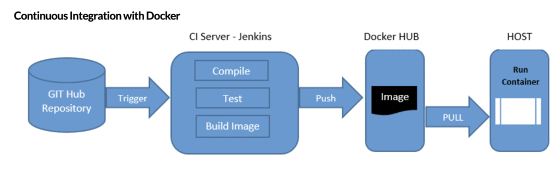
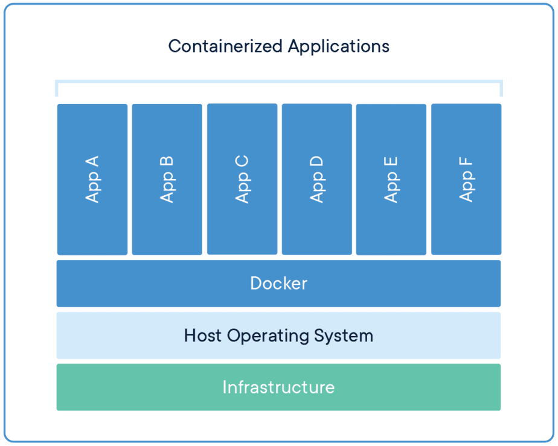
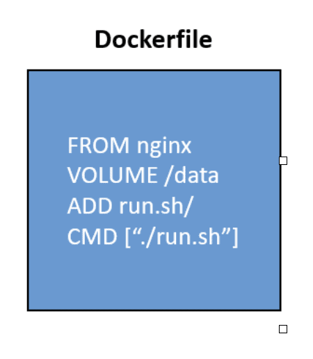
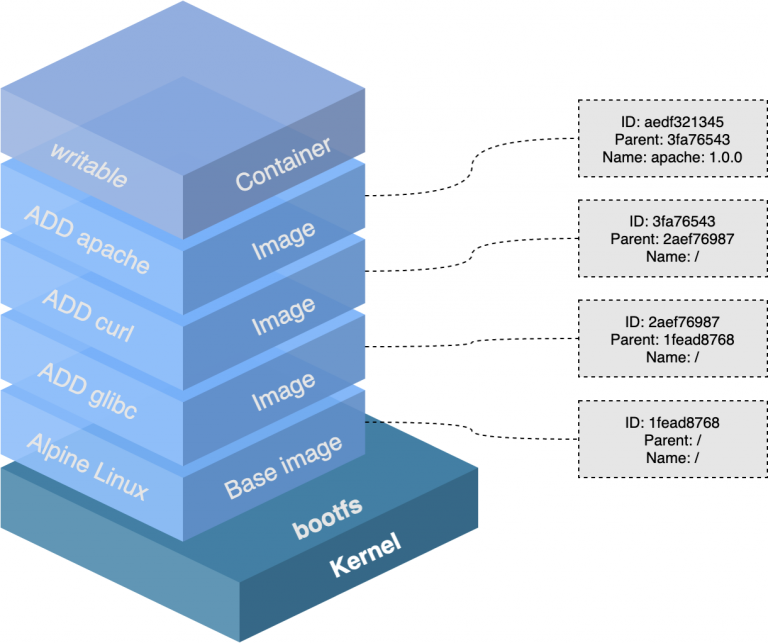
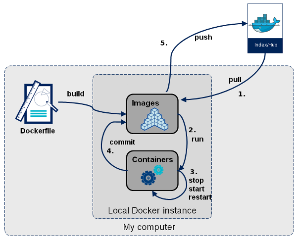

# docker

## What is docker

Docker 是一種開源軟體平台，讓開發者可以在虛擬環境中，開發、部署和管理任的何應用程式。Docker 的輕量化特性，提供應用程式獨立的測試環境。讓使用者只需專注於應用程式的開發，為他們省下建置環境的時間與精力。

## Why docker

- fast deployment
- version control
- ci/cd



## build images # 建立 images
  - Dockerfile
  - docker build
  - docker commit
  - docker save

## containerize

容器化是一種在概念上相似於VM，但在原理上略有不同的技術，其主要目的在於提供開發者用於應用程式的隔離環境供開發者將想測試的應用程式與 Dependency（相依性資源）封裝於容器進行。容器化與 VM 的相異之處在於，由於容器不會模擬系統底層的基礎架構，因此需耗費的資源也相對較低。開發者能夠在容器內配置不同的資源，因為每個容器都獨立運行且彼此之間不會互相影響。透過容器化，開發者也可快速替換容器內的映象檔，以達到快速部署的目的。



## docker components

- dockerfile

用於建立映像檔的檔案，描述映像檔的內容以及相關指令



- image

Docker 映像檔是創建容器的模板，我們能將它想像為一種虛擬機快照（snapshot），映像檔包含了開發者需要部署的應用程式、作業系統和編譯環境。開發者能透過映像檔建置不同的容器，在容器中，每個應用程式都是獨立運行的，彼此互不影響。



## docker flow




## docker-compose

Docker Compose 是一個用於定義和運行多個 Docker 容器應用程序的工具。它使您能夠使用一個 YAML 文件來配置應用程序的服務、網絡、卷和環境變數，然後使用單個命令來啟動整個應用程序堆疊。Docker Compose 提供了一種簡單而有效的方法，以確保不同容器之間的依賴關係和配置一致性。

[CheatSheet](https://devhints.io/docker-compose)

```yaml
version: "3.8"  # 指定 docker-compose 版本
services: # 定義要使用的服務
  elasticsearch: # Service Name
     image: elasticsearch:8.10.2 # Image Name/ url
     environment: # 環境變數
      - discovery.type=single-node # 指定使用單節點模式
      - network.host=0.0.0.0
      - http.host=0.0.0.0
      - xpack.security.enabled=true
      - xpack.security.authc.api_key.enabled=true
      - ELASTIC_PASSWORD=changeme
     ports:
       - 9200:9200 # 將容器的 9200 port 對應到主機的 9200 port
       - 9300:9300   
     healthcheck: # 檢查節點是否正常運行
       test: nc -z localhost 9200 || exit 1
       interval: 5s
       timeout: 10s
       retries: 100
```

## docker desktop

Docker Desktop 是一個用於 Mac 和 Windows 的應用程式，可讓您在本機開發和測試 Docker 應用程式。Docker Desktop 包含 Docker Engine、Docker CLI 客戶端、Docker Compose、Notary、Kubernetes、和 Credential Helper。

# podman

## Daemonless

"Daemonless" 意味着一個軟件或應用程序在運行時不需要守護程序或背景伺服器進程。在容器化上下文中，"Daemonless" 通常指的是容器管理工具（例如 Podman）的運作方式，這些工具運行容器而無需在系統中運行一個永久性的守護程序（通常稱為 Docker 守護程序）。

傳統的容器管理工具，如 Docker，運行時需要一個守護程序（伺服器），該守護程序負責管理和監視容器的生命週期，處理容器的建立、啟動、停止和銷毀等操作。這個守護程序通常在背景運行，並依賴於系統的特定功能，例如 Linux 上的dockerd 守護程序。

然而，"Daemonless" 容器工具，如 Podman，採用不同的方法。它們運行容器的方式是直接在命令行中執行相關命令，而無需背景守護程序。每次您運行一個容器命令時，工具都會處理容器的生命週期，並在命令完成後清理資源。這種方式降低了安全風險，因為無需在系統上運行永久性的守護程序，也減少了系統資源的使用。

"Daemonless" 容器工具還通常支持 "Rootless Containers"，這意味著您可以運行容器而無需超級用戶權限，提高了容器的安全性。 Podman 是一個具有這些特性的 "Daemonless" 容器工具的示例。

## Pod

Podman跟Docker一樣是個容器管理程式。與Docker高度相似，方便 Docker使用者可以無痛轉移到Podman平台。Podman有個與 Docker很不相同的特色，就是Podman 是daemonless，不需經由daemon管理容器運行。對一般伺服器使用者而言，最明顯的差別就是，利用top觀察實驗室裡有誰在競爭運算資源的時候，如果容器是用Docker管理的，只會看到一堆由Docker身分代行的程式；如果是用Podman管理容器，則可直接看到是那個使用者在競爭運算資源。Podman rootless mode更是由使用者帳號自己管理自己的容器倉庫，伺服器管理者也不用擔心由使用者帳號執行的容器會有越權問題。


# reference

- https://cloud.tencent.com/developer/article/1976198
- https://dockerlabs.collabnix.com/docker/cheatsheet/
- https://www.omniwaresoft.com.tw/product-news/docker-news/docker-introduction/
- https://www.cc.ntu.edu.tw/chinese/epaper/0059/20211220_5907.html
- https://www.redhat.com/en/topics/containers/what-is-podman
- https://editor.leonh.space/2022/podman/