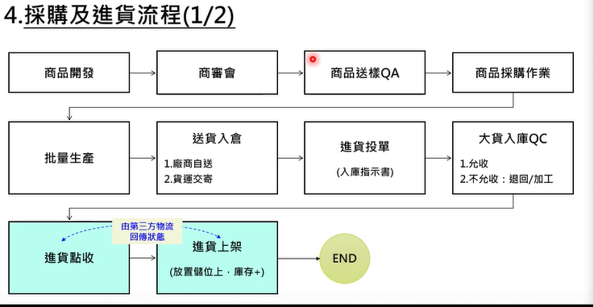
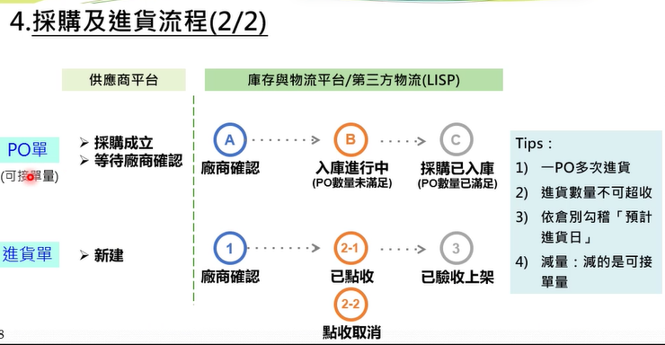
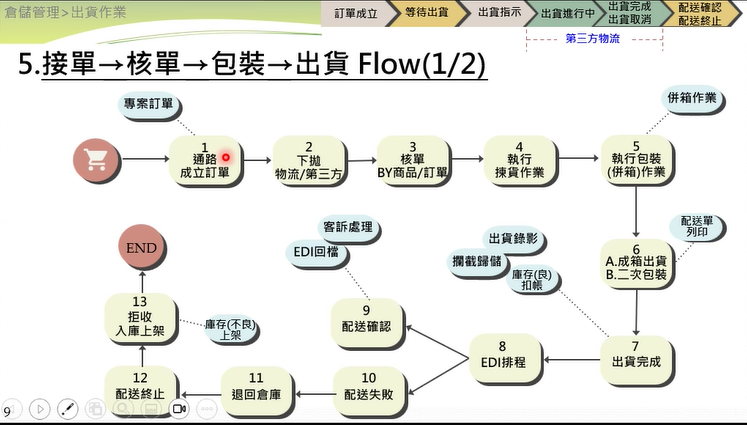
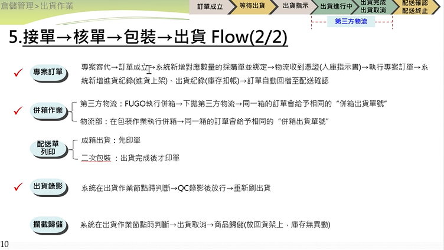
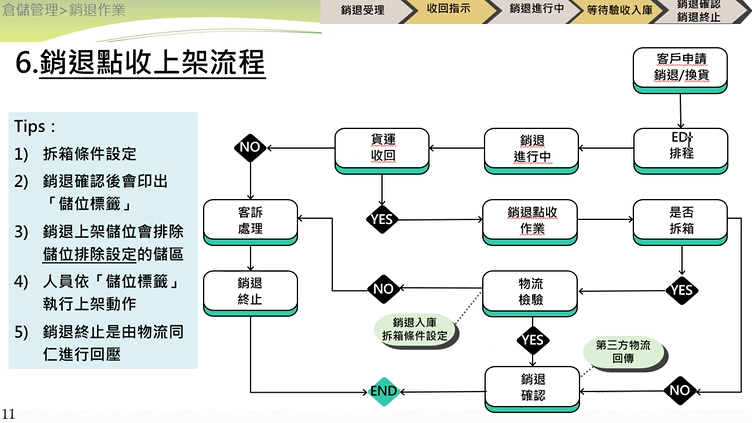
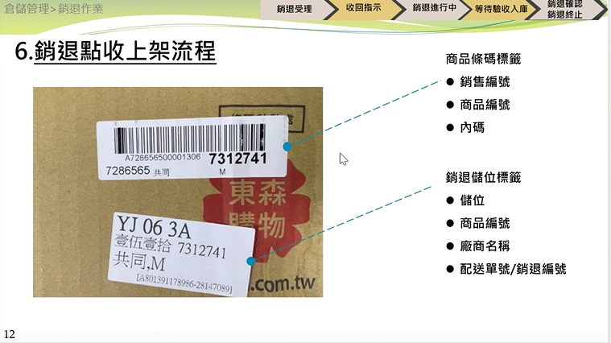
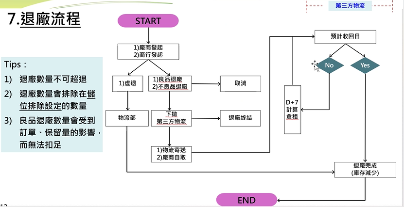
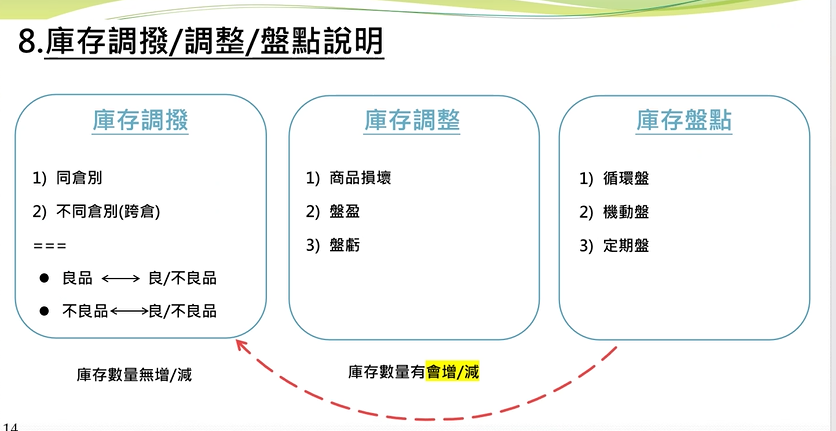

 
<!--
---
竹君第二次上課
---

-->

- 包裝會影響出貨方式
- 包裝有6種
  - 制式紙箱，條碼為自編碼(商品編號)
  - 原箱，商品原本的包裝，條碼有自編碼以及國際條碼
  - 裸品，沒有包裝，條碼為自編碼，會二次包裝
  - 環保便利袋，條碼自編碼，有兩條膠帶，不一定要二次包裝
  - 破壞袋，一次使用
  - 循環袋，可以重複使用
- 採購流程
- 
- QC兩種
  - 大貨QC -> 指的是很多貨要進來要QC
  - 商品QC -> 指的是單一商品要進來要QC
  - 當廠商送貨到物流中心時要做進貨投單(入庫指示書，就像掛號)
  - 接著會做大貨QC
    - 允收
    - 不允收 ->退回/加工
  - 接著要點收(算數量，看醫生)
  - 進貨上架(放到儲位上) -> 庫存+1
- 
- 進貨單狀態->新建->廠商確認->已點收(在第三方物流，但會回到富購)->已驗收
                          ->點收取消-> 回到新建

- 一PO單可以分多次進貨 ex. 一PO單有10件商品，可以分成2次進貨，第一次進貨5件，第二次進貨5件
- 一採購單會對應多張進貨單
- 同時間只會有一張進貨單，不會有同時存在多張進貨單，此時PO單狀態為入庫進行中
- 不可超收
- 採購單有個預計進貨日，要先滿足較早的進貨日才能進貨
- 採購單上會有"預計進貨日"
- 供應商可加量，因有時可能賣量不錯，所以廠商可自行加量
- 減量:減的是可接單量

- 通路成立訂單後下拋到第三方
  - 可用庫存量
- 核單 -> 方便撿貨
  - by商品/訂單
  - by訂單 -> 總撿(一挑) -> 先把所有商品撿出來，再分開
  - (二挑) by訂單/商品
  - 通路特性
  - TV -> 少樣多量(電視)
  - EC -> 多樣少量(網路)
- 執行包裝(併箱)
- 出貨
  - 成箱出貨 -> 撿完貨後 -> 列印配送單 -> 把貨送到輸送帶 ->黏上配送單 
  - 二次包裝 -> 要用箱子額外包裝
  - 出貨完成後才會扣庫存 
- EDI 與第三方物流交換資料的方式

-退廠流程
- 退廠數量不可超退
- 虛退 -> 虛擬退貨
  - 當沒有實體商品但是又必須要退貨時，會先進行銷退，此時庫存會加1，因此還要再做虛擬退貨
  - 一般退場->下拋給第三方
- 良品退廠數量會受到訂單跟保留量的影響而無法扣足
  - 舉例來說就是良品庫存有10個，但因有訂單買了4個，所以保留量為4，因此只能退6個
- 保留量指的是通路保留量

- 庫存調撥 (庫存無增減)
  - 不良轉不良
    - 可退廠轉成不可退廠
- 庫存調整
  - 不良品的庫存調整
    - 貨損
- 盤點
  - 機動盤
  - 循環盤
    - 檢視歸儲時放錯位置的錯誤
  - 定期盤