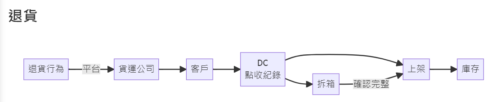
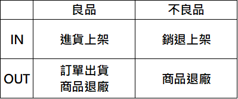
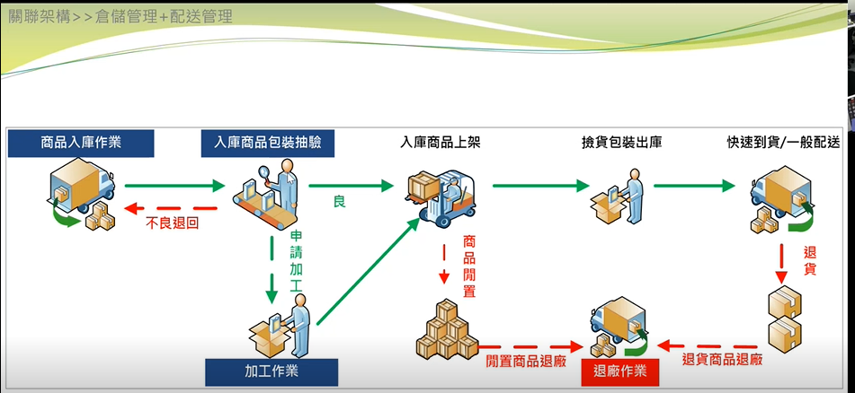
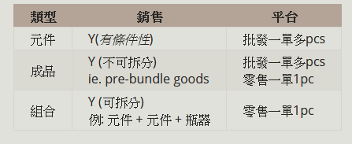
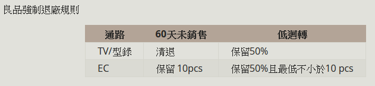
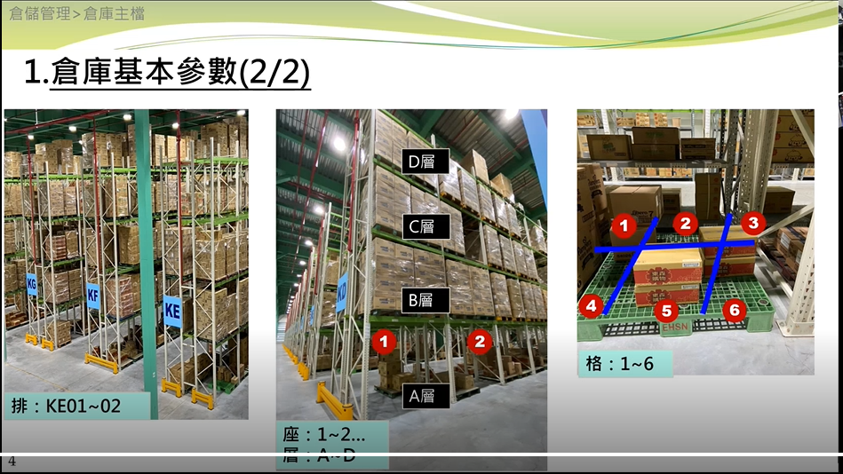

<!--
---
marp: true
theme: uncover
---

-->

# 目的
- 紀錄竹君第一次會議上課的重點

# 物流關聯平台架構管理

- 倉庫有兩棟 楊梅
- 物流是末端
- 前面先有商品的產生才會有配送跟管理
- 消費行為產生的源頭
- 東購提供平台給供應商做商品買賣的地方
- 買斷->貨權在東購 寄售->貨權在供應商
- 以上兩種物流流程會有不同

- 一般商品可以分為組合 恆溫 贈品 三種 也會對應不同的管理
- 以上稱為庫送

- 商品類型決定物流配送方式
  - 一般商品
  - 低溫冷凍
  - 大型家電
  - 低溫冷藏
  - 票券商品
  - 
# 倉儲管理
- 分為第三方物流(3PL, third party) 以及 東購物流
- 3PL -> 倉儲物流委託的對象
- 寄售商品大部分由第三方物流
- 買斷則是由東購物流
- 每個第三方物流所負責的商品種類不同
- 新竹物流(LIST)-> 一般商品
- 物流系統都是使用自己的WMS 第三方的物流系統 現場作業
- 全日物流-> 低溫冷凍
- 東源物流-> 大型家電
- 黑貓低溫-> 低溫冷藏
- 東購物流只是跟第三方租倉庫，然後切一塊處裡東購物流的商品以及流程
- 合作的配送商會跟第三方物流合作進行配送
- 寄送跟買斷不會分商品類型，而是依據貨權在誰身上決定
- 以上第三方物流可視為衛星倉，可視為一個倉庫
- 東購物流
  - 買斷
  - 包材銷售 紙箱/膠帶等等 賣給供應商
  - 專案訂單
  - 流通加工/整新作業
    - 流通加工->服務廠商/貼標籤
    - 整新作業只會發生在買斷商品
    - 把退貨的物品整新後重新銷售
    - 
  - 銷退拆箱
- 供應商會透過B2B後台購買包材，然後透過東購物流出貨，東購的物流使用富購
- 東購物流部駐點在第三方物流
- 銷退作業是唯一一個沒有委託給第三方物流的作業，在新竹物流LISP辦公，

- 新竹物流 LIST 現場作業(有順序)
  - 倉庫主檔
  - 進貨作業
  - 效期管理
  - 出貨作業
  - 銷退點收 (良品)
  - 銷退上架 (不良品)
  - 退廠作業
  - 盤點作業
  - 庫存調撥(跨倉)/調整

s
- 操作銷退拆箱作業只有東購物流操作
- 品保是抽檢，所以有可能沒檢驗到問題
- 良品跟不良品的庫存不同
- 第三方物流都有放寄售跟買斷
- 拆箱不分寄售跟買斷
- 良品60天未銷售的商品會強制進行退廠作業
- 良品低迴轉率的商品會強制進行退廠作業
- 不良品廠商可自行申請退廠
- 不良品效期快到會強制退廠
- 攔截歸儲-> 因還未出庫所以還是屬於良品
- 虛擬退貨 -> 退貨時沒有實體但是庫存會加1 ex. 媒體事件像是蘇丹紅導致的退款
- 虛擬退貨會由物流人員在富購操作
- 會由儲位來判斷是否有實體退貨以及可出貨量
- 
# 配送管理作業

- 買斷 -> 退貨 -> 整新 -> 報廢(x)

- 倉庫基本參數
  - 父階 子階
    - 目前父階:物流一倉
  - 可配送區域: 台灣 境外
  - 郵政編碼設定
  - 貨運商以及指派優先順序
  - 配送天數
  - 儲存類型
    - 跟商品類型分類有關
- 倉庫主檔
  - 長興 楊梅 幼獅 (LISP)

