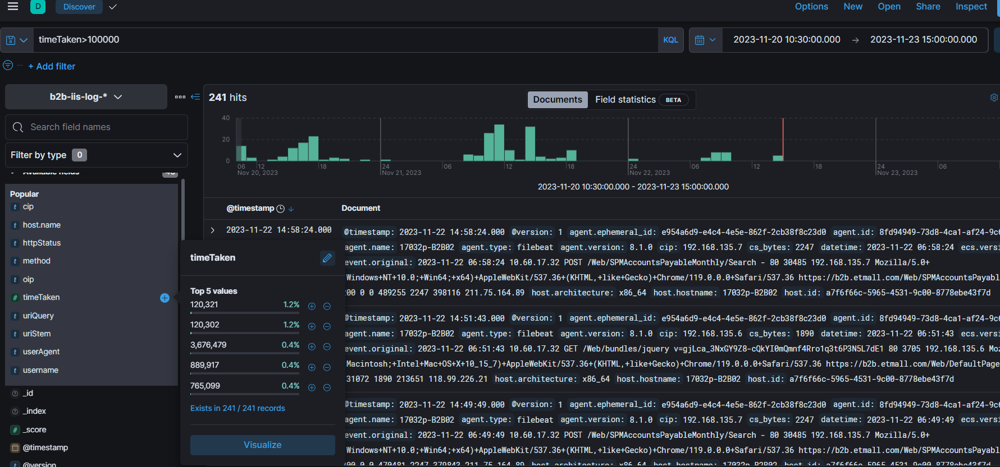

# 原由

因https://redmine.etzone.net/issues/40206這張單主要要優化SQL查詢速度，需要能從log看出是否優化有效果，因此本文件提供如何透過ELK找到相關log的方法

## ELK

首先登入ELK (http://10.60.17.105:5601/) 點選左邊的Discover

 

在左邊尋找 `b2b-iis-log`

在KQL欄位輸入 `timeTaken>100000`

代表要尋找 timeTaken欄位大於 100000 (100秒)

輸入完後點選右上角的搜尋按鈕，即可看到response 時間超過100點的log

接著點選左方的`timeTaken`後可以看到的`Visualize`按鈕，點選後會進入到`Visualize`頁面

 

點完之後可以看到每個時間點的request的回應時間

接著點選左方有個 `uriStem` 可以看到query路徑，藉此確認哪些路徑的query時間過長

 