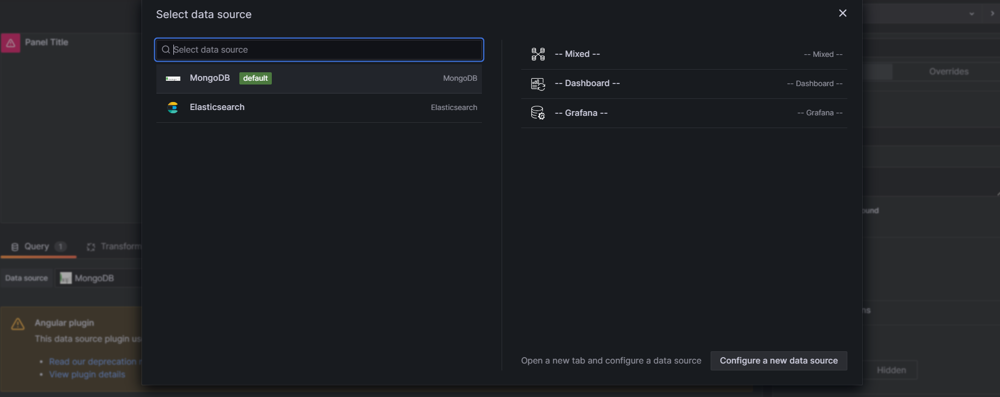
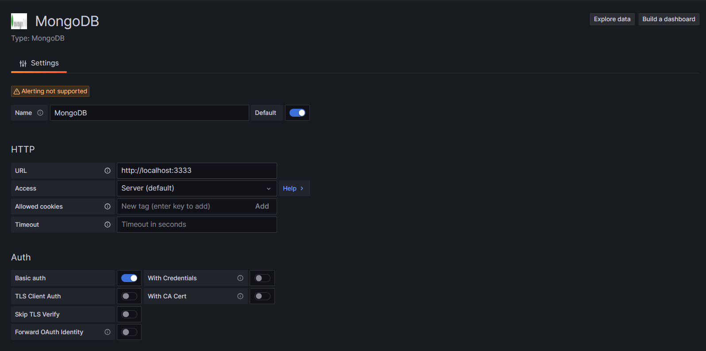

# Grafana Dashboard Tutorial

## 前言

本次分享目的為
- 理解ELK以及Grafana的使用方式
- 學會如何操作kibana以及grafana建立dashboard
- 分享資料視覺化的邏輯以及技巧

## Pre-requisite

1. 下載並安裝 [Docker Desktop](https://www.docker.com/products/docker-desktop)

2. 下載images
`連結`

3. 下載ELK & grafana images

4. 安裝 grafana images
 
```bash
docker load -i grafana.tar
```

6. 透過docker-compose 啟動images

開啟一檔案 `docker-compose.yml` 輸入以下內容

```yml
version: "3.8" # docker-compose 使用的版本
services:
  elasticsearch:
     image: elasticsearch:8.11.1 # 指定使用的docker image
     environment: # 環境變數
      - discovery.type=single-node # 使用single-node模式
      - network.host=0.0.0.0 # 開放所有網路
      - http.host=0.0.0.0 
      - xpack.security.enabled=true # 需打開才能連線
      - xpack.security.authc.api_key.enabled=true 
      - ELASTIC_PASSWORD=elastic # 預設密碼
     ports:
       - 9200:9200 # elastic search 使用的port
       - 9300:9300   
     healthcheck:
       test: nc -z localhost 9200 || exit 1 # 檢查是否有開啟port
       interval: 5s
       timeout: 10s
       retries: 100
  kibana:
     image: kibana:8.11.1
     ports:
       - 5601:5601
     environment:
       - ELASTICSEARCH_USERNAME="kibana_system"
       - ELASTICSEARCH_PASSWORD="kibana_system"      
     healthcheck:
       test: ["CMD-SHELL", "curl -u kibana_system:kibana_system -s http://localhost:5601/api/status"]
       interval: 5s
       timeout: 10s
       retries: 120
     depends_on:
      elasticsearch:
        condition: service_healthy
  grafana:
     image: ajeje93/grafana-mongodb:latest
     ports:
       - 3001:3000
```

5. 登入grafana dashboard

```bash
http://localhost:3000
```
輸入預設帳號密碼
```bash     
帳號: admin
密碼: admin
```

## Grafana Introduction


## Add Connection

可選擇各種不同的連結方式，支援各種不同的資料庫以及API




## Data Source

目前已建立的資料點


### MongoDB

填寫資料庫連線資訊

HTTP 這邊指的是proxy serve [參考](https://github.com/JamesOsgood/mongodb-grafana)

URL: proxy server url以及port，`預設是localhost:3333`

Access: 選擇 server

Auth選擇basic auth，輸入mongodb username & password

MongoDB Details: 輸入mongodb url以及port，url前方需要帶入username以及password，Database name為資料庫名稱 這邊填入 `mcDataCerter`

填完後選擇save & test




### ElasticSearch

url 欄位填入ES的url以及port。

`需要注意的是因為ES與grafana為不同的container，因此無法直接使用localhost，可選擇填入elasticsearch:9200`

因此在這邊我們填入 `http://elasticsearch:9200`

Authentication 選擇 `Basic Authentication` 輸入帳號密碼

在index name的部分填入 所要使用的index name


## Dashboard

### Kibana

[Kibana Query language](https://www.elastic.co/guide/en/kibana/current/kuery-query.html)


#### User case

- response time > 100秒
- 異動欄位紀錄表
- 登入次數統計
- 
### Grafana


### Line Chart


### Bar Chart

### Table 

## Alert

### contact points


- email 
- 設定 smtp server

修改此檔案


  


### MongoDB
   