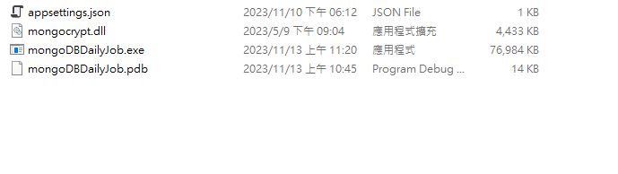
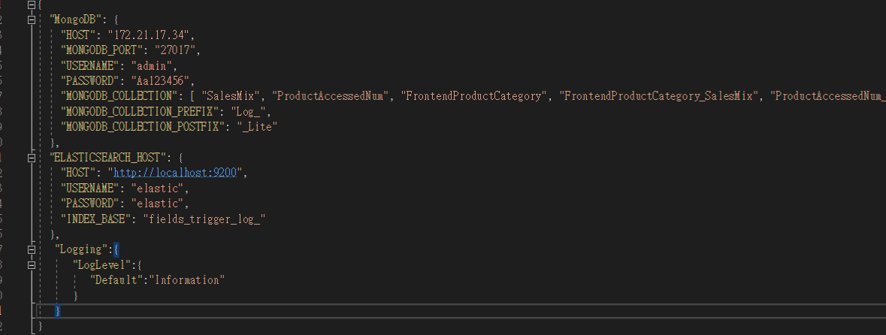
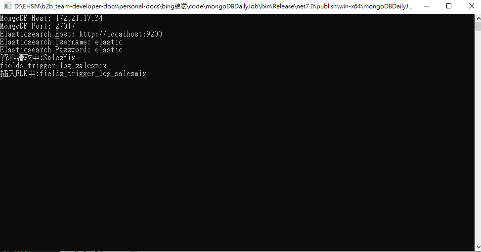
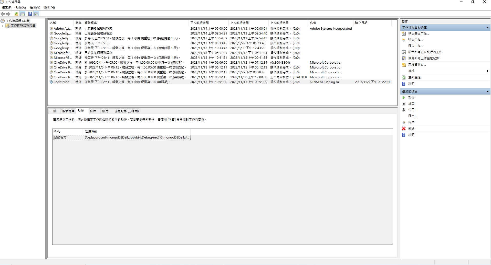
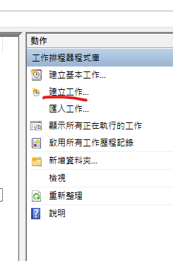
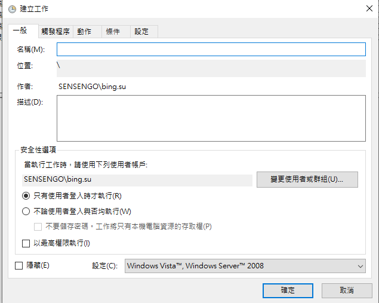
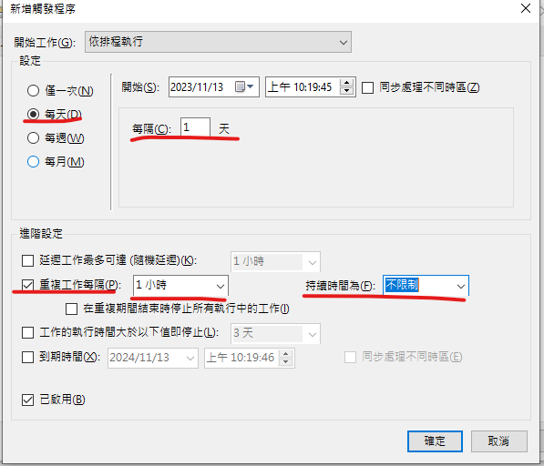
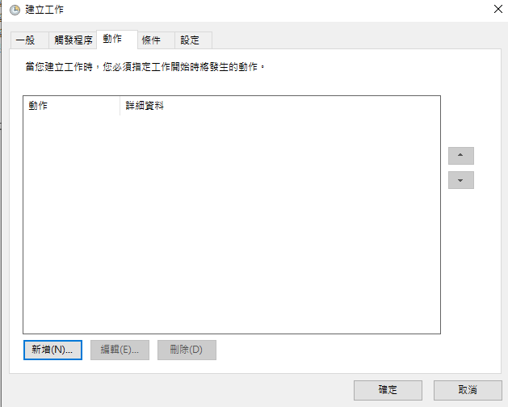
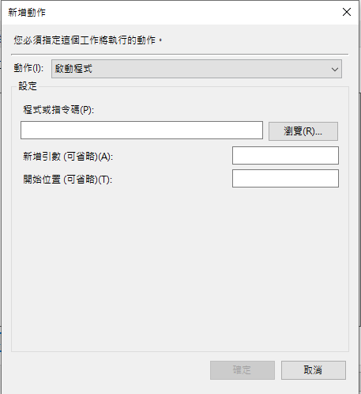
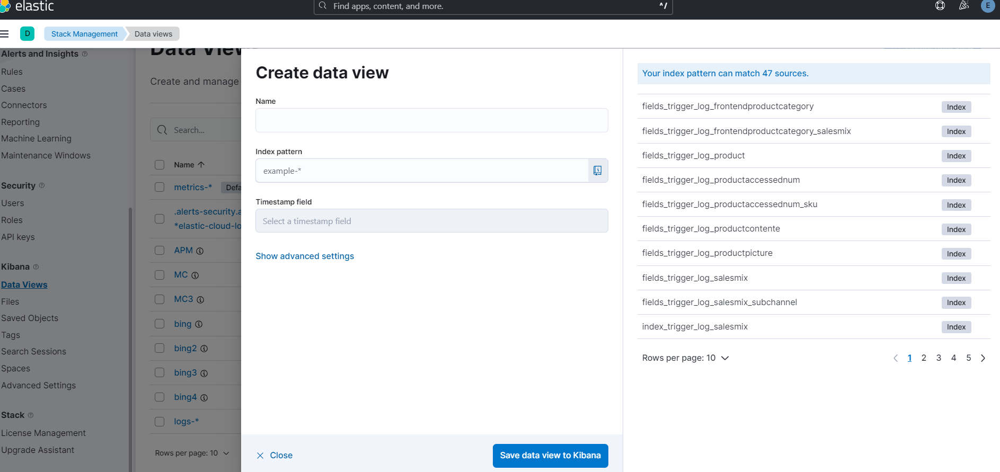

# Install MongoDB Query Monitoring Tool

## Download 獨立執行檔並解壓縮

https://gitlab.etzone.net/B2BB2E/b2b_team-developer-docs/blob/master/personal-docs/bing%E7%B6%AD%E6%96%8C/code/mongoDBDailyJobExe/win-x64.7z




## 修改appsettings.json

```json
{
   "MongoDB": {
   "HOST": "172.21.17.34", // mongodb IP
   "MONGODB_PORT": "27017",
   "USERNAME": "admin",  // mongodb username
   "PASSWORD": "Aa123456",  // mongodb password
   "MONGODB_COLLECTION": [ "SalesMix", "ProductAccessedNum", "FrontendProductCategory", "FrontendProductCategory_SalesMix", "ProductAccessedNum_SKU", "ProductContente", "ProductPicture", "Product", "SalesMix_subChannel" ],  // mongodb 要蒐集的collection name
   "MONGODB_COLLECTION_PREFIX": "Log_", // mongodb collection prefix
   "MONGODB_COLLECTION_POSTFIX": "_Lite"  // mongodb collection postfix
 },
 "ELASTICSEARCH_HOST": {
   "HOST": "http://localhost:9200",  // host
   "USERNAME": "elastic",  // elasticsearch username
   "PASSWORD": "elastic", // elasticsearch password
   "INDEX_BASE": "fields_trigger_log_" // index name prefix
 },
  "Logging":{
     "LogLevel":{
        "Default":"Information"
     }
  }
}
```



## 執行畫面

確認相關設定有沒有正確



## 加入工作排程

1. 打開工作排程器



建立工作



填寫名稱以及描述


選擇觸發程序並新增



選擇 
1. `依排程執行`
2. `每天` `每隔一天`
3. 重複時間選擇 `每隔一小時` 持續時間`不限制`
 


建立動作，動作為執行程序，並選擇剛剛下載的EXE檔案，按下確定後新增






最後到kibana上確認相關index是否已經建立
