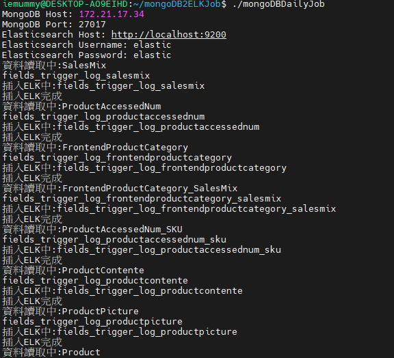

# Install MongoDB Query Monitoring Tool


## 取得檔案後首先須解壓縮

也可以透過以下連結取得

https://gitlab.etzone.net/B2BB2E/b2b_team-developer-docs/blob/master/personal-docs/bing%E7%B6%AD%E6%96%8C/code/mongoDBJobExe/mongoDBJob.7z

## 修改appsettings.json

接著需要修改appsetting.json 修改mongodb 以及 ELK的連線資訊


修改 
MongoDB `HOST/Username/Password` 欄位

ELASTICSEARCH_HOST `Host/username/password` 欄位

```json
{
   "MongoDB": {
   "HOST": "172.21.17.34", // mongodb IP
   "MONGODB_PORT": "27017",
   "USERNAME": "admin",  // mongodb username
   "PASSWORD": "Aa123456",  // mongodb password
   "MONGODB_COLLECTION": [ "SalesMix", "ProductAccessedNum", "FrontendProductCategory", "FrontendProductCategory_SalesMix", "ProductAccessedNum_SKU", "ProductContente", "ProductPicture", "Product", "SalesMix_subChannel" ],  // mongodb 要蒐集的collection name
   "MONGODB_COLLECTION_PREFIX": "Log_", // mongodb collection prefix
   "MONGODB_COLLECTION_POSTFIX": "_Lite",  // mongodb collection postfix
   "MONGODB_COLLECTION_STARTTIME": "2023-10-01", 
   "DataBaseName": "mcDataCenter"
 },
 "ELASTICSEARCH_HOST": {
   "HOST": "http://localhost:9200",  // host
   "USERNAME": "elastic",  // elasticsearch username
   "PASSWORD": "elastic", // elasticsearch password
   "INDEX_BASE": "fields_trigger_log_" // index name prefix
 },
  "Logging":{
     "LogLevel":{
        "Default":"Information"
     }
  }
}
```
修改完後可執行程式確認是否有正確連線


## 執行畫面

確認相關設定有沒有正確


 
## 加入cronjob

設定cronjob 每小時整點執行一次

```
crontab -e
```

新增以下內容

```
0 * * * *  cd {path}/mongoDB2ELKJob; ./mongoDBDailyJob
```

path 為資料夾的路徑
