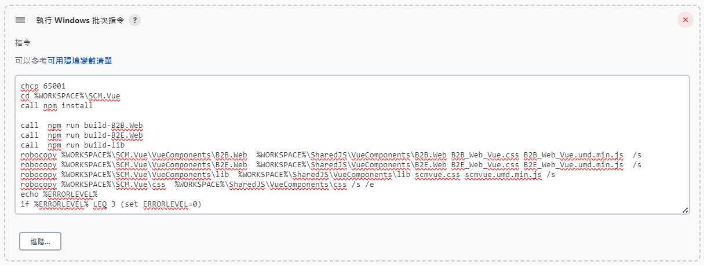
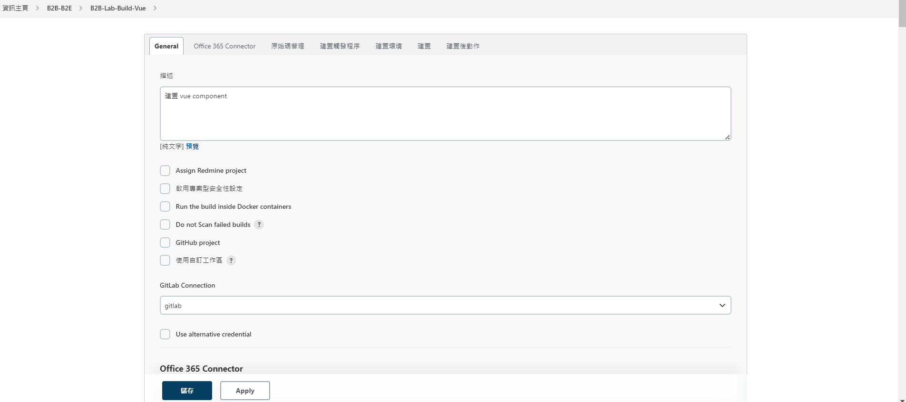
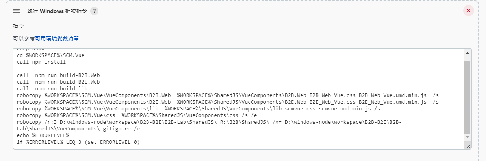
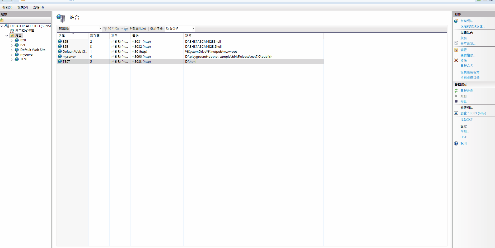

# Jenkins Build Time Optimal

## 原由

由於目前Jenkins 的 daily build job 每次需要耗時20-25分鐘，希望能縮短建置的時間。

經分析整個建置過程的耗時分布約如下

1. git clone SCM & checkout branch ~ 5 min
2. build SCM 專案 ~ 10-15 min 
3. build SCM.vue ~ 5 min

## 建置時間優化方向

目前作法是將build SCM.vue這個部分移出daily build，日後有修改時在手動觸發build SCM.vue。

因此需要做的事情如下

1. 將build SCM.vue的部分移出daily build
2. 另起task 進行 build SCM.vue
3. deploy SCM.vue 到指定的目錄
4. 確認iis的靜態檔案cache的設定

### 將build SCM.vue的部分移出daily build 



### 另起task 進行 build SCM.vue並deploy到指定的目錄






### 確認iis的靜態檔案cache的設定

這邊是要確認iis的靜態檔案cache的設定，確保更新vue component之後可以順利讓iis讀取到


 
## batch file backup 

```bash
chcp 65001
cd %WORKSPACE%\SCM.Vue
call npm install

call  npm run build-B2B.Web
call  npm run build-B2E.Web
call  npm run build-lib
robocopy %WORKSPACE%\SCM.Vue\VueComponents\B2B.Web  %WORKSPACE%\SharedJS\VueComponents\B2B.Web B2B_Web_Vue.css B2B_Web_Vue.umd.min.js  /s 
robocopy %WORKSPACE%\SCM.Vue\VueComponents\B2E.Web  %WORKSPACE%\SharedJS\VueComponents\B2E.Web B2E_Web_Vue.css B2E_Web_Vue.umd.min.js  /s 
robocopy %WORKSPACE%\SCM.Vue\VueComponents\lib  %WORKSPACE%\SharedJS\VueComponents\lib scmvue.css scmvue.umd.min.js /s 
robocopy %WORKSPACE%\SCM.Vue\css  %WORKSPACE%\SharedJS\VueComponents\css /s /e
echo %ERRORLEVEL%
if %ERRORLEVEL% LEQ 3 (set ERRORLEVEL=0)
```
