<!-- vscode-markdown-toc -->
* 1. [概述](#)
* 2. [更新日誌](#-1)
* 3. [背景知識](#-1)
* 4. [ELK Stack 簡介](#ELKStack)
* 5. [Grafana Loki Stack 簡介](#GrafanaLokiStack)
* 6. [簡易比較](#-1)
* 7. [安裝 ELK stack 以及 Loki (based on docker)](#ELKstackLokibasedondocker)
	* 7.1. [如何管理以及讓各個container互相通訊？](#container)
	* 7.2. [元件config設定](#config)
		* 7.2.1. [promtail](#promtail)
		* 7.2.2. [loki](#loki)
		* 7.2.3. [filebeat](#filebeat)
		* 7.2.4. [logstash](#logstash)
	* 7.3. [Grafana 以及 Kibana](#GrafanaKibana)
		* 7.3.1. [Grafana](#Grafana)
* 8. [kibana](#kibana)
	* 8.1. [比較](#-1)
		* 8.1.1. [filter & search](#filtersearch)
		* 8.1.2. [performance](#performance)

<!-- vscode-markdown-toc-config
	numbering=true
	autoSave=true
	/vscode-markdown-toc-config -->
<!-- /vscode-markdown-toc --># 目錄

# Log System 比較

##  1. <a name=''></a>概述

1. 本篇將比較 ELK 與 Grafana Loki 兩套Log框架，並決定最後是否使用ELK
2. 本篇包含安裝以及相關資訊的整理以及網路上別人整理的比較

##  2. <a name='-1'></a>更新日誌

2023/09/22 第一版 by Bing

##  3. <a name='-1'></a>背景知識

由於東購2.0會架構在`RedHat OpenShift`(OPC)的平台上，OPC預計未來將不會支援ELK(EFK) Stack，因此目前須評估是否要額外加裝ELK的stack。評估的點為以下幾點

1. 是否有需求是只能透過ELK完成
2. 效能的比較
3. 技術以外的考量

##  4. <a name='ELKStack'></a>ELK Stack 簡介

1.	ELK Stack:
- Elasticsearch: 是一個實時分佈式搜索和分析引擎。它主要用於索引、搜尋和分析大量的數據快速地。在這個堆疊中，它主要用作日誌數據的存儲和搜索後端。
-	Logstash: 是一個靈活的日誌收集、處理和轉發的工具。它可以接收從不同的源來的數據，加工這些數據，然後將其發送到像Elasticsearch這樣的存儲後端。
-	Kibana: 是一個與Elasticsearch集成的視覺化和探索工具。它允許用戶建立儀表板來展示和分析在Elasticsearch中存儲的數據。

基於以上的特性因此在log的儲存分析上常使用ELK來建構log系統，但ELK能做的事情並非僅有log分析，ELK可應用在其他更多的資料分析上。

##  5. <a name='GrafanaLokiStack'></a>Grafana Loki Stack 簡介

-	Prometheus: 是一個開源的監控和警報工具套件，主要用於度量和警報，而不是日誌管理。
-	Loki: 一個由Grafana Labs開發的日誌聚合系統，與Grafana深度集成，設計上與Prometheus有許多相似之處。
-	Grafana: 是一個用於時序數據的視覺化工具，它原生支持Prometheus和Loki，以及其他數據源，如Elasticsearch。

相較於ELK，Loki則主要是針對log所設計的儲存分析系統，主要訴求為輕量以及較不佔空間，搭配Grafana的儀錶板有極好的表現。

##  6. <a name='-1'></a>簡易比較

ELK因透過ElasticSearch進行儲存以及搜尋，擁有像是全文檢索的功能以及效率，缺點的話為很吃記憶體以及硬碟容量。

Loki為針對log所設計的儲存分析系統，雖然並無強調全文檢索的能力，但透過適當的Label方式並搭配regular expression也可有效的達到全文檢索的效果。

實測的結果顯示ELK擅長的為`需要做Aggregation`的Query，Loki因無對log content做index 因此這類型的query效能較差。但

##  7. <a name='ELKstackLokibasedondocker'></a>安裝 ELK stack 以及 Loki (based on docker)

首先先安裝docker完後可分別下載下列Image

- elastic/filebeat (file monitor)
- logstash (log pipline)
- elasticsearch (storage/search)
- kibana (dashboard)
- grafana/promtail (file monitor)
- grafana/loki  (storage/search)
- grafana/grafana  (dashboard)


###  7.1. <a name='container'></a>如何管理以及讓各個container互相通訊？

由於各個container之間彼此是互相獨立的，需要互相通訊時我們可以透過  `docker-compose` 的指令

首先建立一個File叫做 `docker-compose.yml`


接著輸入以下內容

```
services:
  loki:
     image: grafana/loki
     ports:
       - 3100:3100
  promtail:
     image: grafana/promtail
     volumes:
        - 'C:/Users/b2badmin/AppData/Local/Docker/log/vm:/data/db'  # <- extra space here
  grafana:
     image: grafana/grafana
     ports:
       - 3000:3000
```

`services`: 代表要啟用一個由下方images所組成的service

`loki`: service名稱，image為要啟用哪個image

`ports`為要export的port

`volumes`為將硬碟資料夾對應到docker裡面的資料夾，在此用來監控本機log

儲存完後接著開啟 `cmd` 進入該資料夾後輸入 `docker-compose up`


執行後應該可以看到docker-desktop看到container的地方有個名為`loki`的container的群組


用同樣方式建立ELK的群組

以下為ELK的`docker-compose`檔案內容

```
version: "3.8"
services:
  elasticsearch:
     image: elasticsearch:7.16.2
     environment:
      - discovery.type=single-node
     ports:
       - 9200:9200
       - 9300:9300   
  filebeat:
     image: elastic/filebeat:8.10.1
     volumes:
        - 'C:/Users/b2badmin/Documents:/data/db'  # <- extra space here
  logstash:
     image: logstash:8.9.2
     ports:
       - 5044:5044
       - 9600:9600
  kibana:
     image: kibana:7.16.2
     ports:
       - 5601:5601
```

###  7.2. <a name='config'></a>元件config設定

####  7.2.1. <a name='promtail'></a>promtail


promtail的config檔案預設路徑為 `/etc/promtail/config.yam`

以下為config內容

```
server:
  http_listen_port: 9080
  grpc_listen_port: 0

positions:
  filename: /tmp/positions.yaml

clients:
  - url: http://loki:3100/loki/api/v1/push

scrape_configs:
- job_name: system
  static_configs:
  - targets:
      - localhost
    labels:
      job: varlogs
      __path__: /data/db/*.log
```

promtail需要指名要monitor資料夾，這邊監測`/data/db/`下所有.log的檔案

值得注意的是`http://loki:3100/loki/api/v1/push`這行
由於在docker裡面的IP是浮動的且每次重啟都會不一樣，`因此可以直接寫container的名稱`當作該container的DNS

####  7.2.2. <a name='loki'></a>loki

以下為loki `config`檔的內容，預設路徑為`/etc/loki/loki-local.yml`

`auth_enabled` 為是否要進行驗證，可先行關閉
`server`為設定server模式相關的config

```
auth_enabled: false

server:
  http_listen_port: 3100

common:
  path_prefix: /loki
  storage:
    filesystem:
      chunks_directory: /loki/chunks
      rules_directory: /loki/rules
  replication_factor: 1
  ring:
    kvstore:
      store: inmemory

schema_config:
  configs:
    - from: 2020-10-24
      store: boltdb-shipper
      object_store: filesystem
      schema: v11
      index:
        prefix: index_
        period: 24h

ruler:
  alertmanager_url: http://localhost:9093

```

####  7.2.3. <a name='filebeat'></a>filebeat

以下為filebeat `config`檔的內容，預設路徑為`/etc/filebeat/filebeat.yml`

`output.logstash`代表輸出至logstash，可依照需求修改輸出至其他地方

```
filebeat.config:
  modules:
    path: ${path.config}/modules.d/*.yml
    reload.enabled: false

filebeat.inputs:   
- type: log
  enabled: true   
  paths:   
   - /data/db/*.log

processors:
  - add_cloud_metadata: ~
  - add_docker_metadata: ~

output.logstash:
  hosts: "logstash:5044"
```

以下是logstash config，指定輸出至`本機的elasticsearch`

####  7.2.4. <a name='logstash'></a>logstash
```
input {
  beats {
    port => 5044
  }
}

output {
  elasticsearch {
    hosts => ["http://elasticsearch:9200"]
    index => "%{[@metadata][beat]}-%{[@metadata][version]}" 
    action => "create"
  }
}

```

###  7.3. <a name='GrafanaKibana'></a>Grafana 以及 Kibana

####  7.3.1. <a name='Grafana'></a>Grafana
安裝完Grafana後打開localhost:3000 (預設3000 port)
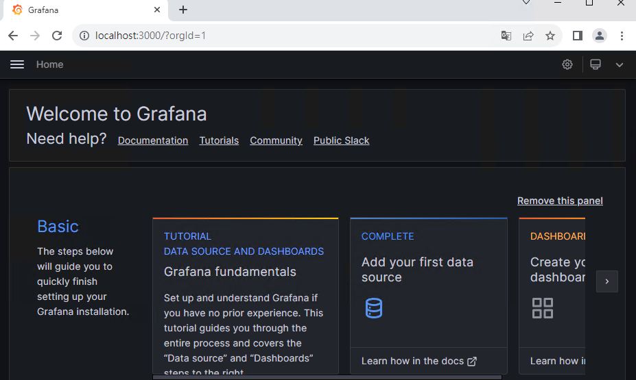

接著首先需要新增`Data Source` 點選首頁的`Add your first data source`之後在type選擇`Loki`


選完後再下方的URL那邊輸入 `http://loki:3100/` 可直接使用 `loki` 做為DNS name
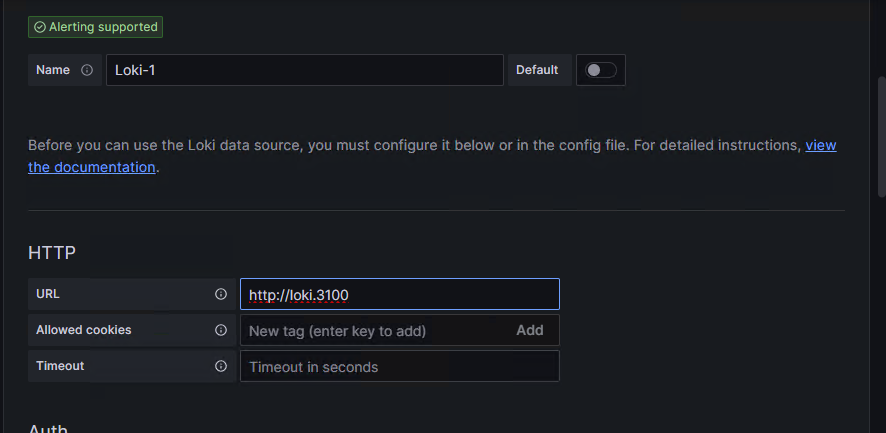

點選下方的的 `Save & test` 確認是否能新增成功，若有成功會看到下方的畫面

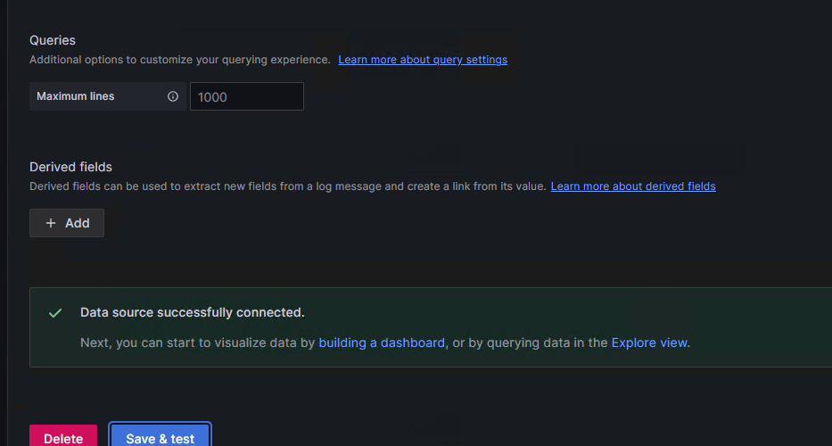

接著可點選左方的`Explore`確認logstash有沒有順利接收到log

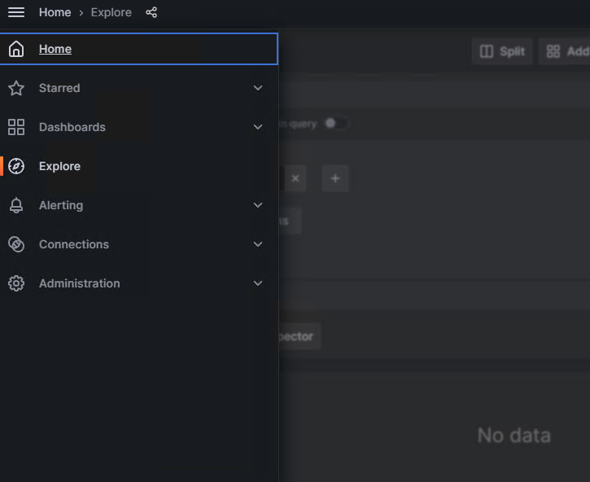
在label區選擇filename 並且選擇我們所監控的檔案名，按下右邊的 `Run Query`
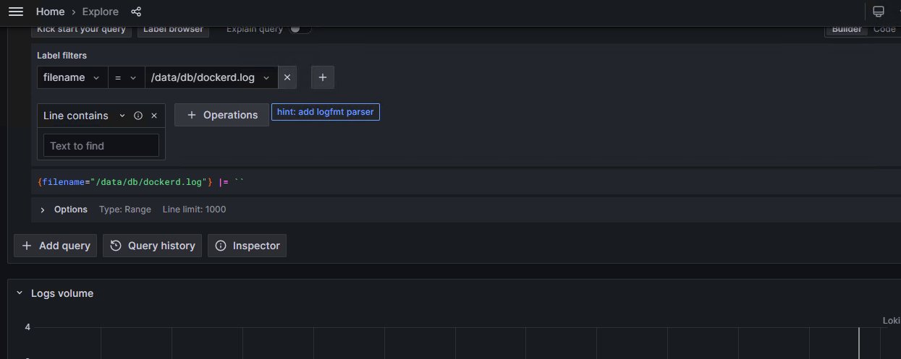
可成功看到下方有log出現
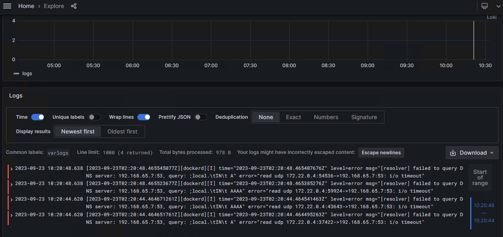

##  8. <a name='kibana'></a>kibana
開啟kibana的畫面後可以選`Observability` 
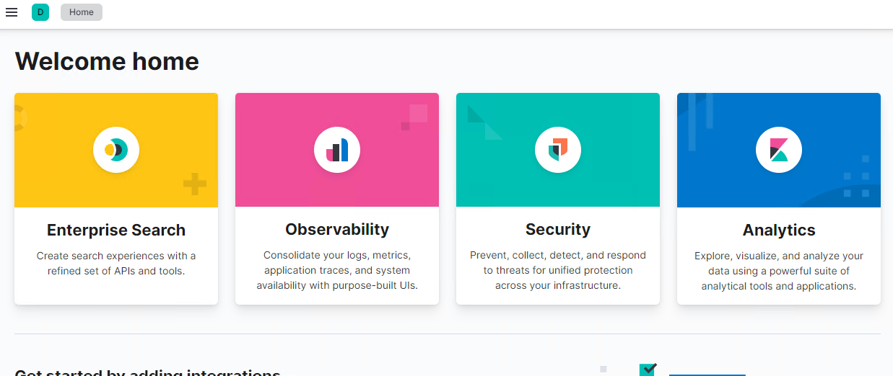

左方有個 `log`可點選
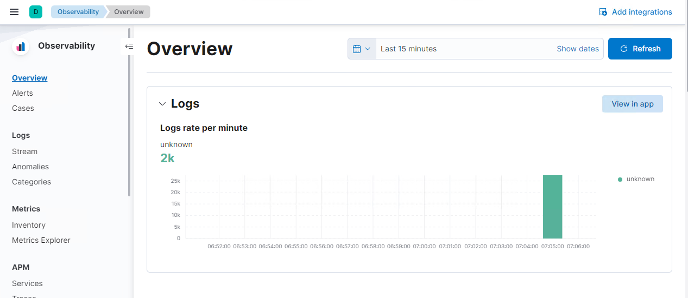
按下去之後若有成功從 `elastiscsearch`顯示出logs
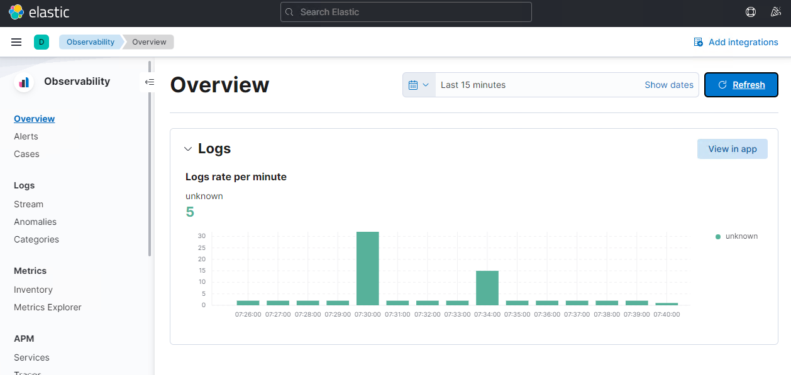

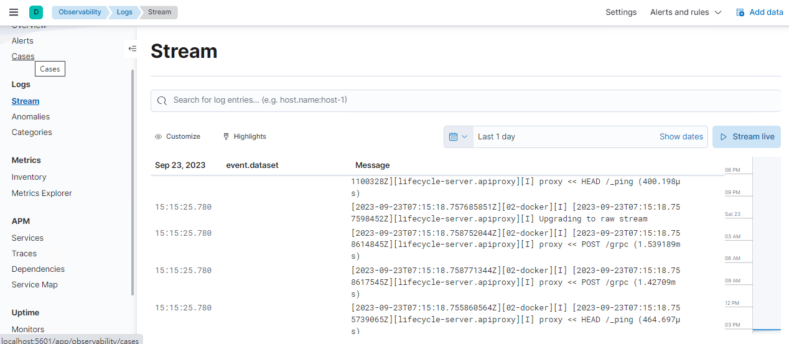
可以下 filter 去過濾log
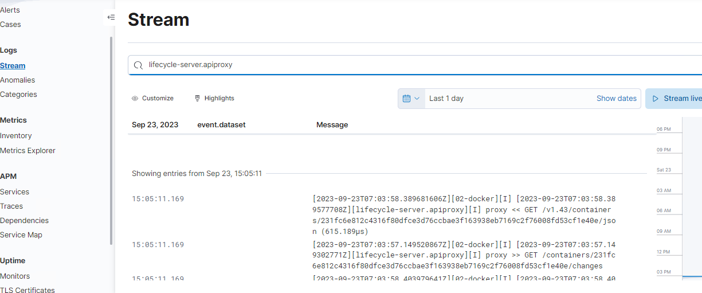

###  8.1. <a name='-1'></a>比較

####  8.1.1. <a name='filtersearch'></a>filter & search

基本的搜尋測試，ELK可直接輸入所想要的關鍵字，並過濾出含有關鍵字的log
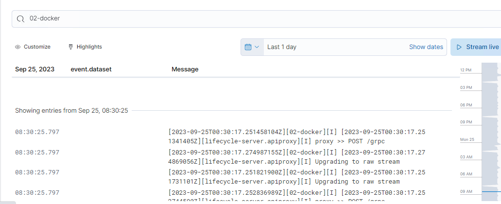

Loki則需要先選擇label，這邊選擇的是`filename`，可依需求改成`service`等方式達到類似`全文檢索的功能`。
選擇完label後下方的operation可以選擇`line contain`代表要過濾所包含的關鍵字，此時輸入完關鍵字後即可過濾出包含關鍵字的log。

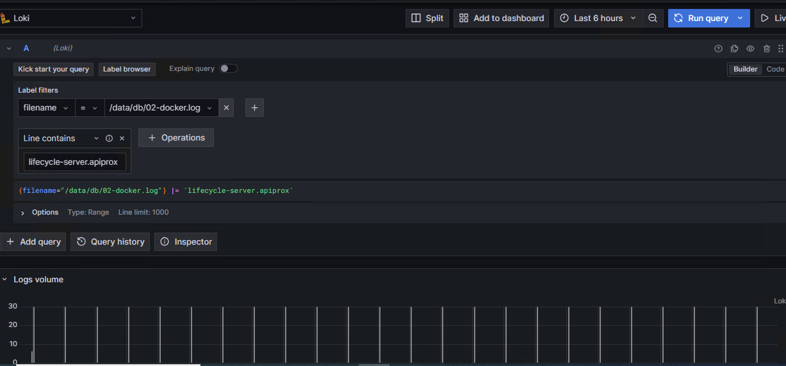

####  8.1.2. <a name='performance'></a>performance

以下資訊引用自 [log solution comparison](https://crashlaker.medium.com/which-logging-solution-4b96ad3e8d21)


此比較為輸入大量的log資訊後各log系統所使用的`disk size` 以及 query long-term 的資訊時的比較。
`ingestion time elapsed` 代表輸入資料時所耗費的時間

`Consumed Index disk size` 代表用來index的硬碟空間

`Query 1 month (12/12h interval)` query 一個月的時間並以12小時為Interval所花費的時間

`Query 1 month (30s interval)` query 一個月的時間並以30秒為Interval所花費的時間

`Query 1 day (12/12 interval)` query 一天的時間並以12秒為Interval所花費的時間

`Query 1 day (30s interval)` query 一個月的時間並以30秒為Interval所花費的時間


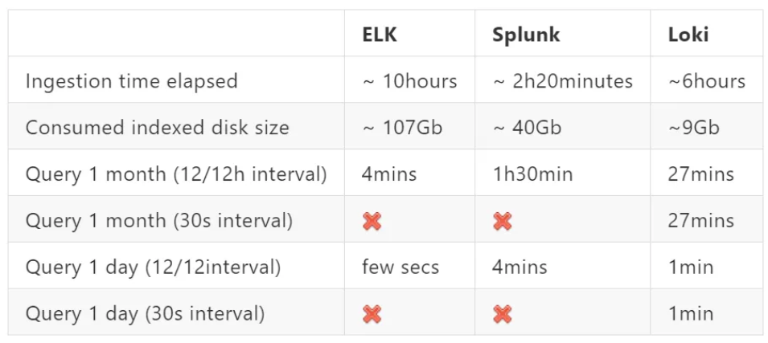


可以看出以硬碟的使用量來看ELK使用了107GB，而Loki使用了約9GB。
以query時間來看ELK在Query 一個月時若interval為12小時，則時間為4分鐘，但loki需要27分鐘。

紅色打X的部分代表不支援此功能

若query為一天的話ELK只需要幾秒的時間，而loki則需要一分鐘。

由以上的數據可以得知，ELK擅長的是需要做`aggregation的query`，而Loki則不擅於此。但若單純的query filter兩者應該是不會差太多Loki支援的interval相對較為有彈性。

# 小結

1. 目前在使用上單純做Filter的話Loki並無明顯感受到效能上的問題，雖說ELK有提供全文檢索而Loki並無標榜此功能，但透過Loki的meta index以及加上regular expression的功能也可達到類似的功能，應能應付大部分的搜尋需求。
2. 若query時需要額外的aggregation或其他複雜的功能，則ELK的效能表現更為突出。
3. 考慮到東購2.0的架構，若需要額外加裝ELK，等於額外要申請VM並安裝ELK且在其他vm上還需將log導流到ELK vm上，也可能會多出`技術以外的effort (與其他單位的negotiation)`

回到開頭的問題

`是否有需求是只能透過ELK完成`

A:若需要針對log進行aggregation則ELK的表現較佳 ，單純的filter query Loki效能尚在可接受範圍。但ELK所占用的硬碟容量約為Loki的十倍。


`技術以外的考量`

A:會多出技術以外的effort (與其他單位的negotiation)

# 參考資料

[Loki](https://grafana.com/oss/loki/)

[ELK](https://www.elastic.co/cn/elastic-stack)

[loki-vs-elasticsearch](https://signoz.io/blog/loki-vs-elasticsearch/)

[log solution comparison](https://crashlaker.medium.com/which-logging-solution-4b96ad3e8d21)