# 使用mongodb語法計算每個欄位出現的次數


## 背景

mongodb中有一個collection用來記錄每次有sql欄位變動的歷程，每一次變動都會寫入一筆資料，

需求為希望統計此collection中每個欄位出現的次數，以便後續做資料分析，因此需要計算每個欄位出現的次數。

## Log_salesmix_lite collection

用來記錄sql欄位變動的collection，每次sql欄位變動都會寫入一筆資料，因此可以用來計算每個欄位出現的次數。

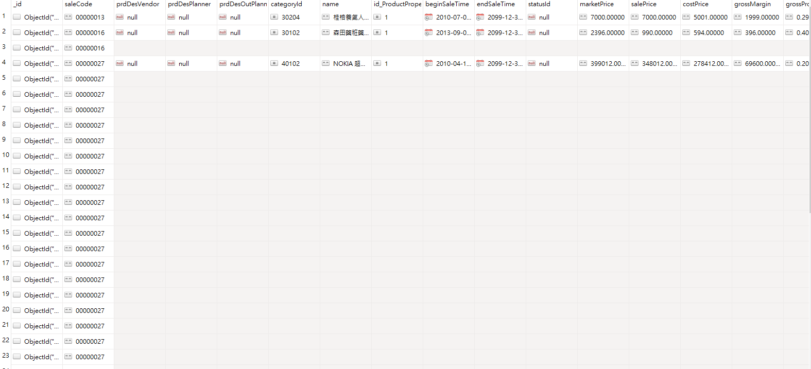

## 嘗試用nodejs程式計算

一開始想法是用nodejs程式連結mongodb撈出資料後進行計算，但後來發現效能太差，因此改用mongodb語法進行計算。


以下語法以及說明

note : 2023-11-05T00:00:00+0800 代表+8時區


## 目標

原有的資料結構 array，每個key代表當次有更改的欄位以及對應的數值

- 每次修改內容不同，所以每個json的key以及數量也會不同


``` json
[{
    "_id" : ObjectId("58c8c066275ae7289cad62ce"),
    "saleCode" : "00000013",
    "prdDesVendor" : null,
    "prdDesPlanner" : null,
    "prdDesOutPlanner" : null,
    "categoryId" : NumberLong(30204),
    "name" : "桂格養氣人蔘aa=",
    "id_ProductProperty" : NumberLong(1),
    "beginSaleTime" : ISODate("2010-07-01T16:00:00.000Z"),
    "endSaleTime" : ISODate("2099-12-30T16:00:00.000Z"),
    "statusId" : null,
    "marketPrice" : "7000.00000",
    "salePrice" : "7000.00000",
    "costPrice" : "5001.00000",
    "grossMargin" : "1999.00000",
    "grossProfit" : "0.29000",
    "presentDescription" : null,
    "shelveReservation" : 1,
    "canReturn" : 1,
    "canChange" : 1,
    "paymentPeriod" : 60,
    "installmentSetting" : 1,
    "shipmentTaxType" : null,
    "isReceipt" : null,
    "employeePrice" : "6990.00",
    "saleBonus" : null,
    "canBuyByProfit" : 1,
    "canBuyByAccount" : null,
    ...
    }
    ,...
    ]
```

目標
```json
{
    "lastModifier" : 9.0,
    "lastModifiedTime" : 8.0,
    "primary_key" : 9.0,
    "isExpressProduct2" : 2.0,
    "fugoContractNo" : 1.0,
    "isExpressProduct" : 2.0,
    "trg_action" : 9.0,
    "_id" : 9.0,
    "trg_create_on" : 9.0,
    "saleCode" : 9.0,
    ...
}
```


`使用aggregate 方法做pipeline計算，需設計各種stage達到我們想要的結果`


### Step.1 撈出需要計算的資料

要撈出`Log_SalesMix_Lite`此collection 中`trg_create_on`欄位在`2023-11-05T00:00:00+0800`到`2023-11-05T01:00:00+0800`之間的資料

```js
 {
        $match: {
            trg_create_on: {
                $gte: ISODate("2023-11-05T00:00:00+0800"),
                $lt: ISODate("2023-11-05T01:00:00+0800")
            }
        }
    },
```

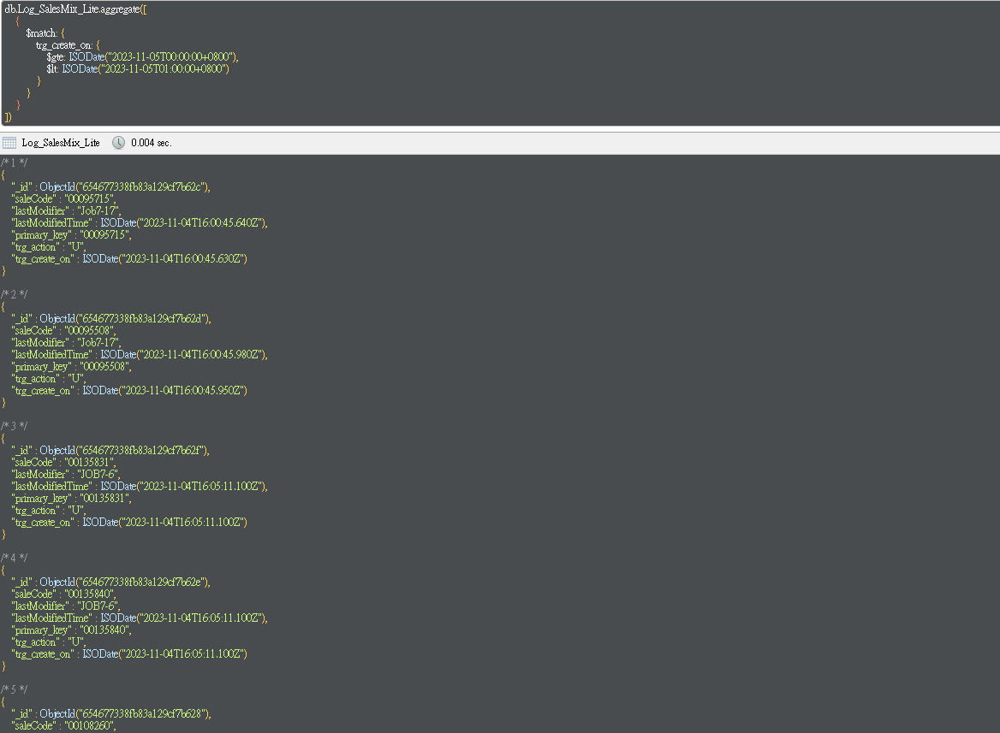

### Step.2 根據primary_key分組，並把同個key的data放進一個array中

```js
{
        $group: {
            _id: "$primary_key",
            data: { $push: "$$ROOT" }
        }
    },
```

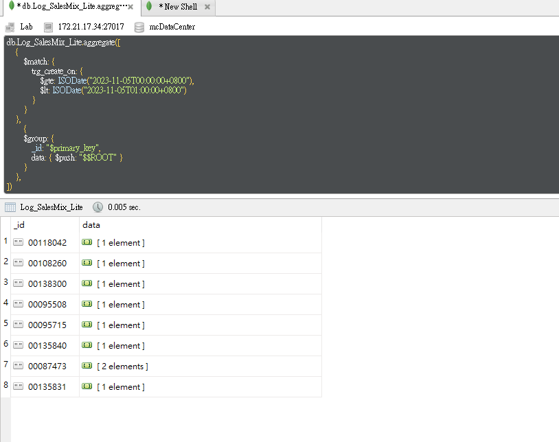

### Step.3 將data array轉成object

```js
{
        $unwind: "$data"
},
```

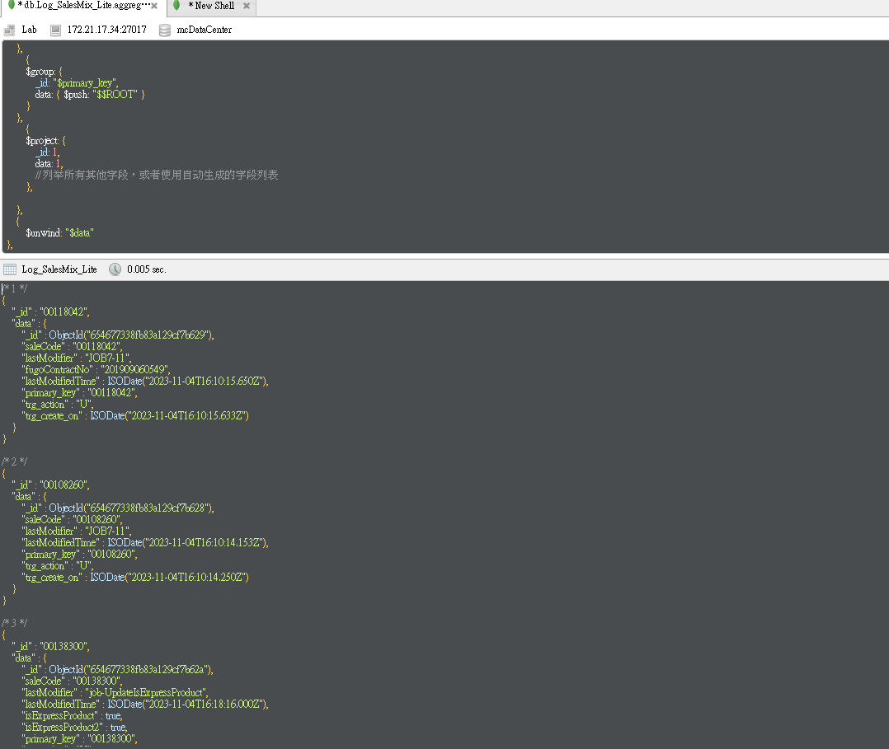

### Step.4 重新組合object，並且將每個欄位轉成key-value的形式

```js
    {
        $replaceRoot: { newRoot: "$data" }
    },
    {
        $project: {
            _id: 1,
            trg_create_on: 1,
            // 使用 $objectToArray 将文档转换为键值对数组
            fields: { $objectToArray: "$$ROOT" }
        }
    },
    {
        $unwind: "$fields"
    },
```
 
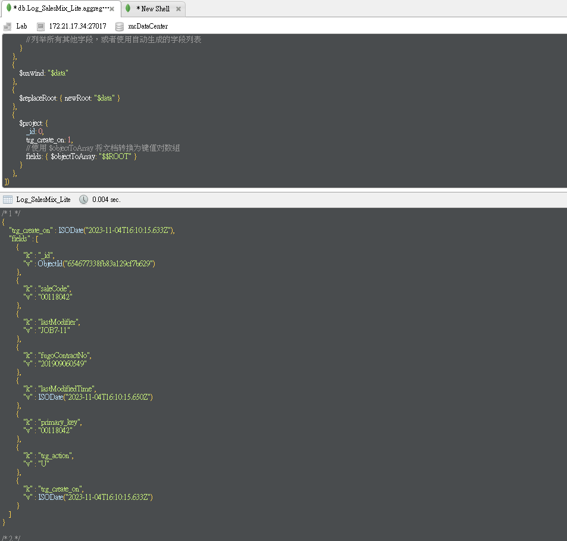

### Step.5 根據key做group並計算次數

```js
{
  $group: {
     _id: {
        field: "$fields.k"
            },
            count: { $sum: 1 },
         //   values: { $addToSet: "$fields.v" }
        }   },
    {
    $group: {
        _id: 
    ISODate("2023-11-05T00:00:00+0800"),  
    data: { $push: "$$ROOT" }
    }
},
```
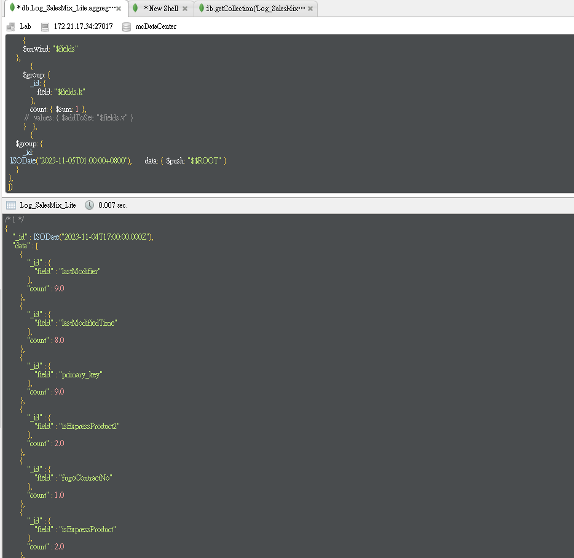

### Step6. 重新組合資料並取出所需要的data

```js
{
        $project: {
            _id: 1,
            result: {
                $arrayToObject: {
                    $map: {
                        input: "$data",
                        as: "item",
                        in: {
                            k: "$$item._id.field",
                            //v: {
                            //    count: "$$item.count", 
                             //   values: "$$item.values"
                            //}
                           v:"$$item.count"
                        }
                    }
                }
            }
        }
    },
    {
        $replaceRoot: { newRoot: "$result" } // 将 result 字段作为新的根
    },

```
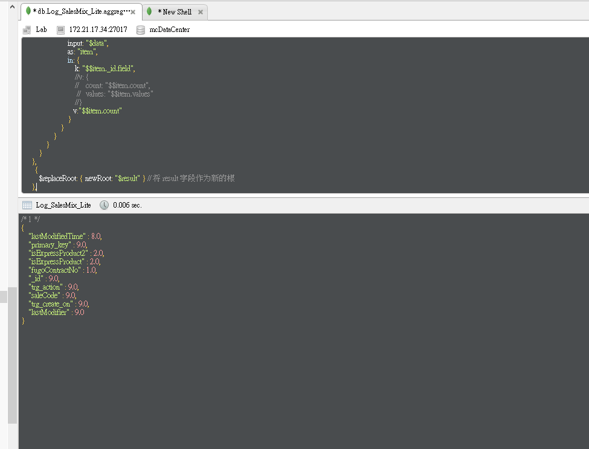


### Step7. 加入新的欄位並將結果寫入新的collection

```js
{ 
  $addFields: { _id: ISODate("2023-11-05T00:00:00+0800")  } },
 {
       $merge: {
            into: "Log_SalesMix_Summary" // 将结果添加到现有集合
      }
  }
```

以下為全部語法

```js 
db.Log_SalesMix_Lite.aggregate([
    {
        $match: {
            trg_create_on: {
                $gte: ISODate("2023-11-05T00:00:00+0800"),
                $lt: ISODate("2023-11-05T01:00:00+0800")
            }
        }
    },
    {
        $group: {
            _id: "$primary_key",
            data: { $push: "$$ROOT" }
        }
    },
    {
        $project: {
            _id: 1,
            data: 1,
            // 列举所有其他字段，或者使用自动生成的字段列表
        }
    },
    {
        $unwind: "$data"
    },
    {
        $replaceRoot: { newRoot: "$data" }
    },
    {
        $project: {
            _id: 0,
            trg_create_on: 1,
            // 使用 $objectToArray 将文档转换为键值对数组
            fields: { $objectToArray: "$$ROOT" }
        }
    },
    {
        $unwind: "$fields"
    },
        {
        $group: {
            _id: {
                field: "$fields.k"
            },
            count: { $sum: 1 },
         //   values: { $addToSet: "$fields.v" }
        }   },
    {
    $group: {
        _id: 
 ISODate("2023-11-05T01:00:00+0800"),       data: { $push: "$$ROOT" }
    }
},
{
        $project: {
            _id: 1,
            result: {
                $arrayToObject: {
                    $map: {
                        input: "$data",
                        as: "item",
                        in: {
                            k: "$$item._id.field",
                            //v: {
                            //    count: "$$item.count",
                             //   values: "$$item.values"
                            //}
                           v:"$$item.count"
                        }
                    }
                }
            }
        }
    },
    {
        $replaceRoot: { newRoot: "$result" } // 将 result 字段作为新的根
    },
    { $addFields: { _id: ISODate("2023-11-05T00:00:00+0800")  } },
 {
        $merge: {
            into: "Log_SalesMix_Summary" // 将结果添加到现有集合
      }
  }
])
```

## 後來用C#語法改寫以便可以加入排程

```c#
using System;
using System.Linq;
using MongoDB.Bson;
using MongoDB.Driver;


namespace runMongoDailyJob
{
    internal class Program
    {
        static void Main(string[] args)
        {

            string mongodbHost = Environment.GetEnvironmentVariable("MONGODB_HOST") ?? "admin:Aa123456@172.21.17.34"; // 默认值为 "localhost"
            string mongodbPort = Environment.GetEnvironmentVariable("MONGODB_PORT") ?? "27017"; // 默认值为 "27017"
            string databaseName = "mcDataCenter"; // 你的数据库名称

            string connectionString = $"mongodb://{mongodbHost}:{mongodbPort}";

            MongoClient client = new MongoClient(connectionString);
            IMongoDatabase database = client.GetDatabase(databaseName);
            IMongoCollection<BsonDocument> collection = database.GetCollection<BsonDocument>("Log_SalesMix_Lite");
            
            DateTime currentTime = DateTime.Now;
            DateTime currentHour = currentTime.Date.AddHours(currentTime.Hour);

            // 计算前一个小时的时间
            DateTime oneHourAgo = currentHour.AddHours(-1);

            var matchStage = new BsonDocument("$match", new BsonDocument
            {
    { "trg_create_on", new BsonDocument
        {
            { "$gte", oneHourAgo },
            { "$lt", currentHour }
        }
    }
});

            var sortStage = new BsonDocument("$sort", new BsonDocument
        {
            { "trg_create_on", 1 }
        });

            var groupStage = new BsonDocument("$group", new BsonDocument
        {
            { "_id", "$primary_key" },
            { "data", new BsonDocument("$push", "$$ROOT") }
        });

            var unwindStage1 = new BsonDocument("$unwind", "$data");

            var replaceRootStage = new BsonDocument("$replaceRoot", new BsonDocument
        {
            { "newRoot", "$data" }
        });

            var projectStage = new BsonDocument("$project", new BsonDocument
        {
            { "_id", 0 },
            { "trg_create_on", 1 },
            { "fields", new BsonDocument("$objectToArray", "$$ROOT") }
        });

            var unwindStage2 = new BsonDocument("$unwind", "$fields");

            var groupStage2 = new BsonDocument("$group", new BsonDocument
        {
            { "_id", new BsonDocument("field", "$fields.k") },
            { "count", new BsonDocument("$sum", 1) }
        });

            var groupStage3 = new BsonDocument("$group", new BsonDocument
        {
            { "_id", oneHourAgo },
            { "data", new BsonDocument("$push", "$$ROOT") }
        });

            var projectStage2 = new BsonDocument("$project", new BsonDocument
        {
            { "_id", 1 },
            { "result", new BsonDocument("$arrayToObject", new BsonDocument
                {
                    { "$map", new BsonDocument
                        {
                            { "input", "$data" },
                            { "as", "item" },
                            { "in", new BsonDocument
                                {
                                    { "k", "$$item._id.field" },
                                    { "v", "$$item.count" }
                                }
                            }
                        }
                    }
                })
            }
        });

            var replaceRootStage2 = new BsonDocument("$replaceRoot", new BsonDocument
        {
            { "newRoot", "$result" }
        });

            var addFieldsStage = new BsonDocument("$addFields", new BsonDocument
        {
            { "_id", oneHourAgo }
        });
            var mergeStage = new BsonDocument("$merge", new BsonDocument
        {
            { "into", "Log_SalesMix_Summary" }
        });
            var pipeline = new[]
            {
            matchStage, sortStage, groupStage, unwindStage1, replaceRootStage,
            projectStage, unwindStage2, groupStage2, groupStage3,
            projectStage2, replaceRootStage2, addFieldsStage,mergeStage
            // 添加其他阶段...
        };
            collection.Aggregate<BsonDocument>(pipeline)
        }
    }
}

```

## 在正式區執行一次約為3秒，可將約10萬筆的record所有欄位計算出來並寫入新的collection中


# 透過ELK視覺化

1. 修改C#程式碼如下，可以將結果寫入ELK中
   
   [參考](https://gitlab.etzone.net/B2BB2E/b2b_team-developer-docs/tree/master/personal-docs/bing%E7%B6%AD%E6%96%8C/code/mongoDBDailyJob)

2. 建立dashboard 把結果視覺化，可依此觀察各欄位次數的變化

- 選取左方的dashboard

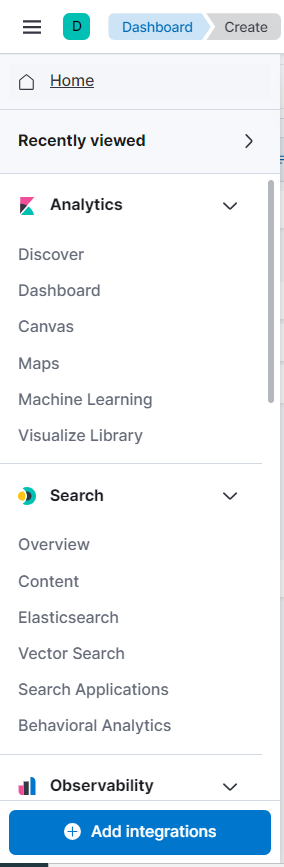

- Create Visualization

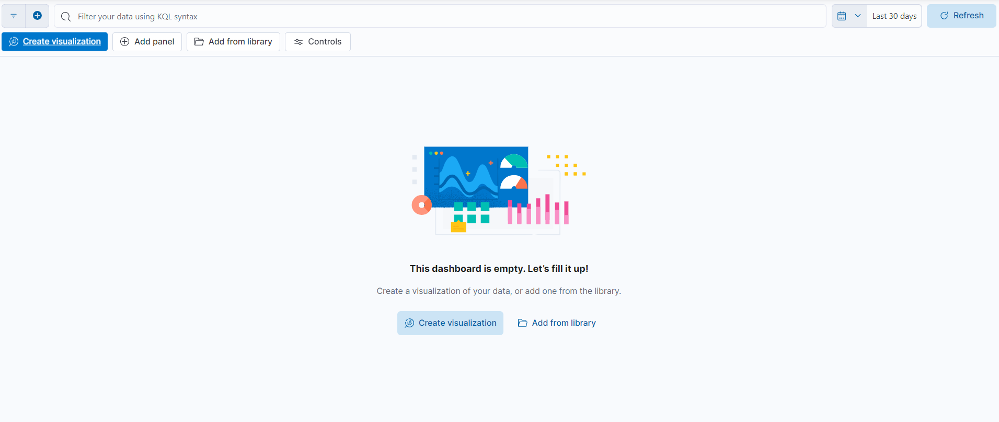

- 圖表類型選取 `Bar vertical percentage`

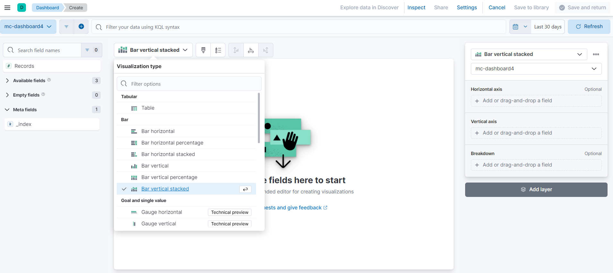

- 設定右方x-axis以及y-axis，breakdown的部分記得選`name`

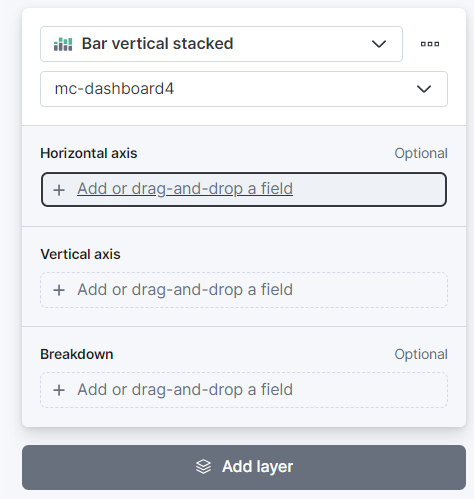

- 結果
  
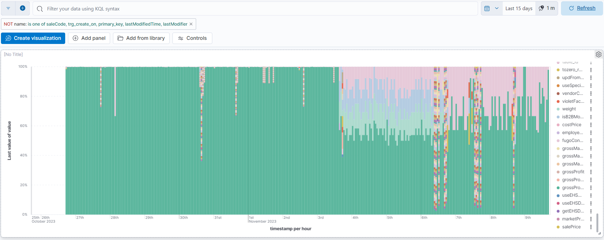 