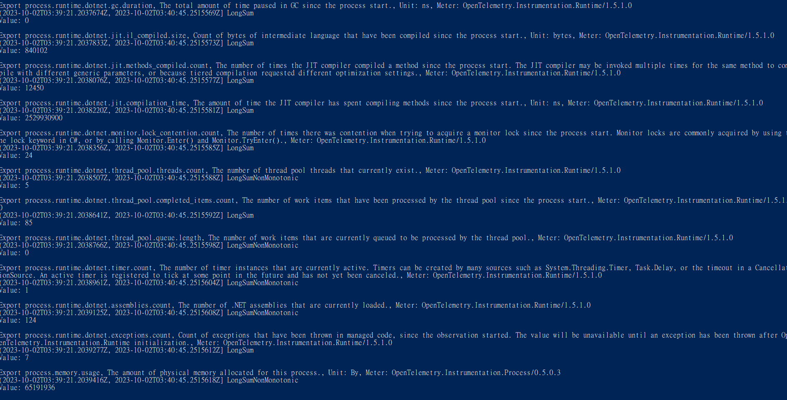
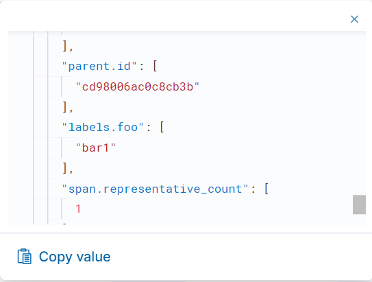

# Observability 修煉之路

# 前言

本文為Observability的概念，並且說明如何在.Net使用OpenTelemetry來實作Observability。主要會涵蓋以下項目

## Topic List

以下為預計分享的topic 列表

- Observability 概述
  - Tracing
  - Log
  - Metrics
  - ELK
    - 現有架構
    - 結合OTel
- OpenTelemetry
  - Overview
  - Span
- Docker
  - Overview
  - Docker-compose
- ELK
  - Overview
  - Install
- OpenTelemetry on .Net
  - Auto Instrumentation
  - Manual Instrumentation
- Data visualization
  - Kibana 

## 可觀察性(Observability)

可觀察性是指一個系統可透過`監視`和`分析`系統`外部`狀態的變化藉以追蹤`內部`出錯的原因及診斷這些錯誤發生的能力
。白話一點的說法就是能夠藉由`系統外的資訊觀察系統內部的運作狀態`，將有被觀察意義的資訊給揭露出來。

以看醫生來舉例就是觀察血壓、體溫、心跳、抽血觀察等等，來判斷身體內部的狀況。


Observability三本柱

- Log
  - 泛指系統或應用程式運行所產生用來紀錄系統或程式資訊的文字檔，像是system log、application log等。

- Metrics
  - 為系統或程式在運行時的量化數據，通常為一數值化的結果，例如CPU使用率、記憶體使用量、API被呼叫的次數等等
  
- Trace
  - 紀錄一個任意請求(Request)在不同應用中處裡的路徑，例如一個請求從前端進入後端，後端再呼叫其他服務，最後回傳給前端，這個過程中的每個步驟都會被記錄下來，並且可以透過`trace_id`來串聯這些步驟，作為後續的追蹤使用。通常為侵入性的作法(埋code)，而且可能會影響應用程式的作業。也有非侵入式的作法，但通常就無法觀察較細微的細節


## Telemetry (by chatGPT)

```text 
指的是遠端數據收集、傳輸和監控系統的過程。通常用於描述從遠端收集數據並將其傳送到集中地點進行分析、監控或記錄的過程。Telemetry 可以應用於各種領域，包括航空航天、醫療、工業、環境監測、運輸等等。

Telemetry 系統通常包括傳感器、數據收集設備、通信設備和數據處理設備。傳感器用於測量不同的參數，例如溫度、壓力、速度、位置等，然後這些數據通過通信設備傳送到中央站點。在中央站點，數據可以進行分析，以幫助監控遠程系統的狀態、性能和健康情況。

航空航天領域經常使用遙測技術，以監測和收集太空探測器、衛星和飛機的性能數據。醫療領域可以使用遙測來監控患者的生理參數，工業和環境應用中可以使用遙測來監控設備的運作和環境條件，而運輸領域則可以使用遙測來追蹤運輸工具的位置和狀態。

總之，Telemetry 是一個重要的技術，用於實時監測和收集遠程位置的數據，有助於提高效率、安全性和性能。
```


# OpenTelemetry


由字面上`Open`以及`Telemetry`可得知`OpenTelemetry` （OTel） 是一種跨平臺、開放式`標準`，解決系統監測時Telemetry的資料模型定義、檢測、採集、處理、輸出等標準化問題, 並提供一組標準化SDK、API與一些常用工具.


要產生Telemetry主要有兩種方式，一個為`Auto Instrumentation`，另一個為`Manual Instrumentation`。

Auto Instrumentation為透過`自動`的方式，將Telemetry資料從系統中擷取出來，並且將其送到OTel的後端，這種方式不需要修改原始碼，但是會有一些限制，例如無法自訂資料的內容等。

Manual Instrumentation為透過`手動`的方式，將Telemetry資料從系統中擷取出來，並且將其送到OTel的後端，這種方式需要修改原始碼，但是可以自訂資料的內容等。


## Automatic v.s Manual Instrumentation

- Automatic 會tracing RESTful API 那層，功能內部元件的呼叫並無法tracing到。
- Manual 則是可以自訂細部的tracing以及metrics量測，缺點就是要改code，


# EL(F)K 簡介

EL(F)K為一套由Elastic所提供的開源軟體組合，包含Elasticsearch, Logstash(FluentD), Kibana三個軟體

- Elasticsearch為一個分散式搜尋引擎，也是個TSDB(Time Series Database)，來儲存以及搜尋資料。
- Logstash(FluentD)為一個資料收集引擎，建立data process pipline，
- Kibana為一個資料視覺化工具。

## ELK流程圖


## 安裝ELK


透過下方docker-compose內容，並開啟`CMD`後輸入以下指令
```bash
docker-compose pull #下載image
docker-compose up #啟動container
```

docker-compose.yml內容如下

```yaml
version: "3.8" # docker-compose 使用的版本
services:
  elasticsearch:
     image: elasticsearch:8.10.2 # 指定使用的docker image
     environment: # 環境變數
      - discovery.type=single-node # 使用single-node模式
      - network.host=0.0.0.0 # 開放所有網路
      - http.host=0.0.0.0 
      - xpack.security.enabled=true # 需打開才能連線
      - xpack.security.authc.api_key.enabled=true 
      - ELASTIC_PASSWORD=changeme # 預設密碼
     ports:
       - 9200:9200 # elastic search 使用的port
       - 9300:9300   
     healthcheck:
       test: nc -z localhost 9200 || exit 1 # 檢查是否有開啟port
       interval: 5s
       timeout: 10s
       retries: 100
  kibana:
     image: kibana:8.10.2
     ports:
       - 5601:5601
     environment:
       - ELASTICSEARCH_USERNAME="kibana_system"
       - ELASTICSEARCH_PASSWORD="kibana_system"      
     healthcheck:
       test: ["CMD-SHELL", "curl -u kibana_system:kibana_system -s http://localhost:5601/api/status"]
       interval: 5s
       timeout: 10s
       retries: 120
     depends_on:
      elasticsearch:
        condition: service_healthy
  fleet-server:
    image: elastic/elastic-agent:8.10.2
    container_name: fleet-server
    user: root
    ports:
       - 8220:8220
    environment:
      - FLEET_SERVER_ENABLE=1
      - FLEET_SERVER_ELASTICSEARCH_HOST=http://elasticsearch:9200
      - FLEET_SERVER_SERVICE_TOKEN=AAEAAWVsYXN0aWMvZmxlZXQtc2VydmVyL3Rva2VuLTE2OTc0MjQ0NjE2NTQ6cGZDLVIydnhUbW01WXN2VHlzT3l5QQ
      - FLEET_SERVER_POLICY_ID=fleet-server-policy
      - FLEET_SERVER_ELASTICSEARCH_USERNAME=elastic
      - FLEET_SERVER_ELASTICSEARCH_PASSWORD=elastic
      - p 8220:8220
    healthcheck:
      test: ["CMD-SHELL", "curl -u elastic:elastic -s http://localhost:5601/api/status"]
    depends_on:
      kibana:
        condition: service_healthy
  agent01:
    image: elastic/elastic-agent:8.10.2
    container_name: agent01
    user: root
    environment:
      - FLEET_ENROLLMENT_TOKEN=aFFiZE40c0IyYTk3OTFNM0prS3M6UDVmcFVwLVRRbzJEZWprVnF0c3JKQQ==
      - FLEET_ENROLL=1
      - FLEET_URL=https://fleet-server:8220
      - FLEET_INSECURE=true
      - p 8200:8200
    ports:
      - 8200:8200
    depends_on:
      fleet-server:
        condition: service_healthy
```
下載後container並未全部啟動，須完成下方流程。

1. 進入ElasticSearch設定kibana的帳號密碼，首先進入elasticsearch container輸入以下指令

```bash
./bin/elasticsearch-setup-passwords interactive
```
可參考下方的gif圖，設定的密碼之後會用到，因此需要先記下來。


設定完`kibana_system`的密碼後，需要把密碼設定回`docker-compose.yml/kibana.ELASTICSEARCH_PASSWORD的欄位`

之後重跑一次`docker-compose up`

啟動後可以看到docker container如下，並且可以透過`localhost:5601`進入Kibana


一進到頁面後需要輸入`elastic`的帳號才能進入，密碼為剛剛設定的密碼。

若遇到無法登入時需要進入到ES的container內修改密碼，指令如下

```bash
./elasticsearch-reset-password -u elastic
```
此指令代表要重設elastic這user的密碼，重設完後會得到新的密碼，輸入即可登入。

登入之後需要先設定fleet-server的policy，點選左方的menu選擇Management選區的`Fleet`


接著請照以下流程設定

1. 選擇 `Add Fleet Server` 
2. 選擇`Advance`
3. 然後點選`Create Polity`
4. 當出現`Agent Policy Created`出現時，代表有成功。
5. 產生`service-token`
6. 將token貼回`docker-compose.yml/fleet-server.FLEET_SERVER_SERVICE_TOKEN`的欄位
7. 重啟`docker-compose up`
8. 回到網頁確認是否有連上fleet-server

流程可參考以下示範


接著需要設定agent的policy，
 


1. 點選`Add Agent`
2. `Create Policy`
3. 在下方的Enroll找到`FLEET_ENROLLMENT_TOKEN`並貼回docker-compose裡面`agent01.FLEET_ENROLLMENT_TOKEN`的欄位
4. 重啟`docker-compose up`
5. 回到網頁確認是否有連上agent

可參考以下流程


接著要設定APM server，點選左方的menu選擇Management選區的`APM`

1. 選擇 `Add Data`
2. 選擇`Manage APM integration in Fleet`
3. `Add Elastic APM`
4. 需要將Host欄位的`localhost`改為 `0.0.0.0`
5. `Save and Continue`
6. 成功後選擇 `Add Elastic Agent`
7. 一樣複製`ENROLLMENT_TOKEN`並貼回docker-compose裡面`agent01.FLEET_ENROLLMENT_TOKEN`的欄位
8. 重啟`docker-compose`
9. 回到網頁確認是否有連上agent
10. 接著點進Agent裡面頁面旁邊的Setting，需要把elastissearch的網址從`localhost`改為`elasticsearch`

到此即設定完成，接著進management申請完API Key後，完成 `安裝OpenTelemetry 於.net`的步驟，即能看到APM資料，可參考以下流程。


## OpenTelemetry on .Net

### Auto Instrumentation

以下安裝流程為參考Otel官方的[教學文件](https://opentelemetry.io/docs/instrumentation/net/getting-started/) 


1. 先建置測試專案

```bash
dotnet new web
```

2. 專案`Program.cs`內容

```
using System.Globalization;

var builder = WebApplication.CreateBuilder(args);
var app = builder.Build();

var logger = app.Logger;

int RollDice()
{
    return Random.Shared.Next(1, 7);
}

string HandleRollDice(string? player)
{
    var result = RollDice();

    if (string.IsNullOrEmpty(player))
    {
        logger.LogInformation("Anonymous player is rolling the dice: {result}", result);
    }
    else
    {
        logger.LogInformation("{player} is rolling the dice: {result}", player, result);
    }

    return result.ToString(CultureInfo.InvariantCulture);
}

app.MapGet("/rolldice/{player?}", HandleRollDice);

app.Run();

```

3. 修改 properties/launchSetting.json

```json
{
  "$schema": "http://json.schemastore.org/launchsettings.json",
  "profiles": {
    "http": {
      "commandName": "Project",
      "dotnetRunMessages": true,
      "launchBrowser": true,
      "applicationUrl": "http://localhost:8080",
      "environmentVariables": {
        "ASPNETCORE_ENVIRONMENT": "Development"
      }
    }
  }
}

```

4. 使用auto-instrumentation的方式置入instrumentation

開啟power-shell (需要管理員權限)，並執行以下指令

```bash
$module_url = "https://github.com/open-telemetry/opentelemetry-dotnet-instrumentation/releases/latest/download/OpenTelemetry.DotNet.Auto.psm1"
$download_path = Join-Path $env:temp "OpenTelemetry.DotNet.Auto.psm1"
Invoke-WebRequest -Uri $module_url -OutFile $download_path -UseBasicParsing
Import-Module $download_path
Install-OpenTelemetryCore
$env:OTEL_TRACES_EXPORTER="none"
$env:OTEL_METRICS_EXPORTER="none"
$env:OTEL_LOGS_EXPORTER="none"
$env:OTEL_DOTNET_AUTO_TRACES_CONSOLE_EXPORTER_ENABLED="true"
$env:OTEL_DOTNET_AUTO_METRICS_CONSOLE_EXPORTER_ENABLED="true"
$env:OTEL_DOTNET_AUTO_LOGS_CONSOLE_EXPORTER_ENABLED="true"
Register-OpenTelemetryForCurrentSession -OTelServiceName "RollDiceService"
``` 
最後執行專案

```bash
dotnet run 
```
執行完後可以看到console內有openTelemetry的log



### Manual Instrumentation


在.net framework中，已提供logging，metrics以及activity APIs 實作OTel的標準，代表OTel不用再額外提供APIs，只要使用原生的APIs即可。.Net OTel用下列的方式實作了OTel的標準

- Microsoft.Extensions.Logging.ILogger<TCategoryName> (Logging)
- System.Diagnostics.Metrics.Meter (Metrics)
- System.Diagnostics.ActivitySource and System.Diagnostics.Activity (Tracing)

`OpenTelemetry in .NET is implemented as a series of NuGet packages that form a couple of categories:`

- Core API
- Instrumentation - these packages collect instrumentation from the runtime and common libraries.
- Exporters - these interface with APM systems such as Prometheus, Jaeger, and OTLP.

## Register Customer Signals to Auto Instrumentation

使用方式為在使用Automatic的情況下塞入自定義的Instrumentation，這種方式可以在`僅修改少量原始碼`的情況下，將自定義的Telemetry塞入到Auto Instrumentation中。


接續先前`rollingDice`的範例，首先在專案中加入`System.Diagnostics.DiagnosticSource`的Nuget Package

```csharp
<PackageReference Include="System.Diagnostics.DiagnosticSource" Version="7.0.2" />
```

接著新增一個名為`source`的`ActivitySource`，使用的名稱為`Sample.DistributedTracing`

```csharp
 ActivitySource source = new ActivitySource("Sample.DistributedTracing", "1.1.0");
```

接著幫此Activity加入`key`為`foo`的tag，`value為bar1` 

 
```csharp
using (var activity = source.StartActivity("Main"))
{
    activity?.SetTag("foo", "bar1"); //加入此trace要使用的log
}
``` 
接著就是開始建置後使用ELK觀察結果，首先到左方的`menu`選擇`discover`


接著左方的filter選擇`APM`


接著在右方可看到剛剛傳送上來的`traces`，點選其中一個並查看其內容。


可以看到剛剛設的tag已經被傳送上來了。


以上就成功埋入相關的tag到automatic instrumentation中了。

接著為嘗試加入`metrics`

首先一樣在專案中加入`System.Diagnostics.DiagnosticSource`的Nuget Package

接著在code裡加入以下的程式碼

```csharp
    var meter = new Meter("Sample.Service", "1.0");
    var successCounter = meter.CreateCounter<long>("srv.successes.bing", description: "Number of successful responses");
    successCounter.Add(1, new KeyValuePair<string, object?>("tagName", "tagValue"));
```
命名一個名為`Sample.Service`的`Meter`，並且建立一個名為`srv.successes.bing`的`counter`，並且加入一個`tag`為`tagName`，`value為tagValue`的`counter`。
 
接著就是開始建置後使用ELK觀察結果，首先一樣到左方的`menu`選擇`discover`，並且左方的filter選擇`APM`
接著在右方的filter輸入`data_stream.type:"metrics" `，可看到下方出現相關的record，點選其中一條即可看到剛剛傳送上來的`srv.successes.bing`，並且可以看到剛剛設的tag已經被傳送上來了。


`ps. metrics預設為每分鐘一筆，所以要等一分鐘才會出現。traces則是每個operation的當下產生並送出。`

## Demo


## resource

https://cloud.google.com/architecture/devops