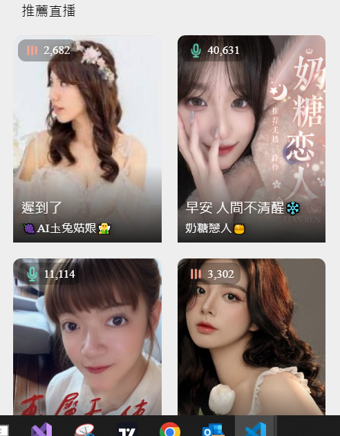

<!--
---
marp: true
theme: uncover
---

-->
# 萌寵樂園直播串流

## 目的

## 需求

## 規格

- 從萌寵頁面左下角點直播按鈕，進入直播頁面
- 第二頁可選擇 館別 寵物別 門市
- 入口  etmall/ettoday/微電商
- 8/12 給畫面設計稿
- 直播時有個畫面可以看到會員互動的統計，摸摸幾次 給幾個罐頭等
- 同時段會有5個直播
- 後台可預約直播時間
- 可上架商品
- 記錄從哪個入口來，以及儲值狀況
- DAU 13000 同時在線人數 100
- 目前DAU2500  同時在線人數 20
- 聊天室互動都要記錄 user_id,action_id,action_time
- 不用存聊天紀錄，但互動紀錄要
- 禮物先用簡單的禮物
- 儲值
- 雲端暫定用GCP
- 前後端同台vm
- DB ->MySQL MSSQL
- webSocket 連接
- youtube直撥方式　手機放直的
- 
## 待釐清問題

- 雲端與地端結合架構
- 認證流程、資料流
- 直播頁與原本頁面的結合
- 直播頁聊天紀錄是否儲存　-> 不用
- 直播頁後端 -> dotnet core
- 直播頁禮物清單
- 直播頁禮物付款
- 直播頁特效
- 右下角寶箱
- 五大主題頁面
- 寶箱打賞
- dot net core在linux上
  - NET Core 應用程式可以使用內建的 Kestrel 伺服器獨立運行，不需要 IIS。
  - 在 Linux 上，常見的做法是使用 Kestrel 作為應用程式伺服器。然後，通常會在 Kestrel 前面使用反向代理伺服器，如 Nginx 或 Apache。
  - Kestrel 是 .NET Core 的輕量級、跨平台 Web 伺服器。
- CI/CD 流程
  - jenkins + gitlab
  - azure devops
## 雲端機器選擇

- 現有機器的bottnet評估

## 技術相關

- redis
- mysql
- 

## 參考頁面

