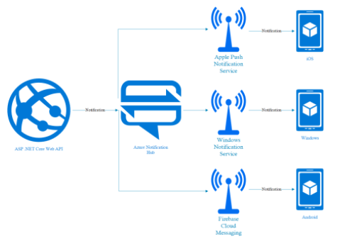
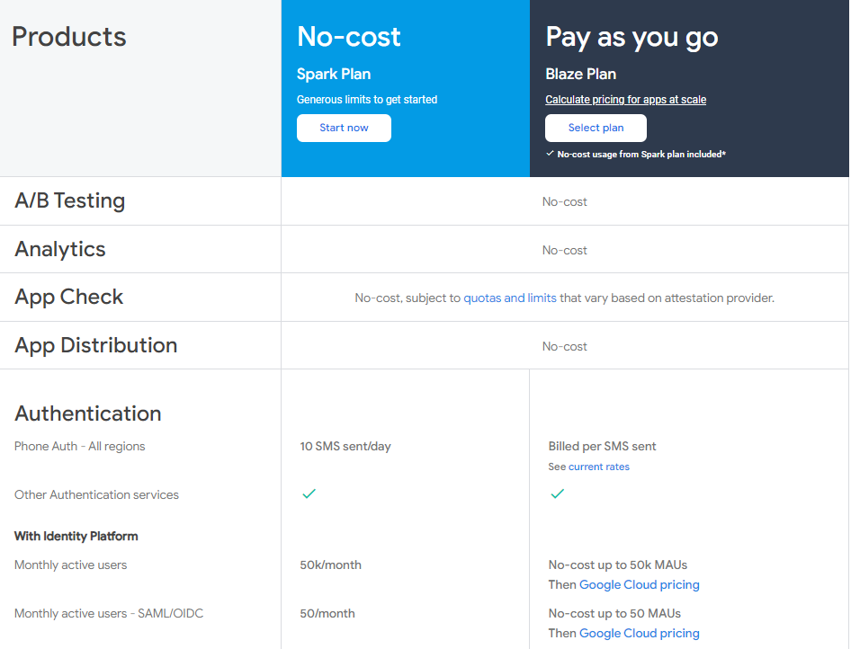
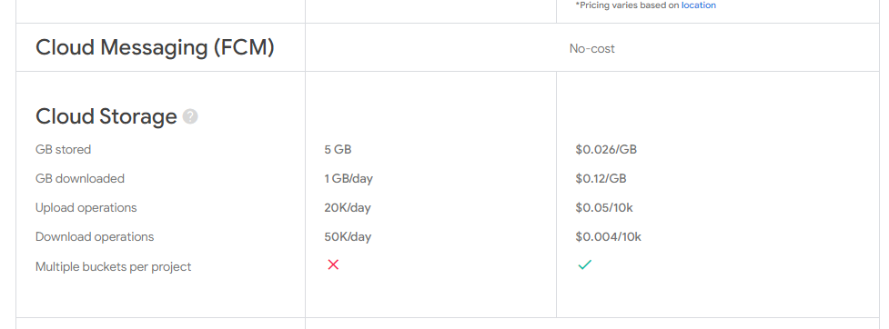
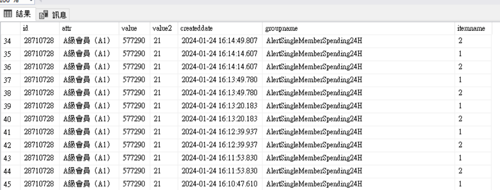
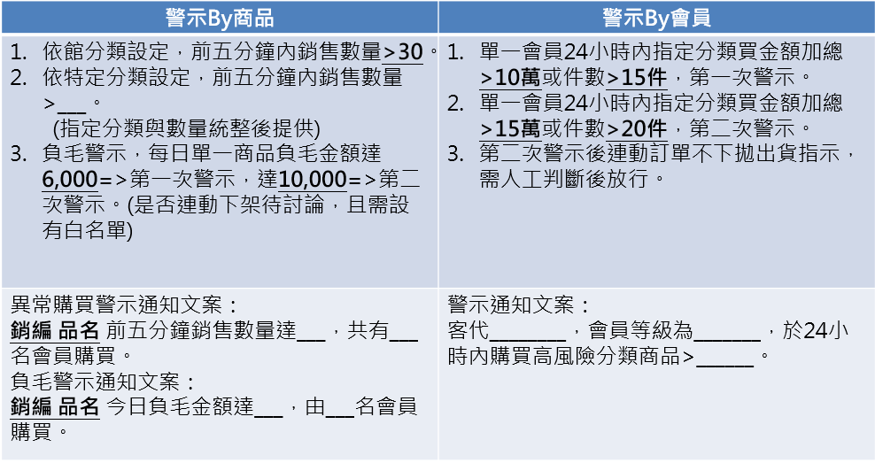
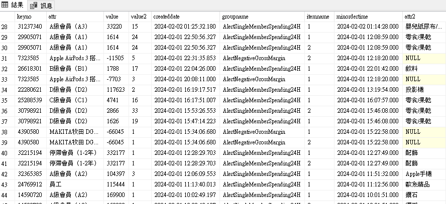

<!--
---
marp: true
theme: uncover
---

-->
# App notification 需求說明

森活家需要收到警示推播，但目前沒有收取推播的功能，因此需要開發推播，其中開發工作包含

- 撰寫一Job，定時去B2B的table取資料，並發送推播
- Job 排程每分鐘執行一次，發送通知後需要在table更新狀態
- 申請firebase推播服務後台
- 要在頁面加入一javascript與app native溝通
- 新建一redApi更新table的狀態
- 通知也需要傳送到teams

## Azure Notification Hub v.s Firease Cloud Messaging Directly

- Azure Notification Hub
  - 優點
    - 可以管理多個平台的推播
    - 可以管理多個應用程式的推播
    - 可以管理多個推播服務
    - 大量user的推播(100萬以上)
  - 缺點
    - 管理較為複雜
- Firebase Cloud Messaging
  - 優點
    - 管理較為簡單，
    - 透過sdk整合push
  - 缺點
    - user數量
  - 

- 流程
  - App 打開後註冊FCM (需開API)
  - 將FCM token 傳送到後端
  - 後端需要有欄位紀錄FCM 以及 mobile os

## Firebase Cloud Messaging




## ios 版與webview flow

- 需要在頁面加入一javascript code
```js
function webViewCallback(devicetoken){
...
return 0 
}
```

此外在要呼叫native的地方加入下方的code

```js

window.webkit.messageHandlers.ToApp.postMessage("Send message to Swift")

```

目前暫定如下

```js
function webViewCallback(deviceToken){
...
}

window.webkit.messageHandlers.redApp.postMessage("get_device_token")

```

`redApp`需要事先與ios 定義好的名稱

呼叫之後ios底層會根據message做對應的處理，最後呼叫`webViewCallback`將數值丟回到webView上做後續處理

會用此方式取得token是因為ios的token每次都會變動，因此需要在app啟動時取得token，並且傳送到後端




keyno: 編號
attr: 會員等級
value: 購買金額
value2: 購買的品項數量
createddate: 觸發時間
groupname: 警示類型
itemname: 警示觸發次數

MSSQL table 欄位必須與c#欄位型別一致，否則會出現錯誤

把數值記在consul，若consul沒有key則會新增，之後需要去consul修改


## 設定Job Scheduler

1. 進入B2B.Job 裏頭新增file
2. 撰寫Job的內容
3. 需要進入B2B.Schedule 新增對應的xml
4. 測試時需要先將B2B.Schedule設定成啟動專案
5. 在B2B.Schedule屬性裡面設定要執行的Job名稱




 

groupname: "AlertSingleMemberSpending24H"

單一會員當日內指定分類購買金額加總>10萬 或件數 > 15

keyno: 員編
attr: 會員等級
value: 購買金額
value2: 數量
minordertime: 最小訂單購買時間
attr2: 商品分類

groupname: "AlertSingleMemberSpending24H"

單一會員當日內指定分類購買金額加總>10萬 或件數 > 15

keyno: 員編
attr: 會員等級
value: 購買金額
value2: 數量
minordertime: 最小訂單購買時間
attr2: 商品分類


groupname: "AlertSingleMemberSpending24H"

單一會員當日內指定分類購買金額加總>10萬 或件數 > 15

keyno: 員編
attr: 會員等級
value: 購買金額
value2: 數量
minordertime: 最小訂單購買時間
attr2: 商品分類


# Reference

- https://www.c-sharpcorner.com/article/send-push-notifications-from-net-6-application-to-firebase-using-the-firebase-c/

- https://medium.com/%E5%BD%BC%E5%BE%97%E6%BD%98%E7%9A%84-swift-ios-app-%E9%96%8B%E7%99%BC%E5%95%8F%E9%A1%8C%E8%A7%A3%E7%AD%94%E9%9B%86/%E5%88%A9%E7%94%A8-firebase-cloud-messaging-fcm-%E7%99%BC%E9%80%81%E6%8E%A8%E6%92%AD-b4a9bd4f89d6

- https://techmindfactory.com/ASP-.NET-Core-Web-API-with-Azure-Notification-Hub/

- https://ithelp.ithome.com.tw/articles/10207572?sc=iThelpR


