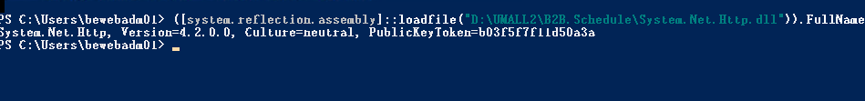

# App notification 需求說明

森活家需要收到警示推播，但目前沒有收取推播的功能，因此需要開發推播，其中開發工作包含

- 撰寫一Job，定時去B2B的table取資料，並發送推播
- Job 排程每分鐘執行一次，發送通知後需要在table更新狀態
- 申請firebase推播服務後台
- 要在頁面加入一javascript與app native溝通
- 新建一redApi更新table的狀態
- 通知也需要傳送到teams

## Azure Notification Hub v.s Firease Cloud Messaging Directly

- Azure Notification Hub
  - 優點
    - 可以管理多個平台的推播
    - 可以管理多個應用程式的推播
    - 可以管理多個推播服務
    - 大量user的推播(100萬以上)
  - 缺點
    - 管理較為複雜
- Firebase Cloud Messaging
  - 優點
    - 管理較為簡單，
    - 透過sdk整合push 
  - 缺點
    - user數量
  - 

- 流程
  - App 打開後註冊FCM (需開API)
  - 將FCM token 傳送到後端
  - 後端需要有欄位紀錄FCM 以及 mobile os

## Job 流程

### 簡易邏輯

1. 讀取過去30分鐘 realtime.alerts4table的資料
2. 判斷是否有發送過，若沒有發送過則發送警示
3. 發送過後寫入一筆資料到Formal.SenLifeAppPushLog

### 設定Job Scheduler

1. 進入B2B.Job 裏頭新增file
2. 撰寫Job的內容
3. 需要進入B2B.Schedule 新增對應的xml 
4. 測試時需要先將B2B.Schedule設定成啟動專案
5. 在B2B.Schedule屬性裡面設定要執行的Job名稱

### Other

警示判斷來源: etmall,umall,網連通,直銷電商

keyno: 編號

attr: 會員等級

value: 購買金額
 
value2: 購買的品項數量

createddate: 觸發時間

groupname: 警示類型

itemname: 警示觸發次數

 

## 警示類型說明

`groupname: "AlertSingleMemberSpending24H"`

單一會員當日內指定分類購買金額加總>10萬 或件數 > 15

欄位對應

keyno: 員編 

attr: 會員等級

value: 購買金額

value2: 數量

minordertime: 最小訂單購買時間

attr2: 商品分類

`groupname: "AlertNegativeGrossMargin"`

每日單一商品負毛金額達條件

keyno: 銷售編號

attr:  商品名稱

value: 負毛金額

value2: 數量

minordertime: 最小訂單購買時間

attr2: 

`groupname: "AlertQtyByBackendCategory"`

依分類前5分鐘內銷售數量達條件

keyno: 員編

attr: 會員等級

value: 購買金額

value2: 數量

minordertime: 最小訂單購買時間

attr2: 商品分類

https://stackoverflow.com/questions/65698676/asp-net-firebaseadmin-fails-to-initilize-system-missingfieldexception

https://stackoverflow.com/questions/52980133/issues-with-system-net-http-dll