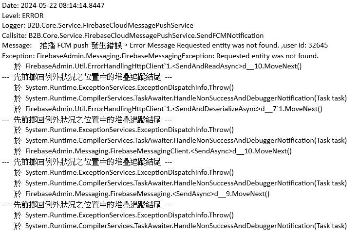

# 問題描述

日前因為error的信件有收到大量森活家推播的exception錯誤信

透過message可以看到 "Requested entity was not found. ,user id: 32645" 此訊息，代表要送給user id 32645時推播失敗，查詢後判斷原因是因為推播對象的fcmToken已經失效，所以無法推播成功。

## 失效的原因可能如下

1.	user在新裝置重新安裝app
2.	user移除app
3.	user清除手機data
4.	fcm app過期

資料來源: https://firebase.google.com/docs/cloud-messaging/manage-tokens

# 解決方案

經討論過後，可以透過以下方式優化

1.	當收到token失效後可以通知PO去通知user重新註冊或安裝森活家App，並告知約定時間後會清除原token。

2.	約定時間過後若user仍未重新註冊則清除此失效的token(當然要有紀錄留存)，清除token後就不會再發訊息給此user也不會有error信

3.	優化log訊息並且在訊息提供相關處理程序以及流程，讓任何人看到都可直接處理此事件。

依照此流程有盡到通知user重新註冊的義務，並且也可減少此信件的發生。

