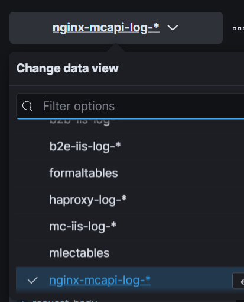

### 現有ELK 的監控項目

http://10.60.17.105:5601/ elastic/1234_abc

監控項目: logs

- iis log
- haproxy log
- nginx log

dashboard: RedAPI_Count/RedAPI_AVGTime

RedAPI_Count 從nginx-redapi-log-* count

好處: 可以看到每個API的呼叫次數 不用埋code，無法有更細節的紀錄

為何需要tracing? 一個requests 內部各自會有不同的邏輯，有tracing可以更細緻的去處理log

why need observability

系統需要observability（可觀測性）是因為它在維護、監控和故障排除方面具有關鍵重要性。觀測性是指能夠收集、監視和分析系統的運行狀態和性能數據的能力。以下是為什麼系統需要observability的一些原因：

故障排除：當系統遇到問題時，可觀察性允許管理員和工程師迅速識別問題所在。這包括在系統發生故障時記錄相關數據，以便事後分析和修復。

監控和性能優化：可觀察性使您能夠實時監控系統的性能指標，並識別潛在的性能問題。這有助於優化系統，以確保其達到預期的性能水平。

安全性：觀察性還可以用於檢測安全漏洞和異常活動。通過分析系統的日誌和監控數據，您可以發現潛在的威脅和入侵嘗試。

擴展性：當系統需要擴展時，可觀察性可以幫助您識別瓶頸、性能問題和資源使用情況，以便更有效地進行擴展計劃。

容量規劃：通過觀察系統的使用情況和資源利用率，您可以更好地進行容量規劃，以確保系統能夠應對未來的需求。

報告和合規性：某些行業和法規要求您保留特定類型的數據以便報告和合規性。可觀察性可以幫助您滿足這些法規要求。

總之，可觀察性是現代信息技術中不可或缺的一部分，它有助於確保系統的穩定性、性能、安全性和可擴展性。通過收集和分析數據，您可以更好地理解系統的運行情況，並更快速地應對問題，提高服務質量和效率。

# docker介紹

Docker 是一個開源的平台和工具，用於輕松地打包、部署和運行應用程序，以及管理這些應用程序的容器化。它的主要目標是實現應用程序在不同環境中的一致性和可移植性。以下是有關 Docker 的詳細介紹：

容器化技術：Docker 基於容器化技術，它允許您將應用程序及其所有相依組件（如庫、運行時、環境變數等）打包到一個稱為容器的輕量級單位中。容器是一個完全自包含的單元，它包括應用程序及其運行環境，這使得應用程序在不同主機上運行時表現一致。

跨平台性：Docker 容器可在任何支援 Docker 的平台上運行，無論是開發人員的本地機器、測試伺服器、雲端伺服器，甚至是在虛擬機或物理機上。這增強了應用程序的可移植性和部署靈活性。

開發者友好：Docker 提供了一個簡單的命令行界面和一個用於容器編排的工具，如 Docker Compose。開發人員可以輕鬆地創建、啟動、停止和刪除容器，並且可以使用 Docker Compose 定義多容器應用程序的配置。

性能優勢：Docker 容器比傳統虛擬機更輕量級，啟動更快，並且因為共享相同的核心內核，所以對系統資源的使用更高效。

Docker Hub：Docker 提供了一個名為 Docker Hub 的中央容器註冊表，其中包含了許多公共和私有容器映像，這些映像可以用於快速部署各種應用程序。開發人員還可以將自己的容器映像上傳到 Docker Hub 供他人使用。

生態系統：Docker 生態系統非常龐大，有眾多的工具和服務，包括容器編排平台（如 Kubernetes、Docker Swarm）、監控工具、自動化部署工具等，以幫助您更輕鬆地管理和擴展容器化應用程序。

安全性：Docker 提供了多層安全性措施，包括容器隔離、容器映像簽名、權限控制等，以確保應用程序的安全運行。

總結來說，Docker 是一個革命性的工具，使開發人員能夠更快速、更一致地部署和運行應用程序，並改進了應用程序的可移植性和可伸縮性。這使得它在現代軟體開發和運營中變得非常流行。

# Opentelemetry

metrics:各種數值的選擇

這裡列出在 .NET 中與 OpenTelemetry 會有相關的 namespace，其中 Instrumentation 與 Exporter 前面章節已經有提到過不在重複。在 .NET 6 之後的版本開始添加 OpenTelemetry 的支援。System.Diagnostics.Metrics 是 OpenTelemetry Metrics API 規範在 .NET 的實現，Meter 類別是在使用時須要先建立的物件與對象，在依據場景來使用所需要 Metrics 的指標與方法，在目前 Metrics API 支援以下幾個儀器類型
Counter : 計數器，可以使用 Add 方法來計算變化率或是總和
ObservableCounter : 與 Counter 類似，用於可觀察的儀器值 例如 CPU 時間(針對不同 Process、Task or 用戶模式)
ObservableGauge : 非相加值得可觀察儀器，例如當前室溫
Histogram : 繪製直方圖或計算百分位數的工具
或許對於上述描述的說明還有些模糊或是不清楚，在微軟 MSDN 文件有提到使用 Metrics 儀器的使用時機
如果是計算內容是隨著時間增加的值 : 建議使用 Counter 與 ObservableCounter
如果是計算時事物 : 建議使用 Histogram
其他類像是業務指標、Cache 命中率、緩存大小 : 建議使用 ObservableGauge