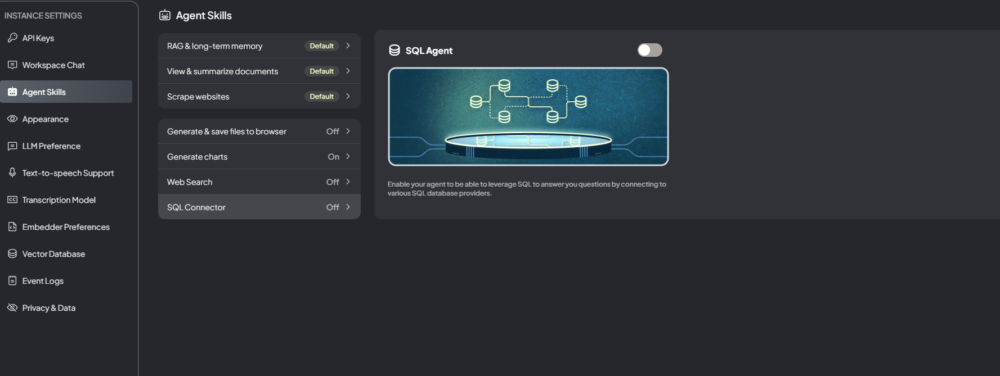

#  

## 目錄
- [](#)
  - [目錄](#目錄)
  - [初始需求分析](#初始需求分析)
  - [RAG vs Ollama 比較](#rag-vs-ollama-比較)
    - [RAG (Retrieval-Augmented Generation)](#rag-retrieval-augmented-generation)
    - [Ollama](#ollama)
  - [推薦解決方案](#推薦解決方案)
  - [環境設置](#環境設置)
  - [AnythingLLM](#anythingllm)
  - [RAG 系統架構詳解](#rag-系統架構詳解)
  - [完整實現指南](#完整實現指南)
  - [優化和注意事項](#優化和注意事項)

## 初始需求分析

客戶需求：
- 建立一個機器人，能夠理解並回答關於特定文檔的問題
- 文檔包含文本、圖片（如流程圖和狀態機）以及表格
- 需要對文檔內容有深入理解
- 文檔數量不多
- 所有處理都需要在本地完成

## RAG vs Ollama 比較

### RAG (Retrieval-Augmented Generation)

優點：
- 更精確的信息檢索
- 更好的上下文理解
- 可擴展性強
- 減少幻覺生成
- 信息更新容易

缺點：
- 設置相對複雜
- 可能需要更多計算資源

### Ollama

優點：
- 設置簡單
- 本地運行，保護數據隱私
- 靈活性高，可選擇不同預訓練模型
- 生成能力強

缺點：
- 可能不如 RAG 精確
- 更容易產生幻覶
- 知識更新需要重新訓練或切換模型

## 推薦解決方案

結合 RAG 和 Ollama 的優點：
1. 使用 RAG 作為基礎架構
2. 將 Ollama 作為 RAG 系統的生成組件

這種方法結合了 RAG 的精確檢索能力和 Ollama 的強大生成能力，同時保持了系統的本地性和隱私保護。

## 環境設置

```bash
# 1. 安裝必要的 Python 庫
pip install docx2txt pytesseract pillow opencv-python-headless camelot-py requests sentence-transformers faiss-cpu

# 2. 安裝 Tesseract OCR
# Windows:
# 1. 下載 Tesseract 安裝程序：https://github.com/UB-Mannheim/tesseract/wiki
# 2. 運行安裝程序並記住安裝路徑
# 3. 將安裝路徑添加到系統環境變量 PATH 中

# macOS:
brew install tesseract

# Linux (Ubuntu/Debian):
sudo apt-get update
sudo apt-get install tesseract-ocr
sudo apt-get install libtesseract-dev

# 3. 安裝 Ollama
# 1. 訪問 Ollama 官網：https://ollama.ai/
# 2. 下載適合您操作系統的安裝程序
# 3. 運行安裝程序
# 4. 安裝完成後，打開終端運行以下命令來拉取所需模型：
ollama pull qwen:7b
```

## AnythingLLM



支援SQL Connector

## RAG 系統架構詳解

RAG 系統包含以下關鍵組件：

1. 文檔處理器
2. 嵌入生成器
3. 向量數據庫
4. 檢索器
5. 生成器（Ollama）
6. open webui

## 完整實現指南

```python
import docx2txt
import pytesseract
from PIL import Image
import cv2
import numpy as np
import camelot
from sentence_transformers import SentenceTransformer
import faiss
import requests

# 文檔處理
def extract_text_from_docx(file_path):
    return docx2txt.process(file_path)

def extract_text_from_image(image_path):
    image = Image.open(image_path)
    return pytesseract.image_to_string(image, lang='chi_tra')

def extract_tables_from_pdf(pdf_path):
    tables = camelot.read_pdf(pdf_path)
    return [table.df.to_dict() for table in tables]

def analyze_diagram_structure(image_path):
    image = cv2.imread(image_path)
    gray = cv2.cvtColor(image, cv2.COLOR_BGR2GRAY)
    edges = cv2.Canny(gray, 50, 150, apertureSize=3)
    
    lines = cv2.HoughLinesP(edges, 1, np.pi/180, 100, minLineLength=100, maxLineGap=10)
    contours, _ = cv2.findContours(edges, cv2.RETR_EXTERNAL, cv2.CHAIN_APPROX_SIMPLE)
    rectangles = [cv2.boundingRect(c) for c in contours if cv2.contourArea(c) > 1000]
    
    return {
        "lines": len(lines) if lines is not None else 0,
        "rectangles": len(rectangles)
    }

# RAG 模型建立
embedder = SentenceTransformer('distiluse-base-multilingual-cased-v2')

def generate_embeddings(texts):
    return embedder.encode(texts)

def build_faiss_index(embeddings):
    dimension = embeddings.shape[1]
    index = faiss.IndexFlatL2(dimension)
    index.add(np.array(embeddings).astype('float32'))
    return index

def retrieve(query, index, documents, top_k=3):
    query_vector = embedder.encode([query])
    D, I = index.search(query_vector, top_k)
    return [documents[i] for i in I[0]]

# Ollama 整合
def generate_with_ollama(query, context):
    prompt = f"根據以下信息回答問題：\n\n上下文：{context}\n\n問題：{query}\n\n回答："
    response = requests.post('http://localhost:11434/api/generate', 
                             json={
                                 "model": "qwen:7b",
                                 "prompt": prompt,
                                 "stream": False
                             })
    return response.json()['response']

# 完整系統實現
documents = []  # 用於存儲處理後的文檔內容
index = None

def process_document(file_path):
    global documents, index
    
    # 根據文件類型處理文檔
    if file_path.endswith('.docx'):
        content = extract_text_from_docx(file_path)
    elif file_path.endswith('.pdf'):
        content = extract_text_from_pdf(file_path)
    elif file_path.endswith(('.png', '.jpg', '.jpeg')):
        content = extract_text_from_image(file_path)
        diagram_info = analyze_diagram_structure(file_path)
        content += f"\n圖片結構：包含 {diagram_info['rectangles']} 個節點和 {diagram_info['lines']} 條連線。"
    else:
        raise ValueError("Unsupported file format")
    
    documents.append(content)
    embeddings = generate_embeddings(documents)
    index = build_faiss_index(embeddings)

def rag_with_ollama(query):
    if not documents or index is None:
        return "請先處理文檔。"
    
    relevant_docs = retrieve(query, index, documents)
    context = "\n".join(relevant_docs)
    return generate_with_ollama(query, context)

# 使用示例
process_document("your_document.docx")
process_document("your_image.png")
user_query = "文檔的主要內容是什麼？"
result = rag_with_ollama(user_query)
print(result)
```

## 優化和注意事項

1. 文檔預處理：
   - 對於大型文檔，考慮將其分割成更小的段落。
   - 使用更高級的 NLP 技術進行文本清理和標準化。

2. 嵌入和索引：
   - 對於大量文檔，考慮使用近似最近鄰索引方法以提高檢索效率。
   - 定期更新和優化索引以維持性能。

3. Ollama 整合：
   - 根據具體需求選擇合適的 Ollama 模型。
   - 考慮使用批處理來提高處理效率。

4. 系統優化：
   - 實現緩存機制以提高常見查詢的響應速度。
   - 添加錯誤處理和日誌記錄以提高系統穩定性。

5. 圖片和表格處理：
   - 使用更先進的計算機視覺技術來提高圖片分析的準確性。
   - 考慮使用 OCR 後處理來提高文本提取質量。

6. 隱私和安全：
   - 確保敏感文檔的安全存儲和處理。
   - 實現用戶認證和授權機制。

7. 持續改進：
   - 收集用戶反饋並不斷優化系統。
   - 定期更新使用的模型和庫以獲得最新的功能和改進。

這個解決方案結合了 RAG 的精確檢索能力和 Ollama 的強大生成能力，同時保持了系統的本地性和隱私保護。通過細心的實現和持續的優化，這個系統應該能夠很好地滿足處理複雜文檔並提供準確回答的需求。