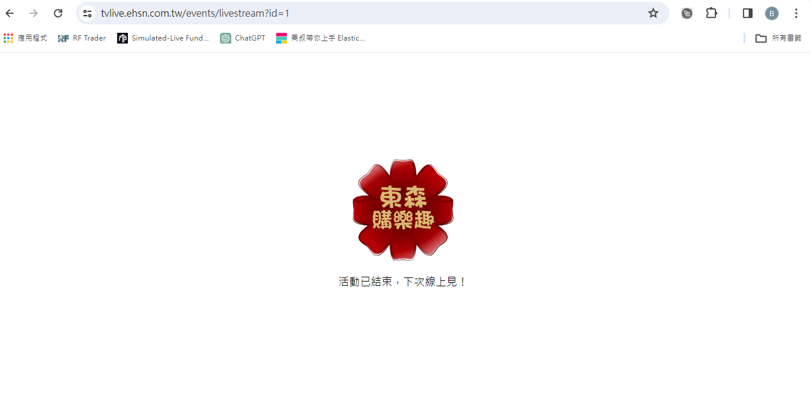

<!--
author: bing
created: 2024-03-06
description: 
-->

# redmine單上的需求

基本設定
- [x] 活動名稱
- [x] 活動說明
- [ ] 直播訊號源：Youtube、M3U8 (?)
- [x] 活動時間 (年月日時分)
- [x] 活動開始時間：開始前頁面不可訪問，並顯示『活動尚未開始，敬請期待！』
- [x] 活動結束時間：結束後頁面不可訪問，並顯示『活動已結束，期待下次見！』

聊天室
- [x] 顯示會員頭像及會員暱稱 (透過Line取得)
- [x] 點擊後展開完整聊天室並自動更新留言

留言給專人
- [x] 留言按鈕 (可擴充)，讓客戶可以直接點擊以快速回覆，如「+1」、「請專員聯絡我」
- [x] 紀錄點擊資料，後續可匯出報表

本場直播商品
- [x] 顯示該場次販售商品，包含商品圖、商品名、商品描述及『快速訂購』按鈕
- [x] 點擊『快速訂購』按鈕，將引導至Fugo快速訂購連結下單

- [x] 直播活動頁會在東森廣場LINE@曝光 (僅針對有綁定客代之粉絲進行推播)
- [ ] 當客戶進入直播網頁時需透過Line取得Line ID，後續與Fugo比對取得東購客代

針對管理員操作，需另外設計獨立連結進行身份切換

- [x] 頁面右上角可進入管理員模式的聊天室
- [x] 管理員可針對個別觀眾進行
- [x] 回覆：需顯示會員訊息及管理員回覆內容
- [x] 置頂：顯示於最上方，可取消
- [x] 禁言：該會員將不可留言，可取消
- [x] 封鎖：該會員不可進入直播活動頁，可取消
- [x] 管理員發送的訊息須能識別
- [x] 管理者可下載報表 直播活動報表_(直播活動名稱).xlsx
- [x] 直播留言：顯示會員點擊互動按鈕的紀錄，供專人回電下單
- [ ] 觀看紀錄：會員進入直播間的時間紀錄，重複顯示

# checklist

- 活動未開始前顯示活動尚未開始頁面
- 活動結束後顯示活動已結束頁面
  -  
- 管理員權限功能
- 留言功能測試
- 快速留言按鈕測試
- 直播測試
- Line login登入測試
- 直播活動頁面顯示
- 壓力測試
  - 按鈕
  - 聊天室壓力測試
